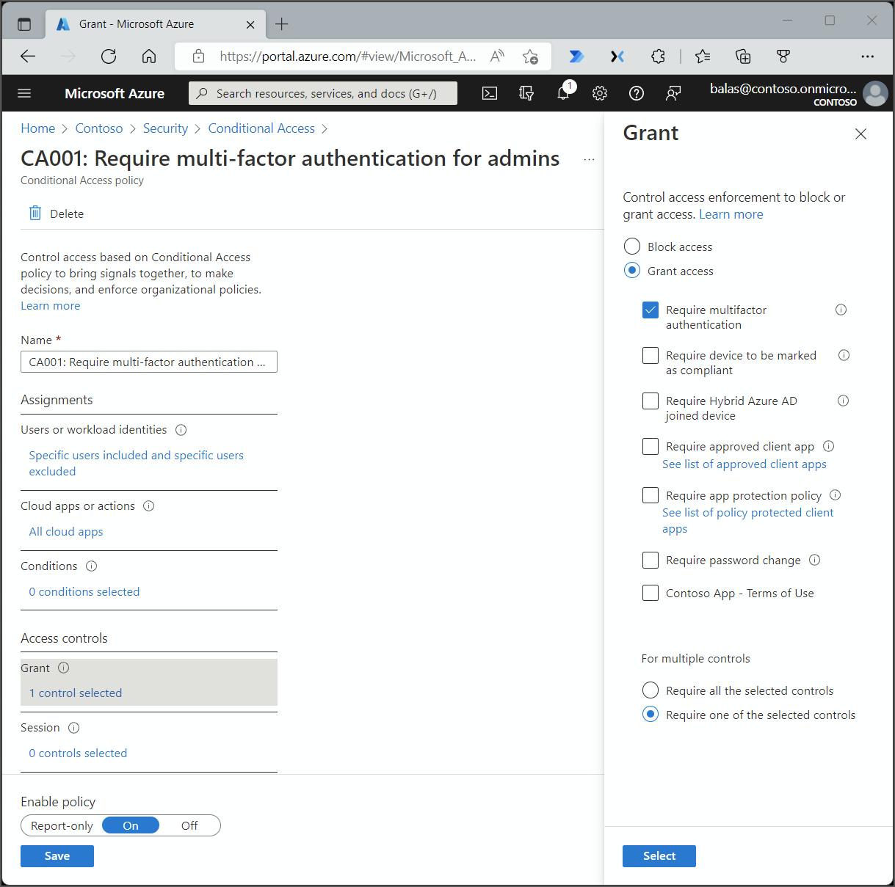

# Conditional Access: Grant

Within a Conditional Access policy, an administrator can make use of access controls to either grant or block access to resources.

## Block access

Block takes into account any assignments and prevents access based on the Conditional Access policy configuration.

Block is a powerful control that should be wielded with appropriate knowledge. Policies with block statements can have unintended side effects. Proper testing and validation are vital before enabling at scale. Administrators should utilize tools such as [Conditional Access report-only mode](concept-conditional-access-report-only.md) and [the What If tool in Conditional Access](what-if-tool.md) when making changes.

## Grant access

Administrators can choose to enforce one or more controls when granting access. These controls include the following options: 

- [Require multi-factor authentication (Azure Multi-Factor Authentication)](../authentication/concept-mfa-howitworks.md)
- [Require device to be marked as compliant (Microsoft Intune)](/intune/protect/device-compliance-get-started)
- [Require hybrid Azure AD joined device](../devices/concept-azure-ad-join-hybrid.md)
- [Require approved client app](app-based-conditional-access.md)
- [Require app protection policy](app-protection-based-conditional-access.md)

When administrators choose to combine these options, they can choose the following methods:

- Require all the selected controls (control **AND** control)
- Require one of the selected controls (control **OR** control)

By default Conditional Access requires all selected controls.

### Require multi-factor authentication

Selecting this checkbox will require users to perform Azure Multi-Factor Authentication. More information about deploying Azure Multi-Factor Authentication can be found in the article [Planning a cloud-based Azure Multi-Factor Authentication deployment](../authentication/howto-mfa-getstarted.md).

### Require device to be marked as compliant

Organizations who have deployed Microsoft Intune can use the information returned from their devices to identify devices that meet specific compliance requirements. This policy compliance information is forwarded from Intune to Azure AD where Conditional Access can make decisions to grant or block access to resources. For more information about compliance policies, see the article [Set rules on devices to allow access to resources in your organization using Intune](/intune/protect/device-compliance-get-started).

A device can be marked as compliant by Intune (for any device OS) or by third-party MDM system for Windows 10 devices. Jamf pro is the only supported third-party MDM system. More information about integration can be found in the article, [Integrate Jamf Pro with Intune for compliance](/intune/protect/conditional-access-integrate-jamf).

Devices must be registered in Azure AD before they can be marked as compliant. More information about device registration can be found in the article, [What is a device identity](../devices/overview.md).

### Require hybrid Azure AD joined device

Organizations can choose to use the device identity as part of their Conditional Access policy. Organizations can require that devices are hybrid Azure AD joined using this checkbox. For more information about device identities, see the article [What is a device identity?](../devices/overview.md).

When using the [device-code OAuth flow](../develop/v2-oauth2-device-code.md), the require managed device grant control or a device state condition are not supported. This is because the device performing authentication cannot provide its device state to the device providing a code and the device state in the token is locked to the device performing authentication. Use the require multi-factor authentication grant control instead.

### Require approved client app

Organizations can require that an access attempt to the selected cloud apps needs to be made from an approved client app. These approved client apps support [Intune app protection policies](/intune/app-protection-policy) independent of any mobile-device management (MDM) solution.

In order to leverage this grant control, Conditional Access requires that the device be registered in Azure Active Directory which requires the use of a broker app. The broker app can be either the Microsoft Authenticator for iOS, or the Microsoft Company portal for Android devices. If a broker app is not installed on the device when the user attempts to authenticate, the user gets redirected to the app store to install the broker app.

This setting applies to the following iOS and Android apps:

- Microsoft Azure Information Protection
- Microsoft Bookings
- Microsoft Cortana
- Microsoft Dynamics 365
- Microsoft Edge
- Microsoft Excel
- Microsoft Flow
- Microsoft Intune Managed Browser
- Microsoft Invoicing
- Microsoft Kaizala
- Microsoft Launcher
- Microsoft Office
- Microsoft OneDrive
- Microsoft OneNote
- Microsoft Outlook
- Microsoft Planner
- Microsoft PowerApps
- Microsoft Power BI
- Microsoft PowerPoint
- Microsoft SharePoint
- Microsoft Skype for Business
- Microsoft StaffHub
- Microsoft Stream
- Microsoft Teams
- Microsoft To-Do
- Microsoft Visio
- Microsoft Word
- Microsoft Yammer
- Microsoft Whiteboard

**Remarks**

- The approved client apps support the Intune mobile application management feature.
- The **Require approved client app** requirement:
   - Only supports the iOS and Android for device platform condition.
   - A broker app is required to register the device. On iOS, the broker app is Microsoft Authenticator and on Android, it is Intune Company Portal app.
- Conditional Access cannot consider Microsoft Edge in InPrivate mode an approved client app.

See the article, [How to: Require approved client apps for cloud app access with Conditional Access](app-based-conditional-access.md) for configuration examples.

### Require app protection policy

In your Conditional Access policy, you can require an [Intune app protection policy](/intune/app-protection-policy) be present on the client app before access is available to the selected cloud apps. 

In order to leverage this grant control, Conditional Access requires that the device be registered in Azure Active Directory which requires the use of a broker app. The broker app can be either the Microsoft Authenticator for iOS, or the Microsoft Company portal for Android devices. If a broker app is not installed on the device when the user attempts to authenticate, the user gets redirected to the app store to install the broker app.

This setting applies to the following client apps:

- Microsoft Cortana
- Microsoft OneDrive
- Microsoft Outlook
- Microsoft Planner

**Remarks**

- Apps for app protection policy support the Intune mobile application management feature with policy protection.
- The **Require app protection policy** requirements:
    - Only supports the iOS and Android for device platform condition.
    - A broker app is required to register the device. On iOS, the broker app is Microsoft Authenticator and on Android, it is Intune Company Portal app.

See the article, [How to: Require app protection policy and an approved client app for cloud app access with Conditional Access](app-protection-based-conditional-access.md) for configuration examples.

### Terms of use

If your organization has created terms of use, additional options may be visible under grant controls. These options allow administrators to require acknowledgment of terms of use as a condition of accessing the resources protected by the policy. More information about terms of use can be found in the article, [Azure Active Directory terms of use](terms-of-use.md).

## Next steps

- [Conditional Access: Session controls](concept-conditional-access-session.md)

- [Conditional Access common policies](concept-conditional-access-policy-common.md)

- [Report-only mode](concept-conditional-access-report-only.md)
