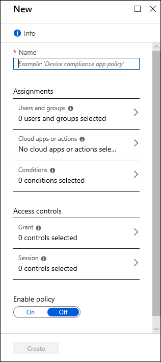

# Building a Conditional Access policy

As explained in the article [What is Conditional Access](overview.md), a Conditional Access policy is an if-then statement, of **Assignments** and **Access controls**. A Conditional Access policy brings signals together, to make decisions, and enforce organizational policies.

How does an organization create these policies? What is required? How are they applied?

Multiple Conditional Access policies may apply to an individual user at any time. In this case, all policies that apply must be satisfied. For example, if one policy requires multi-factor authentication (MFA) and another requires a compliant device, you must complete MFA, and use a compliant device. All assignments are logically **ANDed**. If you have more than one assignment configured, all assignments must be satisfied to trigger a policy.

All policies are enforced in two phases:

- Phase 1: Collect session details 
   - Gather session details, like network location and device identity that will be necessary for policy evaluation. 
   - Phase 1 of policy evaluation occurs for enabled policies and policies in [report-only mode](concept-conditional-access-report-only.md).
- Phase 2: Enforcement 
   - Use the session details gathered in phase 1 to identify any requirements that have not been met. 
   - If there is a policy that is configured to block access, with the block grant control, enforcement will stop here and the user will be blocked. 
   - The user will be prompted to complete additional grant control requirements that were not satisfied during phase 1 in the following order, until policy is satisfied:  
      - Multi-factor authentication​ 
      - Approved client app/app protection policy​ 
      - Managed device (compliant or hybrid Azure AD join)​ 
      - Terms of use 
      - Custom controls  
   - Once all grant controls have been satisfied, apply session controls (App Enforced, Microsoft Cloud App Security, and token Lifetime) 
   - Phase 2 of policy evaluation occurs for all enabled policies. 

## Assignments

The assignments portion controls the who, what, and where of the Conditional Access policy.

### Users and groups

[Users and groups](concept-conditional-access-users-groups.md) assign who the policy will include or exclude. This assignment can include all users, specific groups of users, directory roles, or external guest users. 

### Cloud apps or actions

[Cloud apps or actions](concept-conditional-access-cloud-apps.md) can include or exclude cloud applications or user actions that will be subject to the policy.

### Conditions

A policy can contain multiple [conditions](concept-conditional-access-conditions.md).

#### Sign-in risk

For organizations with [Azure AD Identity Protection](../identity-protection/overview-identity-protection.md), the risk detections generated there can influence your Conditional Access policies.

#### Device platforms

Organizations with multiple device operating system platforms may wish to enforce specific policies on different platforms. 

The information used to calculate the device platform comes from unverified sources such as user agent strings that can be changed.

#### Locations

Location data is provided by IP geolocation data. Administrators can choose to define locations and choose to mark some as trusted like those for their organization's network locations.

#### Client apps

By default Conditional Access policies apply to browser apps, mobile apps, and desktop clients that support modern authentication. 

This assignment condition allows Conditional Access policies to target specific client applications not using modern authentication. These applications include Exchange ActiveSync clients, older Office applications that do not use modern authentication, and mail protocols like IMAP, MAPI, POP, and SMTP.

#### Device state

This control is used to exclude devices that are hybrid Azure AD joined, or marked a compliant in Intune. This exclusion can be done to block unmanaged devices. 

## Access controls

The access controls portion of the Conditional Access policy controls how a policy is enforced.

### Grant

[Grant](concept-conditional-access-grant.md) provides administrators with a means of policy enforcement where they can block or grant access.

#### Block access

Block access does just that, it will block access under the specified assignments. The block control is powerful and should be wielded with the appropriate knowledge.

#### Grant access

The grant control can trigger enforcement of one or more controls. 

- Require multi-factor authentication (Azure AD Multi-Factor Authentication)
- Require device to be marked as compliant (Intune)
- Require Hybrid Azure AD joined device
- Require approved client app
- Require app protection policy
- Require password change
- Require terms of use

Administrators can choose to require one of the previous controls or all selected controls using the following options. The default for multiple controls is to require all.

- Require all the selected controls (control and control)
- Require one of the selected controls (control or control)

### Session

[Session controls](concept-conditional-access-session.md) can limit the experience 

- Use app enforced restrictions
   - Currently works with Exchange Online and SharePoint Online only.
      - Passes device information to allow control of experience granting full or limited access.
- Use Conditional Access App Control
   - Uses signals from Microsoft Cloud App Security to do things like: 
      - Block download, cut, copy, and print of sensitive documents.
      - Monitor risky session behavior.
      - Require labeling of sensitive files.
- Sign-in frequency
   - Ability to change the default sign in frequency for modern authentication.
- Persistent browser session
   - Allows users to remain signed in after closing and reopening their browser window.

## Simple policies

A Conditional Access policy must contain at minimum the following to be enforced:

- **Name** of the policy.
- **Assignments**
   - **Users and/or groups** to apply the policy to.
   - **Cloud apps or actions** to apply the policy to.
- **Access controls**
   - **Grant** or **Block** controls

The article [Common Conditional Access policies](concept-conditional-access-policy-common.md) includes some policies that we think would be useful to most organizations.

## Next steps

[Create a Conditional Access policy](../authentication/tutorial-enable-azure-mfa.md?bc=%2fazure%2factive-directory%2fconditional-access%2fbreadcrumb%2ftoc.json&toc=%2fazure%2factive-directory%2fconditional-access%2ftoc.json#create-a-conditional-access-policy)

[Simulate sign in behavior using the Conditional Access What If tool](troubleshoot-conditional-access-what-if.md)

[Planning a cloud-based Azure AD Multi-Factor Authentication deployment](../authentication/howto-mfa-getstarted.md)

[Managing device compliance with Intune](/intune/device-compliance-get-started)

[Microsoft Cloud App Security and Conditional Access](/cloud-app-security/proxy-intro-aad)