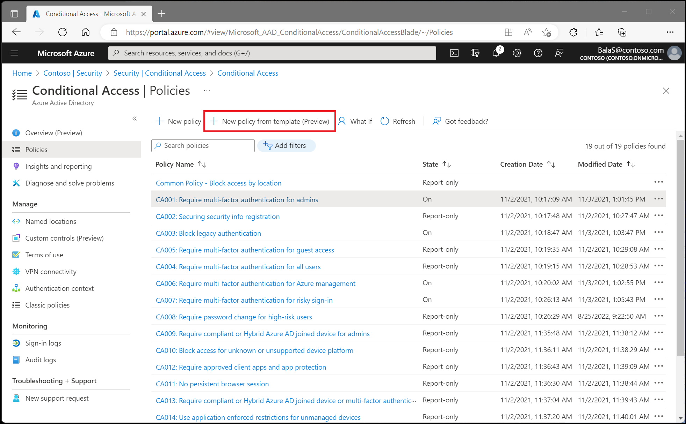

# Common Conditional Access policies

Baseline protection policies are great but many organizations need more flexibility than they offer. For example, many organizations need the ability to exclude specific accounts like their emergency access or break-glass administration accounts from Conditional Access policies requiring multi-factor authentication. For those organizations the common policies referenced in this article can be of use.

## Typical policies deployed by organizations

* [Require MFA for administrators](howto-conditional-access-policy-admin-mfa.md)
* [Require MFA for Azure management](howto-conditional-access-policy-azure-mamgement.md)
* [Block legacy authentication](howto-conditional-access-policy-block-legacy.md)
* [Risk-based Conditional Access (Requires Azure AD Premium P2)](howto-conditional-access-policy-risk.md)
* [Require trusted location for MFA registration](howto-conditional-access-policy-registration.md)
* [Block access by location](howto-conditional-access-policy-location.md)
* [Require compliant device](howto-conditional-access-policy-compliant-device.md)

## Next steps

[Simulate sign in behavior using the Conditional Access What If tool](troubleshoot-conditional-access-what-if.md)
