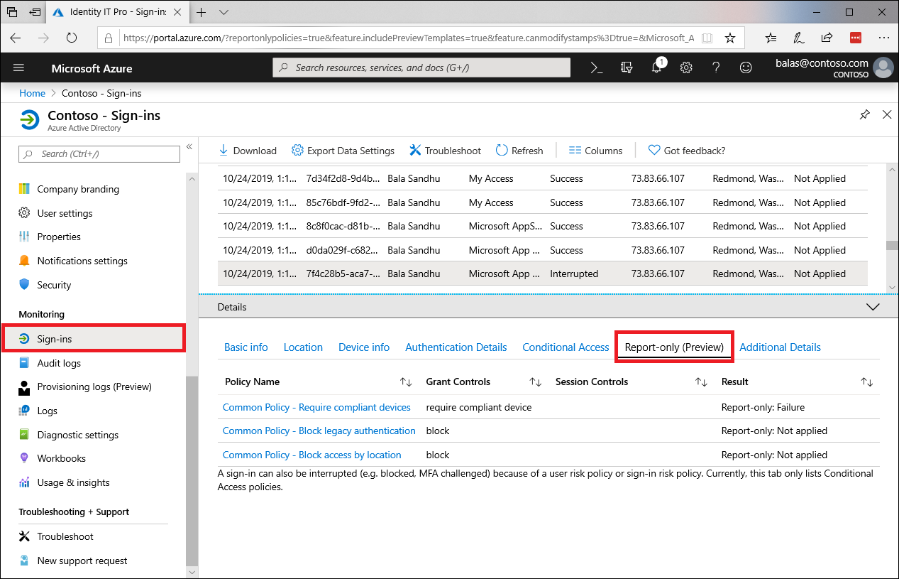

# What is Conditional Access report-only mode?

Conditional Access is widely used by our customers to stay secure by applying the right access controls in the right circumstances. However one of the challenges with deploying a Conditional Access policy in your organization is determining the impact to end users. It can be difficult to anticipate the number and names of users impacted by common deployment initiatives such as blocking legacy authentication, requiring multifactor authentication for a population of users, or implementing sign-in risk policies. 

Report-only mode is a new Conditional Access policy state that allows administrators to evaluate the impact of Conditional Access policies before enabling them in their environment.  With the release of report-only mode:

- Conditional Access policies can be enabled in report-only mode, this isn't applicable with the "User Actions" scope.
- During sign-in, policies in report-only mode are evaluated but not enforced.
- Results are logged in the **Conditional Access** and **Report-only** tabs of the Sign-in log details.
- Customers with an Azure Monitor subscription can monitor the impact of their Conditional Access policies using the Conditional Access insights workbook.

> [!VIDEO https://www.youtube.com/embed/NZbPYfhb5Kc]

> [!WARNING]
> Policies in report-only mode that require compliant devices may prompt users on Mac, iOS, and Android to select a device certificate during policy evaluation, even though device compliance is not enforced. These prompts may repeat until the device is made compliant. To prevent end users from receiving prompts during sign-in, exclude device platforms Mac, iOS and Android from report-only policies that perform device compliance checks. Note that report-only mode is not applicable for Conditional Access policies with "User Actions" scope.

## Policy results

When a policy in report-only mode is evaluated for a given sign-in, there are four new possible result values:

| Result | Description |
| --- | --- |
| Report-only: Success | All configured policy conditions, required non-interactive grant controls, and session controls were satisfied. For example, a multifactor authentication requirement is satisfied by an MFA claim already present in the token, or a compliant device policy is satisfied by performing a device check on a compliant device. |
| Report-only: Failure | All configured policy conditions were satisfied but not all the required non-interactive grant controls or session controls were satisfied. For example, a policy applies to a user where a block control is configured, or a device fails a compliant device policy. |
| Report-only: User action required | All configured policy conditions were satisfied but user action would be required to satisfy the required grant controls or session controls. With report-only mode, the user isn't prompted to satisfy the required controls. For example, users aren't prompted for multifactor authentication challenges or terms of use.   |
| Report-only: Not applied | Not all configured policy conditions were satisfied. For example, the user is excluded from the policy or the policy only applies to certain trusted named locations. |

## Conditional Access Insights workbook

Administrators have the capability to create multiple policies in report-only mode, so it's necessary to understand both the individual impact of each policy and the combined impact of multiple policies evaluated together. The new Conditional Access Insights workbook enables administrators to visualize Conditional Access queries and monitor the impact of a policy for a given time range, set of applications, and users. 
 
## Next steps

[Configure report-only mode on a Conditional Access policy](howto-conditional-access-insights-reporting.md)
