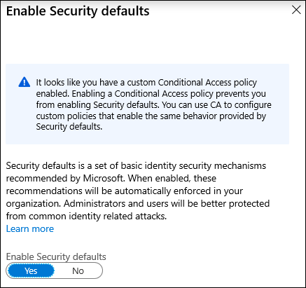

# What are security defaults?

Managing security can be difficult when common identity-related attacks such as password spray, replay, and phishing, are becoming more and more popular. Creating a simpler way to make your organization more secured from these common attacks is the goal of security defaults in Azure Active Directory (AD). Security defaults make it easier to be secure and helps protect your organization from common attacks. Security defaults contain pre-configured security settings for these common attacks. Microsoft is making security defaults available to everyone. The goal is to ensure that all organizations have a basic level of security enabled at no extra cost.

 
The following security configurations will be turned on in your tenant. 

## Unified MFA registration

All users in your tenant will be required register for Azure Multi-Factor Authentication (MFA). Users will have 14 days to register for Azure MFA using the Microsoft Authenticator App. After the 14 days have passed, the user will not be able to sign in until MFA registration has been completed.

We understand that some users may be out of office and/or will not be logging in during the 14 days immediately following enabling security defaults. To ensure every user is given ample time to register for MFA, the 14-day period is unique for each user. A user’s 14-day period begins after their first successful interactive login once security defaults is enabled.

## MFA Enforcement

### Protecting administrators

Users with access to privileged accounts have increased access to your environment. Due to the power these accounts have, you should treat them with special care. One common method to improve the protection of privileged accounts is to require a stronger form of account verification when they are used to sign-in. In Azure Active Directory, you can get a stronger account verification by requiring multi-factor authentication.

Once MFA registration has been completed, the following nine Azure AD administrator roles will be required to perform MFA every single time they sign-in.

- Global administrator
- SharePoint administrator
- Exchange administrator
- Conditional Access administrator
- Security administrator
- Helpdesk administrator / Password administrator
- Billing administrator
- User administrator
- Authentication Administrator

### Protecting all users

We tend to think that administrator accounts are the only accounts that need protection with multi-factor authentication (MFA). Administrators have broad access to sensitive information and can make changes to subscription-wide settings. However, bad actors tend to target end users. After gaining access, these bad actors can request access to privileged information on behalf of the original account holder or download the entire directory to perform a phishing attack on your whole organization. One common method to improve the protection for all users is to require a stronger form of account verification, such as multi factor authentication (MFA) for everyone. Once MFA registration has been completed, users will be prompted for MFA whenever necessary.

### Blocking legacy authentication

To give your users easy access to your cloud apps, Azure Active Directory (Azure AD) supports a broad variety of authentication protocols including legacy authentication. Legacy authentication is a term that refers to an authentication request made by:

- Older Office clients that do not use modern authentication (for example, Office 2010 client)
- Any client that uses legacy mail protocols such as IMAP/SMTP/POP3

Today, the majority of all compromising sign-in attempts come from legacy authentication. Legacy authentication does not support multi-factor authentication (MFA). Even if you have an MFA policy enabled on your directory, a bad actor can authenticate using a legacy protocol and bypass MFA. Once security defaults are enabled in your tenant, all authentication requests made by a legacy protocol to any will be blocked. Security defaults do not block Exchange ActiveSync.

### Protecting privileged actions

Organizations use a variety of Azure services managed through the Azure Resource Manager API including:

- Azure portal 
- Azure PowerShell 
- Azure CLI

Using Azure Resource Manager to manage your services is a highly privileged action. Azure Resource Manager can alter tenant-wide configurations, such as service settings and subscription billing. Single factor authentication is vulnerable to a variety of attacks like phishing and password spray. Therefore, it’s important to verify the identity of users wanting to access Azure Resource Manager and update configurations, by requiring multi-factor authentication before allowing access.

Once security defaults are enabled in your tenant, any user accessing the Azure portal, Azure PowerShell, or Azure CLI will be required to complete multi-factor authentication. This policy applies to all users accessing Azure Resource Manager, regardless of if they’re an administrator or a user. If the user is not registered for MFA, the user will be required to register using the Microsoft Authenticator App in order to proceed. No 14-day MFA registration period will be provided.

## Deployment considerations

The following are some additional considerations related to deployment of security defaults for your tenant.

### Legacy protocols

Legacy authentication protocols (IMAP, SMTP, POP3, etc.) are used by mail clients to make authentication requests. These protocols do not support MFA. Most of the account compromises seen by Microsoft are caused by bad actors performing attacks against legacy protocols attempting to bypass MFA. To ensure that MFA is required when logging into an administrative account and bad actors can’t bypass MFA, security defaults blocks all authentication requests made to administrator accounts from legacy protocols.

> [!WARNING]
> Before you enable this setting, make sure your administrators aren’t using legacy authentication protocols. For more information, see the article [How to move away from legacy authentication](concept-conditional-access-block-legacy-authentication.md).

### Conditional Access

Conditional Access can be used to configure policies that provide the same behavior enabled by security defaults. If you are using Conditional Access and have Conditional Access policies enabled in your environment, security defaults will not be available to you. If you have a license that provides Conditional Access but don’t have any Conditional Access policies enabled in your environment, you are welcome to use security defaults until you enable CA policies.

Here are step-by-step guides on how Conditional Access can be used to configure equivalent policies:

- [Require MFA for administrators](howto-conditional-access-policy-admin-mfa.md)
- [Require MFA for Azure management](howto-conditional-access-policy-azure-management.md)
- [Block legacy authentication](howto-conditional-access-policy-block-legacy.md)

## Enabling security defaults

To enable security defaults in your directory:

1. Sign in to the [Azure portal](https://portal.azure.com) as a security administrator, Conditional Access administrator, or global administrator.
1. Browse to **Azure Active Directory** > **Properties**
1. Select **Manage security defaults**
1. Set the **Enable security defaults** toggle to **Yes**.
1. Click Save.

## Next steps

[Common Conditional Access policies](concept-conditional-access-policy-common.md)

[What is Conditional Access?](overview.md)
