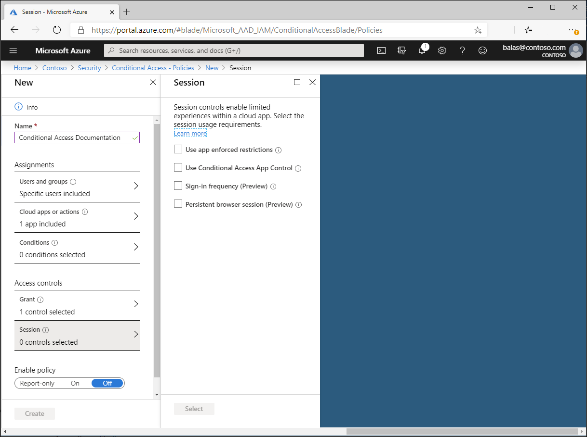

# Conditional Access: Session

Within a Conditional Access policy, an administrator can make use of session controls to enable limited experiences within specific cloud applications.

## Application enforced restrictions

Organizations can use this control to require Azure AD to pass device information to the selected cloud apps. The device information enables the cloud apps to know whether a connection is initiated from a compliant or domain-joined device. This control only supports SharePoint Online and Exchange Online as selected cloud apps. When selected, the cloud app uses the device information to provide users, depending on the device state, with a limited or full experience.

For more information on the use and configuration of app enforced restrictions, see the following articles:

- [Enabling limited access with SharePoint Online](/sharepoint/control-access-from-unmanaged-devices)
- [Enabling limited access with Exchange Online](https://aka.ms/owalimitedaccess)

## Conditional Access application control

Conditional Access App Control uses a reverse proxy architecture and is uniquely integrated with Azure AD Conditional Access. Azure AD Conditional Access allows you to enforce access controls on your organization’s apps based on certain conditions. The conditions define who (user or group of users) and what (which cloud apps) and where (which locations and networks) a Conditional Access policy is applied to. After you’ve determined the conditions, you can route users to [Microsoft Cloud App Security](/cloud-app-security/what-is-cloud-app-security) where you can protect data with Conditional Access App Control by applying access and session controls.

Conditional Access App Control enables user app access and sessions to be monitored and controlled in real time based on access and session policies. Access and session policies are used within the Cloud App Security portal to further refine filters and set actions to be taken on a user. With the access and session policies, you can:

- Prevent data exfiltration: You can block the download, cut, copy, and print of sensitive documents on, for example, unmanaged devices.
- Protect on download: Instead of blocking the download of sensitive documents, you can require documents to be labeled and protected with Azure Information Protection. This action ensures the document is protected and user access is restricted in a potentially risky session.
- Prevent upload of unlabeled files: Before a sensitive file is uploaded, distributed, and used by others, it’s important to make sure that the file has the right label and protection. You can ensure that unlabeled files with sensitive content are blocked from being uploaded until the user classifies the content.
- Monitor user sessions for compliance: Risky users are monitored when they sign into apps and their actions are logged from within the session. You can investigate and analyze user behavior to understand where, and under what conditions, session policies should be applied in the future.
- Block access: You can granularly block access for specific apps and users depending on several risk factors. For example, you can block them if they are using client certificates as a form of device management.
- Block custom activities: Some apps have unique scenarios that carry risk, for example, sending messages with sensitive content in apps like Microsoft Teams or Slack. In these kinds of scenarios, you can scan messages for sensitive content and block them in real time.

For more information, see the article [Deploy Conditional Access App Control for featured apps](/cloud-app-security/proxy-deployment-aad).

## Sign-in frequency

Sign-in frequency defines the time period before a user is asked to sign in again when attempting to access a resource.

Sign-in frequency setting works with apps that have implemented OAUTH2 or OIDC protocols according to the standards. Most Microsoft native apps for Windows, Mac, and Mobile including the following web applications comply with the setting.

- Word, Excel, PowerPoint Online
- OneNote Online
- Office.com
- O365 Admin portal
- Exchange Online
- SharePoint and OneDrive
- Teams web client
- Dynamics CRM Online
- Azure portal

For more information, see the article [Configure authentication session management with Conditional Access](howto-conditional-access-session-lifetime.md#user-sign-in-frequency).

## Persistent browser session

A persistent browser session allows users to remain signed in after closing and reopening their browser window.

For more information, see the article [Configure authentication session management with Conditional Access](howto-conditional-access-session-lifetime.md#persistence-of-browsing-sessions).

## Next steps

- [Conditional Access common policies](concept-conditional-access-policy-common.md)

- [Report-only mode](concept-conditional-access-report-only.md)
