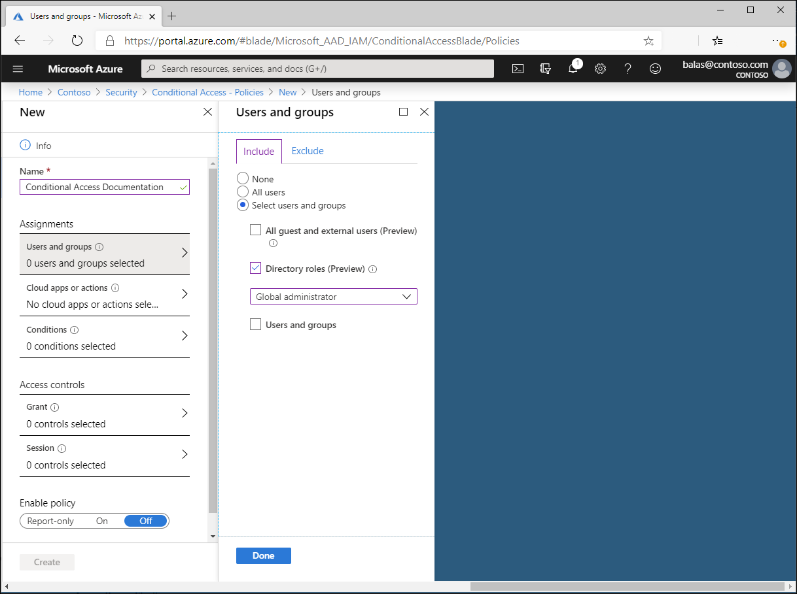

# Conditional Access: Users and groups

A Conditional Access policy must include a user assignment as one of the signals in the decision process. Users can be included or excluded from Conditional Access policies. 

## Include users

This list of users typically includes all of the users an organization is targeting in a Conditional Access policy. 

The following options are available to include when creating a Conditional Access policy.

- None
   - No users selected
- All users
   - All users that exist in the directory including B2B guests.
- Select users and groups
   - All guest and external users
      - This selection includes any B2B guests and external users including any user with the `user type` attribute set to `guest`. This selection also applies to any external user signed-in from a different organization like a Cloud Solution Provider (CSP). 
   - Directory roles
      - Allows administrators to select specific Azure AD directory roles used to determine assignment. For example, organizations may create a more restrictive policy on users assigned the global administrator role.
   - Users and groups
      - Allows targeting of specific sets of users. For example, organizations can select a group that contains all members of the HR department when an HR app is selected as the cloud app. A group can be any type of group in Azure AD, including dynamic or assigned security and distribution groups.

## Exclude users

When organizations both include and exclude a user or group the user or group is excluded from the policy, as an exclude action overrides an include in policy. Exclusions are commonly used for emergency access or break-glass accounts. More information about emergency access accounts and why they are important can be found in the following articles: 

* [Manage emergency access accounts in Azure AD](../users-groups-roles/directory-emergency-access.md)
* [Create a resilient access control management strategy with Azure Active Directory](../authentication/concept-resilient-controls.md)

The following options are available to exclude when creating a Conditional Access policy.

- All guest and external users
   - This selection includes any B2B guests and external users including any user with the `user type` attribute set to `guest`. This selection also applies to any external user signed-in from a different organization like a Cloud Solution Provider (CSP). 
- Directory roles
   - Allows administrators to select specific Azure AD directory roles used to determine assignment. For example, organizations may create a more restrictive policy on users assigned the global administrator role.
- Users and groups
   - Allows targeting of specific sets of users. For example, organizations can select a group that contains all members of the HR department when an HR app is selected as the cloud app. A group can be any type of group in Azure AD, including dynamic or assigned security and distribution groups.

### Preventing administrator lockout

To prevent an administrator from locking themselves out of their directory when creating a policy applied to **All users** and **All apps**, they will see the following warning.

> Don't lock yourself out! We recommend applying a policy to a small set of users first to verify it behaves as expected. We also recommend excluding at least one administrator from this policy. This ensures that you still have access and can update a policy if a change is required. Please review the affected users and apps.

By default the policy will provide an option to exclude the current user from the policy, but this default can be overridden by the administrator as shown in the following image. 

## Next steps

- [Conditional Access: Cloud apps or actions](concept-conditional-access-cloud-apps.md)

- [Conditional Access common policies](concept-conditional-access-policy-common.md)
