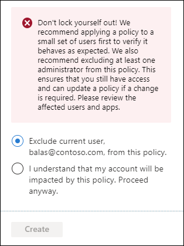

# Conditional Access: Users, groups, and workload identities

A Conditional Access policy must include a user, group, or workload identity assignment as one of the signals in the decision process. These identities can be included or excluded from Conditional Access policies. Azure Active Directory evaluates all policies and ensures that all requirements are met before granting access. 

> [!VIDEO https://www.youtube.com/embed/5DsW1hB3Jqs]

## Include users

This list of users typically includes all of the users an organization is targeting in a Conditional Access policy. 

The following options are available to include when creating a Conditional Access policy.

- None
   - No users selected
- All users
   - All users that exist in the directory including B2B guests.
- Select users and groups
   - Guest or external users
      - This selection provides several choices that can be used to target Conditional Access policies to specific guest or external user types and specific tenants containing those types of users. There are [several different types of guest or external users that can be selected](../external-identities/authentication-conditional-access.md#conditional-access-for-external-users), and multiple selections can be made:
         - B2B collaboration guest users
         - B2B collaboration member users
         - B2B direct connect users
         - Local guest users, for example any user belonging to the home tenant with the user type attribute set to guest
         - Service provider users, for example a Cloud Solution Provider (CSP)
         - Other external users, or users not represented by the other user type selections
      - One or more tenants can be specified for the selected user type(s), or you can specify all tenants. 
   - Directory roles
      - Allows administrators to select specific [built-in Azure AD directory roles](../roles/permissions-reference.md) used to determine policy assignment. For example, organizations may create a more restrictive policy on users actively assigned the Global Administrator role. Other role types aren't supported, including administrative unit-scoped roles and custom roles.
   - Users and groups
      - Allows targeting of specific sets of users. For example, organizations can select a group that contains all members of the HR department when an HR app is selected as the cloud app. A group can be any type of user group in Azure AD, including dynamic or assigned security and distribution groups. Policy is applied to nested users and groups.

> [!IMPORTANT]
> When selecting which users and groups are included in a Conditional Access Policy, there is a limit to the number of individual users that can be added directly to a Conditional Access policy. If there are a large amount of individual users that are needed to be added to directly to a Conditional Access policy, we recommend placing the users in a group, and assigning the group to the Conditional Access policy instead.

> [!WARNING]
> If users or groups are a member of over 2048 groups their access may be blocked. This limit applies to both direct and nested group membership.

> [!WARNING]
> Conditional Access policies do not support users assigned a directory role [scoped to an administrative unit](../roles/admin-units-assign-roles.md) or directory roles scoped directly to an object, like through [custom roles](../roles/custom-create.md).

> [!NOTE]
> When targeting policies to B2B direct connect external users, these policies will also be applied to B2B collaboration users accessing Teams or SharePoint Online who are also eligible for B2B direct connect. The same applies for policies targeted to B2B collaboration external users, meaning users accessing Teams shared channels will have B2B collaboration policies apply if they also have a guest user presence in the tenant.

## Exclude users

When organizations both include and exclude a user or group, the user or group is excluded from the policy. The exclude action overrides the include action in policy. Exclusions are commonly used for emergency access or break-glass accounts. More information about emergency access accounts and why they're important can be found in the following articles: 

* [Manage emergency access accounts in Azure AD](../roles/security-emergency-access.md)
* [Create a resilient access control management strategy with Azure Active Directory](../authentication/concept-resilient-controls.md)

The following options are available to exclude when creating a Conditional Access policy.

- Guest or external users
    - This selection provides several choices that can be used to target Conditional Access policies to specific guest or external user types and specific tenants containing those types of users. There are [several different types of guest or external users that can be selected](../external-identities/authentication-conditional-access.md#conditional-access-for-external-users), and multiple selections can be made:
       - B2B collaboration guest users
       - B2B collaboration member users
       - B2B direct connect users
       - Local guest users, for example any user belonging to the home tenant with the user type attribute set to guest
       - Service provider users, for example a Cloud Solution Provider (CSP)
       - Other external users, or users not represented by the other user type selections
    - One or more tenants can be specified for the selected user type(s), or you can specify all tenants.
- Directory roles
   - Allows administrators to select specific Azure AD directory roles used to determine assignment. For example, organizations may create a more restrictive policy on users assigned the Global Administrator role.
- Users and groups
   - Allows targeting of specific sets of users. For example, organizations can select a group that contains all members of the HR department when an HR app is selected as the cloud app. A group can be any type of group in Azure AD, including dynamic or assigned security and distribution groups. Policy is applied to nested users and groups.

### Preventing administrator lockout

To prevent administrator lockout, when creating a policy applied to **All users** and **All apps**, the following warning appears.

> Don't lock yourself out! We recommend applying a policy to a small set of users first to verify it behaves as expected. We also recommend excluding at least one administrator from this policy. This ensures that you still have access and can update a policy if a change is required. Please review the affected users and apps.

By default the policy provides an option to exclude the current user from the policy, but an administrator can override as shown in the following image. 

If you do find yourself locked out, see [What to do if you're locked out of the Azure portal?](troubleshoot-conditional-access.md#what-to-do-if-youre-locked-out-of-the-azure-portal)

### External partner access

Conditional Access policies that target external users may interfere with service provider access, for example granular delegated admin privileges [Introduction to granular delegated admin privileges (GDAP)](/partner-center/gdap-introduction). For policies that are intended to target service provider tenants, use the **Service provider user** external user type available in the **Guest or external users** selection options.

## Workload identities 

A workload identity is an identity that allows an application or service principal access to resources, sometimes in the context of a user. Conditional Access policies can be applied to single tenant service principals that have been registered in your tenant. Third party SaaS and multi-tenanted apps are out of scope. Managed identities aren't covered by policy.

Organizations can target specific workload identities to be included or excluded from policy.

For more information, see the article [Conditional Access for workload identities](workload-identity.md).

## Next steps

- [Conditional Access: Cloud apps or actions](concept-conditional-access-cloud-apps.md)
- [Conditional Access common policies](concept-conditional-access-policy-common.md)
