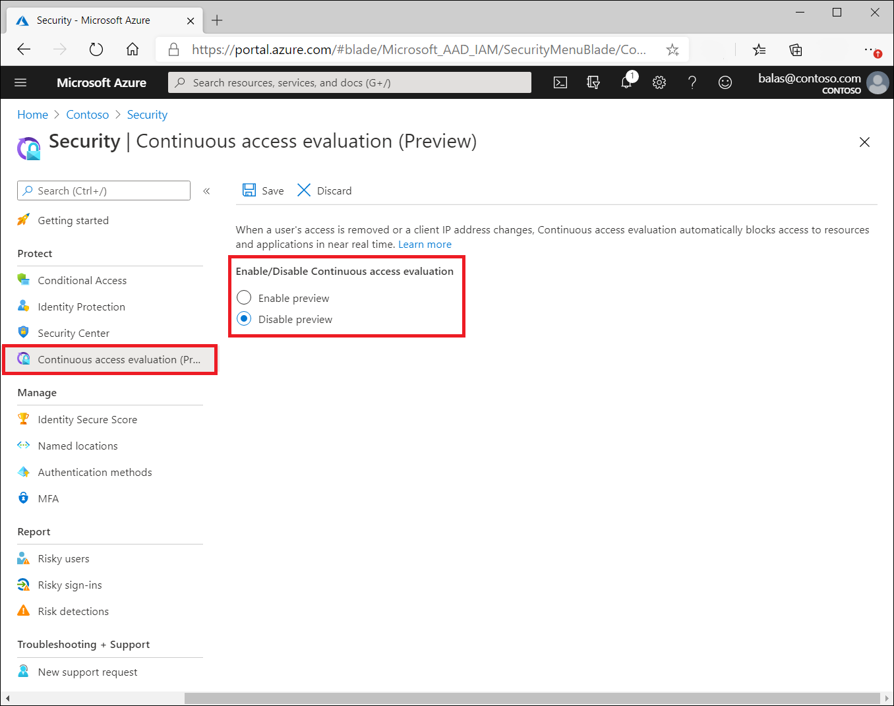

# Continuous access evaluation

Token expiration and refresh is a standard mechanism in the industry. When a client application like Outlook connects to a service like Exchange Online, the API requests are authorized using OAuth 2.0 access tokens. By default, those access tokens are valid for one hour, when they expire, the client is redirected back to Azure AD to refresh them. That refresh period provides an opportunity to reevaluate policies for user access. For example: we might choose not to refresh the token because of a Conditional Access policy, or because the user has been disabled in the directory. 

Customers have expressed concerns about the lag between when conditions change for the user, like network location or credential theft, and when policies can be enforced related to that change. We have experimented with the "blunt object" approach of reduced token lifetimes but found they can degrade user experiences and reliability without eliminating risks.

Timely response to policy violations or security issues really requires a "conversation" between the token issuer, like Azure AD, and the relying party, like Exchange Online. This two-way conversation gives us two important capabilities. The relying party can notice when things have changed, like a client coming from a new location, and tell the token issuer. It also gives the token issuer a way to tell the relying party to stop respecting tokens for a given user due to account compromise, disablement, or other concerns. The mechanism for this conversation is continuous access evaluation (CAE). The goal is for response to be near real time, but in some cases latency of up to 15 minutes may be observed due to event propagation time.

The initial implementation of continuous access evaluation focuses on Exchange, Teams, and SharePoint Online.

To prepare your applications to use CAE, see [How to use Continuous Access Evaluation enabled APIs in your applications](../develop/app-resilience-continuous-access-evaluation.md).

### Key benefits

- User termination or password change/reset: User session revocation will be enforced in near real time.
- Network location change: Conditional Access location policies will be enforced in near real time.
- Token export to a machine outside of a trusted network can be prevented with Conditional Access location policies.

## Scenarios 

There are two scenarios that make up continuous access evaluation, critical event evaluation and Conditional Access policy evaluation.

### Critical event evaluation

Continuous access evaluation is implemented by enabling services, like Exchange Online, SharePoint Online, and Teams, to subscribe to critical events in Azure AD so that those events can be evaluated and enforced near real time. Critical event evaluation does not rely on Conditional Access policies so is available in any tenant. The following events are currently evaluated:

- User Account is deleted or disabled
- Password for a user is changed or reset
- Multi-factor authentication is enabled for the user
- Administrator explicitly revokes all refresh tokens for a user
- High user risk detected by Azure AD Identity Protection

This process enables the scenario where users lose access to organizational SharePoint Online files, email, calendar, or tasks, and Teams from Microsoft 365 client apps within minutes after one of these critical events. 

> [!NOTE] 
> Teams and SharePoint Online does not support user risk events yet.

### Conditional Access policy evaluation (preview)

Exchange Online, SharePoint Online, Teams, and MS Graph are able to synchronize key Conditional Access policies so they can be evaluated within the service itself.

This process enables the scenario where users lose access to organizational files, email, calendar, or tasks from Microsoft 365 client apps or SharePoint Online immediately after network location changes.

> [!NOTE]
> Not all app and resource provider combination are supported. See table below. Office refers to Word, Excel, and PowerPoint.

| | Outlook Web | Outlook Win32 | Outlook iOS | Outlook Android | Outlook Mac |
| :--- | :---: | :---: | :---: | :---: | :---: |
| **SharePoint Online** | Supported | Supported | Supported | Supported | Supported |
| **Exchange Online** | Supported | Supported | Supported | Supported | Supported |

| | Office web apps | Office Win32 apps | Office for iOS | Office for Android | Office for Mac |
| :--- | :---: | :---: | :---: | :---: | :---: |
| **SharePoint Online** | Not Supported | Supported | Supported | Supported | Supported |
| **Exchange Online** | Not Supported | Supported | Supported | Supported | Supported |

| | OneDrive web | OneDrive Win32 | OneDrive iOS | OneDrive Android | OneDrive Mac |
| :--- | :---: | :---: | :---: | :---: | :---: |
| **SharePoint Online** | Supported | Supported | Supported | Supported | Supported |

| | Teams web | Teams Win32 | Teams iOS | Teams Android | Teams Mac |
| :--- | :---: | :---: | :---: | :---: | :---: |
| **Teams Service** | Supported | Supported | Supported | Supported | Supported |
| **SharePoint Online** | Supported | Supported | Supported | Supported | Supported |
| **Exchange Online** | Supported | Supported | Supported | Supported | Supported |

### Client-side claim challenge

Before continuous access evaluation, clients would always try to replay the access token from its cache as long as it was not expired. With CAE, we are introducing a new case that a resource provider can reject a token even when it is not expired. In order to inform clients to bypass their cache even though the cached tokens have not expired, we introduce a mechanism called **claim challenge** to indicate that the token was rejected and a new access token need to be issued by Azure AD. CAE requires a client update to understand claim challenge. The latest version of the following applications below support claim challenge:

| | Web | Win32 | iOS | Android | Mac |
| :--- | :---: | :---: | :---: | :---: | :---: |
| **Outlook** | Supported | Supported | Supported | Supported | Supported |
| **Teams** | Supported | Supported | Supported | Supported | Supported |
| **Office** | Not Supported | Supported | Supported | Supported | Supported |
| **OneDrive** | Supported | Supported | Supported | Supported | Supported |

### Token lifetime

Because risk and policy are evaluated in real time, clients that negotiate continuous access evaluation aware sessions will rely on CAE instead of existing static access token lifetime policies, which means that configurable token lifetime policy will not be honored anymore for CAE-capable clients that negotiate CAE-aware sessions.

Token lifetime is increased to be long lived, up to 28 hours, in CAE sessions. Revocation is driven by critical events and policy evaluation, not just an arbitrary time period. This change increases the stability of applications without affecting security posture. 

If you are not using CAE-capable clients, your default access token lifetime will remain 1 hour unless you have configured your access token lifetime with the [Configurable Token Lifetime (CTL)](../develop/active-directory-configurable-token-lifetimes.md) preview feature.

## Example flows

### User revocation event flow:

1. A CAE-capable client presents credentials or a refresh token to Azure AD asking for an access token for some resource.
1. An access token is returned along with other artifacts to the client.
1. An Administrator explicitly [revokes all refresh tokens for the user](/powershell/module/azuread/revoke-azureaduserallrefreshtoken). A revocation event will be sent to the resource provider from Azure AD.
1. An access token is presented to the resource provider. The resource provider evaluates the validity of the token and checks whether there is any revocation event for the user. The resource provider uses this information to decide to grant access to the resource or not.
1. In this case, the resource provider denies access, and sends a 401+ claim challenge back to the client.
1. The CAE-capable client understands the 401+ claim challenge. It bypasses the caches and goes back to step 1, sending its refresh token along with the claim challenge back to Azure AD. Azure AD will then reevaluate all the conditions and prompt the user to reauthenticate in this case.

### User condition change flow (Preview):

In the following example, a Conditional Access administrator has configured a location based Conditional Access policy to only allow access from specific IP ranges:

1. A CAE-capable client presents credentials or a refresh token to Azure AD asking for an access token for some resource.
1. Azure AD evaluates all Conditional Access policies to see whether the user and client meet the conditions.
1. An access token is returned along with other artifacts to the client.
1. User moves out of an allowed IP range
1. The client presents an access token to the resource provider from outside of an allowed IP range.
1. The resource provider evaluates the validity of the token and checks the location policy synced from Azure AD.
1. In this case, the resource provider denies access, and sends a 401+ claim challenge back to the client because it is not coming from allowed IP range.
1. The CAE-capable client understands the 401+ claim challenge. It bypasses the caches and goes back to step 1, sending its refresh token along with the claim challenge back to Azure AD. Azure AD reevaluates all the conditions and will deny access in this case.

## Enable or disable CAE (Preview)

1. Sign in to the **Azure portal** as a Conditional Access Administrator, Security Administrator, or Global Administrator
1. Browse to **Azure Active Directory** > **Security** > **Continuous access evaluation**.
1. Choose **Enable preview**.
1. Select **Save**.

From this page, you can optionally limit the users and groups that will be subject to the preview.

> [!WARNING]
> To disable continuous access evaluation please select **Enable preview** then **Disable preview** and select **Save**.

> [!NOTE]
>You can query the Microsoft Graph via [**continuousAccessEvaluationPolicy**](/graph/api/continuousaccessevaluationpolicy-get?view=graph-rest-beta&tabs=http#request-body) to verify the configuration of CAE in your tenant. An HTTP 200 response and associated response body indicate whether CAE is enabled or disabled in your tenant. CAE is not configured if Microsoft Graph returns an HTTP 404 response.

## Troubleshooting

### Supported location policies

For CAE, we only have insights into named IP-based named locations. We have no insights into other location settings like [MFA trusted IPs](../authentication/howto-mfa-mfasettings.md#trusted-ips) or country-based locations. When user comes from an MFA trusted IP or trusted locations that include MFA Trusted IPs or country location, CAE will not be enforced after user move to a different location. In those cases, we will issue a 1-hour CAE token without instant IP enforcement check.

> [!IMPORTANT]
> When configuring locations for continuous access evaluation, use only the [IP based Conditional Access location condition](../conditional-access/location-condition.md) and configure all IP addresses, **including both IPv4 and IPv6**, that can be seen by your identity provider and resources provider. Do not use country location conditions or the trusted ips feature that is available in Azure AD Multi-Factor Authentication's service settings page.

### IP address configuration

Your identity provider and resource providers may see different IP addresses. This mismatch may happen due to network proxy implementations in your organization or incorrect IPv4/IPv6 configurations between your identity provider and resource provider. For example:

- Your identity provider sees one IP address from the client.
- Your resource provider sees a different IP address from the client after passing through a proxy.
- The IP address your identity provider sees is part of an allowed IP range in policy but the IP address from the resource provider is not.

If this scenario exists in your environment to avoid infinite loops, Azure AD will issue a one hour CAE token and will not enforce client location change. Even in this case, security is improved compared to traditional one hour tokens since we are still evaluating the [other events](#critical-event-evaluation) besides client location change events.

### Office and Web Account Manager settings

| Office update channel | DisableADALatopWAMOverride | DisableAADWAM |
| --- | --- | --- |
| Semi-Annual Enterprise Channel | If set to enabled or 1, CAE is not be supported. | If set to enabled or 1, CAE is not be supported. |
| Current Channel   or   Monthly Enterprise Channel | CAE is supported regardless of the setting | CAE is supported regardless of the setting |

For an explanation of the office update channels, see [Overview of update channels for Microsoft 365 Apps](/deployoffice/overview-update-channels). It is recommended that organizations do not disable Web Account Manager (WAM).

### Group membership and Policy update effective time

Group membership and policy update made by administrators could take up to one day to be effective. Some optimization has been done for policy updates which reduce the delay to two hours. However, it does not cover all the scenarios yet. 

If there is an emergency and you need to have your policies updated or group membership change to be applied to certain users immediately, you should use this [PowerShell command](/powershell/module/azuread/revoke-azureaduserallrefreshtoken) or "Revoke Session" in the user profile page to revoke the users' session, which will make sure that the updated policies will be applied immediately.

### Coauthoring in Office apps

When multiple users are collaborating on the same document at the same time, the user's access to the document may not be immediately revoked by CAE based on user revocation or policy change events. In this case, the user loses access completely after, closing the document, closing Word, Excel, or PowerPoint, or after a period of 10 hours.

To reduce this time a SharePoint Administrator can optionally reduce the maximum lifetime of coauthoring sessions for documents stored in SharePoint Online and OneDrive for Business, by [configuring a network location policy in SharePoint Online](/sharepoint/control-access-based-on-network-location). Once this configuration is changed, the maximum lifetime of coauthoring sessions will be reduced to 15 minutes, and can be adjusted further using the SharePoint Online PowerShell command "Set-SPOTenant –IPAddressWACTokenLifetime"

### Enable after a user is disabled

If you enable a user right after it is disabled. There will be some latency before the account can be enabled. SPO and Teams will have 15-mins delay. The delay is 35-40 minutes for EXO.

## FAQs

### How will CAE work with Sign-in Frequency?

Sign-in Frequency will be honored with or without CAE.

## Next steps

- [Announcing continuous access evaluation](https://techcommunity.microsoft.com/t5/azure-active-directory-identity/moving-towards-real-time-policy-and-security-enforcement/ba-p/1276933)
- [How to use Continuous Access Evaluation enabled APIs in your applications](../develop/app-resilience-continuous-access-evaluation.md)
- [Claims challenges, claims requests, and client capabilities](../develop/claims-challenge.md)
