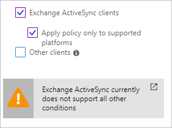
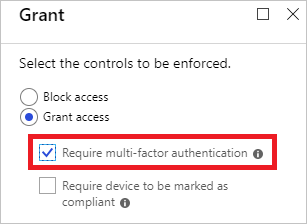
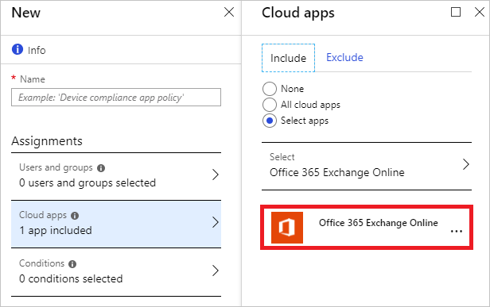

# How To: Set up SharePoint Online and Exchange Online for Azure Active Directory conditional access 

With [Azure Active Directory (Azure AD) conditional access](overview.md), you can control how users access your cloud apps. If you want to use conditional access to control access to SharePoint and Exchange online, you need to:

- Review whether your conditional access scenario is supported
- Prevent client apps from bypassing the enforcement of your conditional access policies.   

This article explains, how you can address both cases.

## What you need to know

You can use Azure AD conditional access to protect cloud apps when an authentication attempt comes from:

- A web browser

- A client app that uses [modern authentication](https://support.office.com/article/Using-Office-365-modern-authentication-with-Office-clients-776c0036-66fd-41cb-8928-5495c0f9168a)

- Exchange ActiveSync 

Some cloud apps also support legacy authentication protocols. This applies, for example, to SharePoint Online and Exchange Online. When a client app can use a legacy authentication protocol to access a cloud app, Azure AD cannot enforce a conditional access policy on this access attempt. To prevent a client app from bypassing the enforcement of policies, you should check whether it is possible to only enable modern authentication on the affected cloud apps. 

Examples for client apps conditional access does not apply to are:

- Office 2010 and earlier

- Office 2013 when modern authentication is not enabled

 
## Control access to SharePoint Online

In addition to modern authentication, SharePoint Online also supports legacy authentication protocols. If the legacy authentication protocols are enabled, your conditional access policies for SharePoint are not enforced for clients that don't use modern authentication.

You can disable legacy authentication protocols for SharePoint access by using the **[Set-SPOTenant](https://technet.microsoft.com/library/fp161390.aspx)** cmdlet: 

	Set-SPOTenant -LegacyAuthProtocolsEnabled $false

## Control access to Exchange Online

When you set up conditional access policies for Exchange Online, you need to review the following:

- Exchange ActiveSync

- Legacy authentication protocols

### Exchange ActiveSync

While Exchange Active Sync supports modern authentication, there are some limitations regarding the support for conditional access scenarios:

- You can only configure the device platforms condition  

    

- Setting the multi-factor authentication requirement is not supported  

    

To effectively protect access to Exchange Online from Exchange ActiveSync, you can:

- Configure a supported conditional access policy by following these steps:

    a. Select just **Office 365 Exchange Online** as cloud app.  

    

    b. Select **Exchange Active Sync** as **client app**, and then select **Apply policy only to supported platforms**.  

    

- Block Exchange ActiveSync by using Active Directory Federation Services (AD FS) rules.

        @RuleName = "Block Exchange ActiveSync"
        c1:[Type == "http://schemas.microsoft.com/2012/01/requestcontext/claims/x-ms-client-application", Value == "Microsoft.Exchange.ActiveSync"]
        => issue(Type = "http://schemas.microsoft.com/authorization/claims/permit", Value = "false");

### Legacy authentication protocols

In addition to modern authentication, Exchange Online also supports legacy authentication protocols. If legacy authentication protocols are enabled, your conditional access policies for Exchange Online are not enforced for clients that don't use modern authentication.

You can disable legacy authentication protocols for Exchange Online by setting AD FS rules. This blocks access from:

- Older Office clients, such as Office 2013 that don't have modern authentication enabled 

- Earlier versions of Office

## Set up AD FS rules

You can use the following issuance authorization rules to enable or block traffic at the AD FS level. 

### Block legacy traffic from the extranet

By applying the following three rules: 

- You enable access for:
    - Exchange ActiveSync traffic
    - Browser traffic
    - Modern authentication traffic
- You block access for: 
    - Legacy client apps from the extranet

**Rule 1:**

    @RuleName = "Allow all intranet traffic"
    c1:[Type == "http://schemas.microsoft.com/ws/2012/01/insidecorporatenetwork", Value == "true"]
    => issue(Type = "http://schemas.microsoft.com/authorization/claims/permit", Value = "true");

**Rule 2:**

    @RuleName = "Allow Exchange ActiveSync"
    c1:[Type == "http://schemas.microsoft.com/2012/01/requestcontext/claims/x-ms-client-application", Value == "Microsoft.Exchange.ActiveSync"]
    => issue(Type = "http://schemas.microsoft.com/authorization/claims/permit", Value = "true");

**Rule 3:**

    @RuleName = "Allow extranet browser and browser dialog traffic"
    c1:[Type == "http://schemas.microsoft.com/ws/2012/01/insidecorporatenetwork", Value == "false"] &&
    c2:[Type == "http://schemas.microsoft.com/2012/01/requestcontext/claims/x-ms-endpoint-absolute-path", Value =~ "(/adfs/ls)|(/adfs/oauth2)"]
    => issue(Type = "http://schemas.microsoft.com/authorization/claims/permit", Value = "true");

### Block legacy traffic from anywhere

By applying the following three rules:

- You enable access for: 
    - Exchange ActiveSync traffic
    - Browser traffic
    - Modern authentication traffic
- You block access for: 
    - Legacy apps from any location

##### Rule 1
    @RuleName = "Allow all intranet traffic only for browser and modern authentication clients"
    c1:[Type == "http://schemas.microsoft.com/ws/2012/01/insidecorporatenetwork", Value == "true"] &&
    c2:[Type == "http://schemas.microsoft.com/2012/01/requestcontext/claims/x-ms-endpoint-absolute-path", Value =~ "(/adfs/ls)|(/adfs/oauth2)"]
    => issue(Type = "http://schemas.microsoft.com/authorization/claims/permit", Value = "true");

##### Rule 2
    @RuleName = "Allow Exchange ActiveSync"
    c1:[Type == "http://schemas.microsoft.com/2012/01/requestcontext/claims/x-ms-client-application", Value == "Microsoft.Exchange.ActiveSync"]
    => issue(Type = "http://schemas.microsoft.com/authorization/claims/permit", Value = "true");

##### Rule 3
    @RuleName = "Allow extranet browser and browser dialog traffic"
    c1:[Type == "http://schemas.microsoft.com/ws/2012/01/insidecorporatenetwork", Value == "false"] &&
    c2:[Type == "http://schemas.microsoft.com/2012/01/requestcontext/claims/x-ms-endpoint-absolute-path", Value =~ "(/adfs/ls)|(/adfs/oauth2)"]
    => issue(Type = "http://schemas.microsoft.com/authorization/claims/permit", Value = "true");

## Next steps

For more information, see [What is conditional access in Azure Active Directory](overview.md).

For instructions about configuring claim rules, see [Configure Claim Rules](https://docs.microsoft.com/windows-server/identity/ad-fs/operations/configure-claim-rules). 

