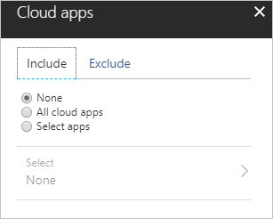

# What are conditions in Azure Active Directory conditional access? 

You can control how authorized users access your cloud apps by using [Azure Active Directory (Azure AD) conditional access](https://docs.microsoft.com/azure/active-directory/active-directory-conditional-access-azure-portal). In a conditional access policy, you define the response ("Then do this") to the reason for triggering your policy ("When this happens"). 

In the context of conditional access, **When this happens** is called a **condition**. **Then do this** is called an **access control**. The combination of your conditions and your access controls represents a conditional access policy.

Conditions you haven't configured in a conditional access policy aren't applied. Some conditions are [mandatory](best-practices.md) to apply a conditional access policy to an environment. 

This article is an overview of the conditions and how they're used in a conditional access policy. 

## Users and groups

The users and groups condition is mandatory in a conditional access policy. In your policy, you can either select **All users** or select specific users and groups.

When you select **All users**, your policy is applied to all users in the directory, including guest users.

When you **Select users and groups**, you can set the following options:

* **All guest users** targets a policy to B2B guest users. This condition matches any user account that has the **userType** attribute set to **guest**. You can use this setting when a policy needs to be applied as soon as the account is created in an invite flow in Azure AD.

* **Directory roles** targets a policy based on a user’s role assignment. This condition supports directory roles like **Global administrator** or **Password administrator**.

* **Users and groups** targets specific sets of users. For example, you can select a group that contains all members of the HR department when an HR app is selected as the cloud app. A group can be any type of group in Azure AD, including dynamic or assigned security and distribution groups.

You can also exclude specific users or groups from a policy. One common use case is service accounts if your policy enforces multifactor authentication (MFA). 

Targeting specific sets of users is useful for the deployment of a new policy. In a new policy, you should target only an initial set of users to validate the policy behavior. 

## Cloud apps 

A cloud app is a website or service. Websites protected by the Azure AD Application Proxy are also cloud apps. For a detailed description of supported cloud apps, see [cloud apps assignments](https://docs.microsoft.com/azure/active-directory/active-directory-conditional-access-technical-reference#cloud-apps-assignments). 

The **cloud apps** condition is mandatory in a conditional access policy. In your policy, you can either select **All cloud apps** or select specific apps.

Select:

- **All cloud apps** to baseline policies to apply to the entire organization. Use this selection for policies that require multifactor authentication when sign-in risk is detected for any cloud app. A policy applied to **All cloud apps** applies to access to all websites and services. This setting isn't limited to the cloud apps that appear on the **Select apps** list. 

- Individual cloud apps to target specific services by policy. For example, you can require users to have a [compliant device](https://docs.microsoft.com/azure/active-directory/active-directory-conditional-access-mam#app-based-or-compliant-device-policy-for-exchange-online-and-sharepoint-online) to access SharePoint Online. This policy is also applied to other services when they access SharePoint content. An example is Microsoft Teams. 

You can exclude specific apps from a policy. However, these apps are still subject to the policies applied to the services they access. 

## Sign-in risk

A sign-in risk is an indicator of the likelihood (high, medium, or low) that a sign-in attempt wasn't made by the legitimate owner of a user account. Azure AD calculates the sign-in risk level during a user's sign-in. 
You can use the calculated sign-in risk level as condition in a conditional access policy.

To use this condition, you need to have [Azure Active Directory Identity Protection](https://docs.microsoft.com/azure/active-directory/active-directory-identityprotection-enable) enabled.
 
Common use cases for this condition are policies that have the following protections: 

- Block users with a high sign-in risk. This protection prevents potentially non-legitimate users from accessing your cloud apps. 
- Require multifactor authentication for users with a medium sign-in risk. By enforcing multifactor authentication, you can provide additional confidence that the sign-in is done by the legitimate owner of an account.

For more information, see [Risky sign-ins](https://docs.microsoft.com/azure/active-directory/active-directory-reporting-security-risky-sign-ins).  

## Device platforms

The device platform is characterized by the operating system that runs on your device. Azure AD identifies the platform by using information provided by the device, such as user agent. This information is unverified. We recommend that all platforms have a policy applied to them. The policy should either block access, require compliance with Microsoft Intune policies, or require the device be domain joined. The default is to apply a policy to all device platforms. 

For a list of the supported device platforms, see [device platform condition](technical-reference.md#device-platform-condition).

A common use case for this condition is a policy that restricts access to your cloud apps to [managed devices](require-managed-devices.md). For more scenarios including the device platform condition, see [Azure Active Directory app-based conditional access](app-based-conditional-access.md).

## Device state

The device state condition excludes hybrid Azure AD joined devices and devices marked as compliant from a conditional access policy. This condition is useful when a policy should apply only to an unmanaged device to provide additional session security. For example, only enforce the Microsoft Cloud App Security session control when a device is unmanaged. 

If you want to block access for unmanaged devices, implement [device-based conditional access](https://docs.microsoft.com/azure/active-directory/conditional-access/app-based-conditional-access#app-based-or-compliant-device-policy-for-exchange-online-and-sharepoint-online).

## Locations

By using locations, you can define conditions based on where a connection was attempted. 

Common use cases for this condition are policies with the following protections:

- Require multifactor authentication for users accessing a service when they're off the corporate network.  

- Block access for users accessing a service from specific countries or regions. 

For more information, see [What is the location condition in Azure Active Directory conditional access?](https://docs.microsoft.com/azure/active-directory/active-directory-conditional-access-locations).

## Client apps

By default, a conditional access policy applies to all:

- [Browser apps](technical-reference.md#supported-browsers) 

- [Mobile and desktop apps using modern authentication](technical-reference.md#supported-mobile-applications-and-desktop-clients)

An app is classified as follows:

- A website or service if it uses web SSO protocols, SAML, WS-Fed, or OpenID Connect for a confidential client.

- A mobile app or desktop application if it uses the mobile app OpenID Connect for a native client.

With the client apps condition, you have the option to target a policy to specific subsets of apps, authentication protocols and mail applications that use Microsoft Exchange ActiveSync.

Common use cases for this condition are policies with the following requirements:

- **[Require a managed device](require-managed-devices.md)** for mobile and desktop applications that download large amounts of data to the device. At the same time, allow browser access from any device.

- **[Require a managed device](require-managed-devices.md)** apps using ActiveSync to access Exchange Online.

- **[Block legacy authentication](block-legacy-authentication.md)** to Azure AD (other clients)

- Block access from web applications but allow access from mobile and desktop applications.

### Exchange ActiveSync clients

You can only select **Exchange ActiveSync clients** if:

- Microsoft Office 365 Exchange Online is the only cloud app you've selected.

    

- You don't have other conditions configured in a policy. However, you can narrow down the scope of this condition to apply only to [supported platforms](technical-reference.md#device-platform-condition).
 
    

All controls except [requiring a managed device](require-managed-devices.md) lead to a block.

You can only target this setting to users and groups. It doesn’t support guests or roles. If a guest or role condition is configured, all users are blocked because conditional access can't determine if the policy should apply to the user or not.

 For more information, see:

- [Set up SharePoint Online and Exchange Online for Azure Active Directory conditional access](https://docs.microsoft.com/azure/active-directory/active-directory-conditional-access-no-modern-authentication).
 
- [Azure Active Directory app-based conditional access](https://docs.microsoft.com/azure/active-directory/conditional-access/app-based-conditional-access). 

## Next steps

- To find out how to configure a conditional access policy, see [Quickstart: Require MFA for specific apps with Azure Active Directory conditional access](app-based-mfa.md).

- To configure conditional access policies for your environment, see the [Best practices for conditional access in Azure Active Directory](best-practices.md). 

