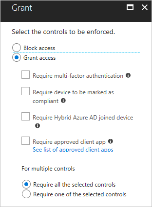
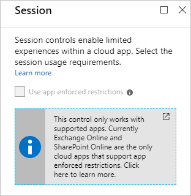

# What are access controls in Azure Active Directory conditional access? 

With [Azure Active Directory (Azure AD) conditional access](../active-directory-conditional-access-azure-portal.md), you can control how authorized users access your cloud apps. In a conditional access policy, you define the response ("do this") to the reason for triggering your policy ("when this happens"). 

In the context of conditional access, 

- "**When this happens**" is called **conditions**

- "**Then do this**" is called **access controls**

The combination of a condition statement with your controls represents a conditional access policy.

Each control is either a requirement that must be fulfilled by the person or system signing in, or a restriction on what the user can do after signing in. 

There are two types of controls: 

- **Grant controls** - To gate access

- **Session controls** - To restrict access within a session

This topic explains the various controls that are available in Azure AD conditional access. 

## Grant controls

With grant controls, you can either block access altogether or allow access with additional requirements by selecting the desired controls. For multiple controls, you can require:

- All selected controls to be fulfilled (*AND*) 
- One selected control to be fulfilled (*OR*)

### Multi-factor authentication

You can use this control to require multi-factor authentication to access the specified cloud app. This control supports the following multi-factor providers: 

- Azure Multi-Factor Authentication 

- An on-premises multi-factor authentication provider, combined with Active Directory Federation Services (AD FS).
 
Using multi-factor authentication helps protect resources from being accessed by an unauthorized user who might have gained access to the primary credentials of a valid user.

### Compliant device

You can configure conditional access policies that are device-based. The objective of a device-based conditional access policy is to grant access to the configured resources only from [managed devices](require-managed-devices.md). Requiring a compliant device is one option you have to define what a managed device is. If this option is selected, your conditional access policy grants access to access attempts made with devices that are [registered](../devices/overview.md) to your Azure Active Directory and are marked as compliant by Intune (for any device OS) or by your third-party MDM system for Windows 10 devices. Third-party MDM systems for device OS types other than Windows 10 are not supported.

For more information, see [set up Azure Active Directory device-based conditional access policies](require-managed-devices.md).

### Hybrid Azure AD joined device

Requiring a Hybrid Azure AD joined device is another option you have to configure device-based conditional access policies. This requirement refers to Windows desktops, laptops, and enterprise tablets that are joined to an on-premises Active Directory. If this option is selected, your conditional access policy grants access to access attempts made with devices that are joined to your on-premises Active Directory and your Azure Active Directory.  

For more information, see [set up Azure Active Directory device-based conditional access policies](require-managed-devices.md).

### Approved client app

Because your employees use mobile devices for both personal and work tasks, you might want to have the ability to protect company data accessed using devices even in the case where they are not managed by you.
You can use [Intune app protection policies](https://docs.microsoft.com/intune/app-protection-policy) to help protect your company’s data independent of any mobile-device management (MDM) solution.

With approved client apps, you can require a client app that attempts to access your cloud apps to support [Intune app protection policies](https://docs.microsoft.com/intune/app-protection-policy). For example, you can restrict access to Exchange Online to the Outlook app. A conditional access policy that requires approved client apps is  also known as [app-based conditional access policy](app-based-conditional-access.md). For a list of supported approved client apps, see [approved client app requirement](technical-reference.md#approved-client-app-requirement).

### Terms of Use

You can require a user in your tenant to consent to the terms of use before being granted access to a resource. As an administrator, you can configure and customize terms of use by uploading a PDF document. If a user falls in scope of this control access to an application is only granted if the terms of use have been agreed. 

### Custom controls 

You can create custom controls in Conditional Access that redirect your users to a compatible service to satisfy further requirements outside of Azure Active Directory. This allows you to use certain external multi-factor authentication and verification providers to enforce Conditional Access rules, or to build your own custom service. To satisfy this control, a user’s browser is redirected to the external service, performs any required authentication or validation activities, and is then redirected back to Azure Active Directory. If the user was successfully authenticated or validated, the user continues in the Conditional Access flow. 

## Custom controls

Custom controls are a capability of the Azure Active Directory Premium P1 edition. When using custom controls, your users are redirected to a compatible service to satisfy further requirements outside of Azure Active Directory. To satisfy this control, a user’s browser is redirected to the external service, performs any required authentication or validation activities, and is then redirected back to Azure Active Directory. Azure Active Directory verifies the response and, if the user was successfully authenticated or validated, the user continues in the conditional access flow.

These controls allow the use of certain external or custom services as conditional access controls, and generally extend the capabilities of Conditional Access.

Providers currently offering a compatible service include:

- [Duo Security](https://duo.com/docs/azure-ca)
- [Entrust Datacard](https://www.entrustdatacard.com/products/authentication/intellitrust)
- [Ping Identity](https://documentation.pingidentity.com/pingid/pingidAdminGuide/index.shtml#pid_c_AzureADIntegration.html)
- RSA
- [Trusona](https://www.trusona.com/docs/azure-ad-integration-guide)

For more information on those services, contact the providers directly.

### Creating custom controls

To create a custom control, you should first contact the provider that you wish to utilize. Each non-Microsoft provider has its own process and requirements to sign up, subscribe, or otherwise become a part of the service, and to indicate that you wish to integrate with conditional access. At that point, the provider will provide you with a block of data in JSON format. This data allows the provider and conditional access to work together for your tenant, creates the new control and defines how conditional access can tell if your users have successfully performed verification with the provider.

Copy the JSON data and then paste it into the related textbox. Do not make any changes to the JSON unless you explicitly understand the change you’re making. Making any change could break the connection between the provider and Microsoft and potentially lock you and your users out of your accounts.

The option to create a custom control is in the **Manage** section of the **Conditional access** page.

Clicking **New custom control**, opens a blade with a textbox for the JSON data of your control.  

### Deleting custom controls

To delete a custom control, you must first ensure that it isn’t being used in any conditional access policy. Once complete:

1. Go to the Custom controls list

2. Click …  

3. Select **Delete**.

### Editing custom controls

To edit a custom control, you must delete the current control and create a new control with the updated information.

## Session controls

Session controls enable limited experience within a cloud app. The session controls are enforced by cloud apps and rely on additional information provided by Azure AD to the app about the session.

### Use app enforced restrictions

You can use this control to require Azure AD to pass the device information to the cloud app. This helps the cloud app know if the user is coming from a compliant device or domain joined device. This control is currently only supported with SharePoint as the cloud app. SharePoint uses the device information to provide users a limited or full experience depending on the device state.
To learn more about how to require limited access with SharePoint, see [control access from unmanaged devices](https://aka.ms/spolimitedaccessdocs).

## Next steps

- If you want to know how to configure a conditional access policy, see [Require MFA for specific apps with Azure Active Directory conditional access](app-based-mfa.md).

- If you are ready to configure conditional access policies for your environment, see the [best practices for conditional access in Azure Active Directory](best-practices.md). 
