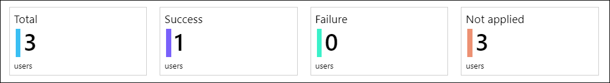
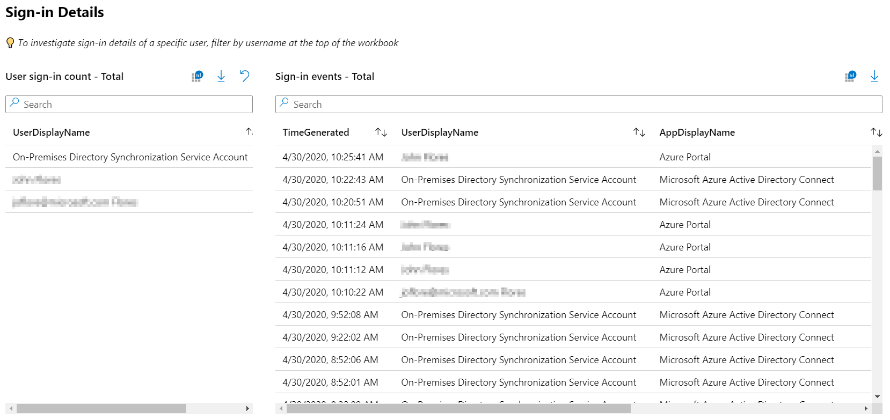
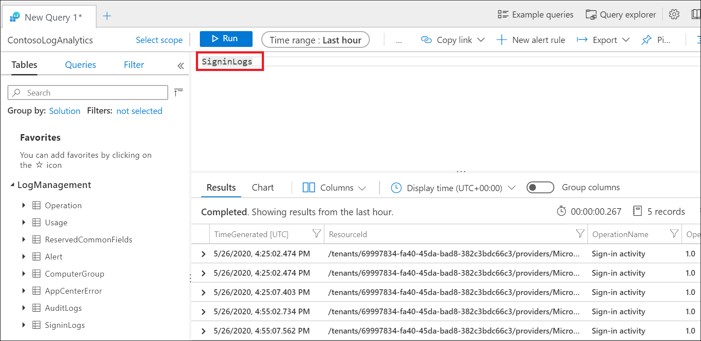

# Conditional Access insights and reporting

The Conditional Access insights and reporting workbook enables you to understand the impact of Conditional Access policies in your organization over time. During sign-in, one or more Conditional Access policies may apply, granting access if certain grant controls are satisfied or denying access otherwise. Because multiple Conditional Access policies may be evaluated during each sign-in, the insights and reporting workbook lets you examine the impact of an individual policy or a subset of all policies.  

## Prerequisites

To enable the insights and reporting workbook, your tenant must have a Log Analytics workspace to retain sign-in logs data. Users must have Microsoft Entra ID P1 or P2 licenses to use Conditional Access.

Users must have at least the Security Reader role assigned and Log Analytics workspace Contributor roles assigned.

### Stream sign-in logs from Microsoft Entra ID to Azure Monitor logs 

If you haven't integrated Microsoft Entra logs with Azure Monitor logs, you need to take the following steps before the workbook loads:  

1. [Create a Log Analytics workspace in Azure Monitor](../../azure-monitor/logs/quick-create-workspace.md).
1. [Integrate Microsoft Entra logs with Azure Monitor logs](../reports-monitoring/howto-integrate-activity-logs-with-log-analytics.md).

## How it works 

To access the insights and reporting workbook:  

1. Sign in to the [Microsoft Entra admin center](https://entra.microsoft.com) as at least a [Conditional Access Administrator](../roles/permissions-reference.md#conditional-access-administrator).
1. Browse to **Protection** > **Conditional Access** > **Insights and reporting**.

### Get started: Select parameters 

The insights and reporting dashboard lets you see the impact of one or more Conditional Access policies over a specified period. Start by setting each of the parameters at the top of the workbook. 

:::image type="content" source="media/howto-conditional-access-insights-reporting/conditional-access-insights-and-reporting-dashboard.png" alt-text="Screenshot showing the Conditional Access insights and reporting workbook." lightbox="media/howto-conditional-access-insights-reporting/conditional-access-insights-and-reporting-dashboard-expanded.png":::

**Conditional Access policy**: Select one or more Conditional Access policies to view their combined impact. Policies are separated into two groups: Enabled and Report-only policies. By default, all Enabled policies are selected. These enabled policies are the policies currently enforced in your tenant.  

**Time range**: Select a time range from 4 hours to as far back as 90 days. If you select a time range further back than when you integrated the Microsoft Entra logs with Azure Monitor, only sign-ins after the time of integration appear.  

**User**: By default, the dashboard shows the impact of the selected policies for all users. To filter by an individual user, type the name of the user into the text field. To filter by all users, type “All users” into the text field or leave the parameter empty. 

**App**: By default, the dashboard shows the impact of the selected policies for all apps. To filter by an individual app, type the name of the app into the text field. To filter by all apps, type “All apps” into the text field or leave the parameter empty. 

**Data view**: Select whether you want the dashboard to show results in terms of the number of users or number of sign-ins. An individual user may have hundreds of sign-ins to many apps with many different outcomes during a given time range. If you select the data view to be users, a user could be included in both the Success and Failure counts. For example, if there are 10 users, 8 of them could have had a result of success in the past 30 days and 9 of them could have had a result of failure in the past 30 days.

## Impact summary 

Once the parameters have been set, the impact summary loads. The summary shows how many users or sign-ins during the time range resulted in “Success”, “Failure”, ”User action required” or “Not applied” when the selected policies were evaluated.  

**Total**: The number of users or sign-ins during the time period where at least one of the selected policies was evaluated.

**Success**: The number of users or sign-ins during the time period where the combined result of the selected policies was “Success” or “Report-only: Success”.

**Failure**: The number of users or sign-ins during the time period where the result of at least one of the selected policies was “Failure” or “Report-only: Failure”.

**User action required**: The number of users or sign-ins during the time period where the combined result of the selected policies was “Report-only: User action required”. User action is required when an interactive grant control, such as multifactor authentication is required. Since interactive grant controls aren't enforced by report-only policies, success or failure can't be determined.  

**Not applied**: The number of users or sign-ins during the time period where none of the selected policies applied.

### Understanding the impact 

View the breakdown of users or sign-ins for each of the conditions. You can filter the sign-ins of a particular result (for example, Success or Failure) by selecting on of the summary tiles at the top of the workbook. You can see the breakdown of sign-ins for each of the Conditional Access conditions: device state, device platform, client app, location, application, and sign-in risk.  

## Sign-in details 

You can also investigate the sign-ins of a specific user by searching for sign-ins at the bottom of the dashboard. The query displays the most frequent users. Selecting a user filters the query.  

> [!NOTE]
> When downloading the sign-in logs, choose JSON format to include Conditional Access report-only result data.

## Configure a Conditional Access policy in report-only mode

To configure a Conditional Access policy in report-only mode:

1. Sign in to the [Microsoft Entra admin center](https://entra.microsoft.com) as at least a [Conditional Access Administrator](../roles/permissions-reference.md#conditional-access-administrator).
1. Browse to **Protection** > **Conditional Access**.
1. Select an existing policy or create a new policy.
1. Under **Enable policy** set the toggle to **Report-only** mode.
1. Select **Save**

> [!TIP]
> Editing the **Enable policy** state of an existing policy from **On** to **Report-only** disables existing policy enforcement. 

## Troubleshooting

### Why are queries failing due to a permissions error?

In order to access the workbook, you need the proper permissions in Microsoft Entra ID and Log Analytics. To test whether you have the proper workspace permissions by running a sample log analytics query:

1. Sign in to the [Microsoft Entra admin center](https://entra.microsoft.com) as at least a [Conditional Access Administrator](../roles/permissions-reference.md#conditional-access-administrator).
1. Browse to **Identity** > **Monitoring & health** > **Log Analytics**.
1. Type `SigninLogs` into the query box and select **Run**.
1. If the query doesn't return any results, your workspace may not have been configured correctly. 

For more information about how to stream Microsoft Entra sign-in logs to a Log Analytics workspace, see the article [Integrate Microsoft Entra logs with Azure Monitor logs](../reports-monitoring/howto-integrate-activity-logs-with-log-analytics.md).

### Why are the queries in the workbook failing?

Customers have noticed that queries sometimes fail if the wrong or multiple workspaces are associated with the workbook. To fix this problem, select **Edit** at the top of the workbook and then the Settings gear. Select and then remove workspaces that aren't associated with the workbook. There should be only one workspace associated with each workbook.

### Why is the Conditional Access policies parameter is empty?

The list of policies is generated by looking at the policies evaluated for the most recent sign-in event. If there are no recent sign-ins in your tenant, you may need to wait a few minutes for the workbook to load the list of Conditional Access policies. Empty results can happen immediately after configuring Log Analytics or if a tenant doesn’t have recent sign-in activity.

### Why is the workbook taking a long time to load?  

Depending on the time range selected and the size of your tenant, the workbook may be evaluating an extraordinarily large number of sign-in events. For large tenants, the volume of sign-ins may exceed the query capacity of Log Analytics. Try shortening the time range to 4 hours to see if the workbook loads.  

### After loading for a few minutes, why is the workbook returning zero results? 

When the volume of sign-ins exceeds the query capacity of Log Analytics, the workbook returns zero results. Try shortening the time range to 4 hours to see if the workbook loads.  

### Can I save my parameter selections?  

You can save your parameter selections at the top of the workbook by going to **Identity** > **Monitoring & health** > **Workbooks** > **Conditional Access Insights and reporting**. Here you find the workbook template, where you can edit the workbook and save a copy to your workspace, including the parameter selections, in **My reports** or **Shared reports**. 

### Can I edit and customize the workbook with other queries? 

You can edit and customize the workbook by going to **Identity** > **Monitoring & health** > **Workbooks** > **Conditional Access Insights and reporting**. Here you find the workbook template, where you can edit the workbook and save a copy to your workspace, including the parameter selections, in **My reports** or **Shared reports**. To start editing the queries, select **Edit** at the top of the workbook.  
 
## Next steps

- [Conditional Access report-only mode](concept-conditional-access-report-only.md)

- For more information about Microsoft Entra workbooks, see the article, [How to use Azure Monitor workbooks for Microsoft Entra reports](../reports-monitoring/howto-use-azure-monitor-workbooks.md).

- [Conditional Access common policies](concept-conditional-access-policy-common.md)
