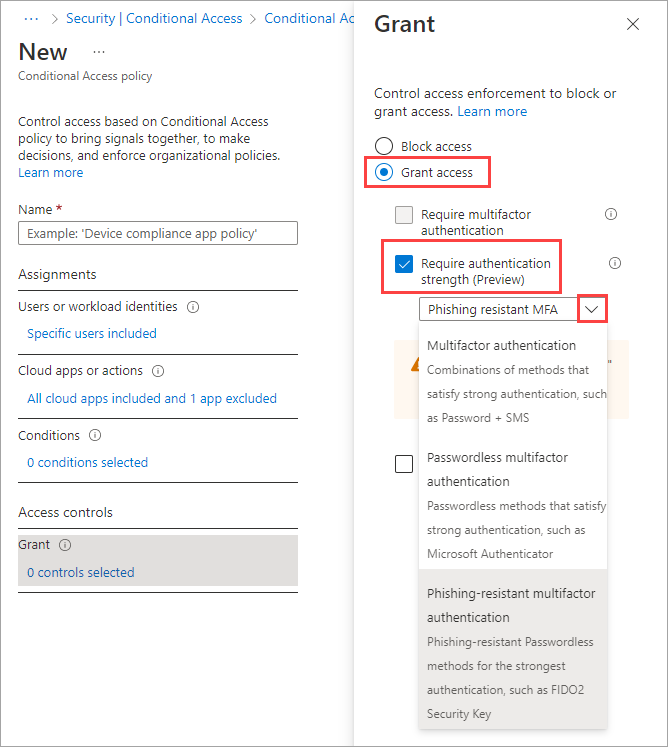

# Conditional Access: Require an authentication strength for external users

Authentication strength is a Conditional Access control that lets you define a specific combination of multifactor authentication (MFA) methods that an external user must complete to access your resources. This control is especially useful for restricting external access to sensitive apps in your organization. For example, you can create a Conditional Access policy, require a phishing-resistant authentication strength in the policy, and assign it to guests and external users.

Microsoft Entra ID provides three [built-in authentication strengths](https://aka.ms/b2b-auth-strengths):

- Multifactor authentication strength
- Passwordless MFA strength
- Phishing-resistant MFA strength

You can use one of the built-in strengths or create a [custom authentication strength](https://aka.ms/b2b-auth-strengths) based on the authentication methods you want to require.

In external user scenarios, the MFA authentication methods that a resource tenant can accept vary depending on whether the user is completing MFA in their home tenant or in the resource tenant. For details, see [Conditional Access authentication strength](https://aka.ms/b2b-auth-strengths).

> [!NOTE]
> Currently, you can only apply authentication strength policies to external users who authenticate with Microsoft Entra ID. For email one-time passcode, SAML/WS-Fed, and Google federation users, use the [MFA grant control](concept-conditional-access-grant.md#require-multifactor-authentication) to require MFA.

## Configure cross-tenant access settings to trust MFA

Authentication strength policies work together with [MFA trust settings](../external-identities/cross-tenant-access-settings-b2b-collaboration.md#to-change-inbound-trust-settings-for-mfa-and-device-claims) in your cross-tenant access settings to determine where and how the external user must perform MFA. A Microsoft Entra user first authenticates with their own account in their home tenant. Then when this user tries to access your resource, Microsoft Entra ID applies the authentication strength Conditional Access policy and checks to see if you've enabled MFA trust.

- **If MFA trust is enabled**, Microsoft Entra ID checks the user's authentication session for a claim indicating that MFA has been fulfilled in the user's home tenant.
- **If MFA trust is disabled**, the resource tenant presents the user with a challenge to complete MFA in the resource tenant using an acceptable authentication method.

The authentication methods that external users can use to satisfy MFA requirements are different depending on whether the user is completing MFA in their home tenant or the resource tenant. See the table in [Conditional Access authentication strength](https://aka.ms/b2b-auth-strengths).

> [!IMPORTANT]
> Before you create the Conditional Access policy, check your cross-tenant access settings to make sure your inbound MFA trust settings are configured as intended.

## Choose an authentication strength

Determine if one of the built-in authentication strengths will work for your scenario or if you'll need to create a custom authentication strength.

1. Sign in to the [Microsoft Entra admin center](https://entra.microsoft.com) as at least a [Conditional Access Administrator](../roles/permissions-reference.md#conditional-access-administrator).
1. Browse to **Protection** > **Authentication methods** > **Authentication strengths**.
1. Review the built-in authentication strengths to see if one of them meets your requirements.
1. If you want to enforce a different set of authentication methods, [create a custom authentication strength](https://aka.ms/b2b-auth-strengths).

## Create a Conditional Access policy

Use the following steps to create a Conditional Access policy that applies an authentication strength to external users.

1. Sign in to the [Microsoft Entra admin center](https://entra.microsoft.com) as at least a [Conditional Access Administrator](../roles/permissions-reference.md#conditional-access-administrator).
1. Browse to **Protection** > **Conditional Access**.
1. Select **Create new policy**.
1. Give your policy a name. We recommend that organizations create a meaningful standard for the names of their policies.
1. Under **Assignments**, select **Users or workload identities**.
1. Under **Include**, choose **Select users and groups**, and then select **Guest or external users**.
1. Select the types of [guest or external users](../external-identities/authentication-conditional-access.md#assigning-conditional-access-policies-to-external-user-types) you want to apply the policy to.

1. Under **Exclude**, select **Users and groups** and choose your organization's emergency access or break-glass accounts.
1. Under **Target resources** > **Cloud apps**, under **Include** or **Exclude**, select any applications you want to include in or exclude from the authentication strength requirements.
1. Under **Access controls** > **Grant**:
   1. Choose **Grant access**.
   1. Select **Require authentication strength**, and then select the built-in or custom authentication strength from the list.

   

1. Confirm your settings and set **Enable policy** to **Report-only**.
2. Select **Create** to create to enable your policy.

After you confirm your settings using [report-only mode](howto-conditional-access-insights-reporting.md), an administrator can move the **Enable policy** toggle from **Report-only** to **On**.

## Next steps

[Conditional Access templates](concept-conditional-access-policy-common.md)

[Use report-only mode for Conditional Access to determine the results of new policy decisions.](concept-conditional-access-report-only.md)
