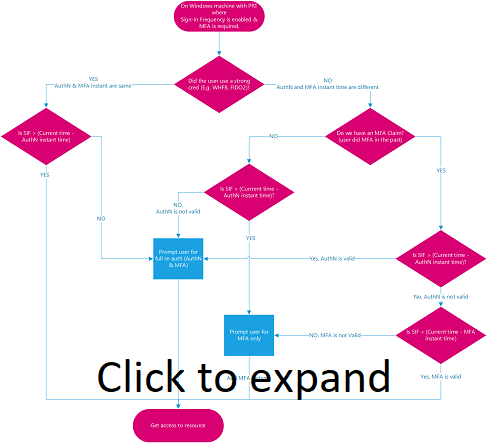

# Configure authentication session management with Conditional Access

In complex deployments, organizations might have a need to restrict authentication sessions. Some scenarios might include:

* Resource access from an unmanaged or shared device
* Access to sensitive information from an external network
* High impact users
* Critical business applications

Conditional Access controls allow you to create policies that target specific use cases within your organization without affecting all users.

Before diving into details on how to configure the policy, let’s examine the default configuration.

## User sign-in frequency

Sign-in frequency defines the time period before a user is asked to sign in again when attempting to access a resource.

The Microsoft Entra ID default configuration for user sign-in frequency is a rolling window of 90 days. Asking users for credentials often seems like a sensible thing to do, but it can backfire: users that are trained to enter their credentials without thinking can unintentionally supply them to a malicious credential prompt.

It might sound alarming to not ask for a user to sign back in, in reality any violation of IT policies will revoke the session. Some examples include (but aren't limited to) a password change, an incompliant device, or account disable. You can also explicitly [revoke users’ sessions using PowerShell](/powershell/module/azuread/revoke-azureaduserallrefreshtoken). The Microsoft Entra ID default configuration comes down to “don’t ask users to provide their credentials if security posture of their sessions hasn't changed”.

The sign-in frequency setting works with apps that have implemented OAuth2 or OIDC protocols according to the standards. Most Microsoft native apps for Windows, Mac, and Mobile including the following web applications comply with the setting.

- Word, Excel, PowerPoint Online
- OneNote Online
- Office.com
- Microsoft 365 Admin portal
- Exchange Online
- SharePoint and OneDrive
- Teams web client
- Dynamics CRM Online
- Azure portal

The sign-in frequency setting works with third-party SAML applications and apps that have implemented OAuth2 or OIDC protocols, as long as they don't drop their own cookies and are redirected back to Microsoft Entra ID for authentication on regular basis.

### User sign-in frequency and multifactor authentication

Sign-in frequency previously applied to only to the first factor authentication on devices that were Microsoft Entra joined, Microsoft Entra hybrid joined, and Microsoft Entra registered. There was no easy way for our customers to re-enforce multifactor authentication on those devices. Based on customer feedback, sign-in frequency will apply for MFA as well.

### User sign-in frequency and device identities

On Microsoft Entra joined and Microsoft Entra hybrid joined devices, unlocking the device, or signing in interactively will only refresh the Primary Refresh Token (PRT) every 4 hours. The last refresh timestamp recorded for PRT compared with the current timestamp must be within the time allotted in SIF policy for PRT to satisfy SIF and grant access to a PRT that has an existing MFA claim. On [Microsoft Entra registered devices](../devices/concept-device-registration.md), unlock/sign-in would not satisfy the SIF policy because the user is not accessing a Microsoft Entra registered device via a Microsoft Entra account. However, the [Microsoft Entra WAM](../develop/scenario-desktop-acquire-token-wam.md) plugin can refresh a PRT during native application authentication using WAM.

Note: The timestamp captured from user log-in is not necessarily the same as the last recorded timestamp of PRT refresh because of the 4-hour refresh cycle. The case when it is the same is when a PRT has expired and a user log-in refreshes it for 4 hours. In the following examples, assume SIF policy is set to 1 hour and PRT is refreshed at 00:00.

Example 1: *when you continue to work on the same doc in SPO for an hour*

- At 00:00, a user signs in to their Windows 10 Microsoft Entra joined device and starts work on a document stored on SharePoint Online.
- The user continues working on the same document on their device for an hour.
- At 01:00, the user is prompted to sign in again based on the sign-in frequency requirement in the Conditional Access policy configured by their administrator.

Example 2: *when pausing work with a background task running in the browser, then interacting again after the SIF policy time has passed*

- At 00:00, a user signs in to their Windows 10 Microsoft Entra joined device and starts to upload a document to SharePoint Online.
- At 00:10, the user gets up and takes a break locking their device. The background upload continues to SharePoint Online.
- At 02:45, the user returns from their break and unlocks the device. The background upload shows completion.
- At 02:45, the user is prompted to sign in when they interact again based on the sign-in frequency requirement in the Conditional Access policy configured by their administrator since the last sign-in happened at 00:00.

If the client app (under activity details) is a Browser, we defer sign in frequency enforcement of events/policies on background services until the next user interaction.   

Example 3: *with 4-hour refresh cycle of primary refresh token from unlock*

Scenario 1 - User returns within cycle

- At 00:00, a user signs into their Windows 10 Microsoft Entra joined device and starts work on a document stored on SharePoint Online.
- At 00:30, the user gets up and takes a break locking their device.
- At 00:45, the user returns from their break and unlocks the device.
- At 01:00, the user is prompted to sign in again based on the sign-in frequency requirement in the Conditional Access policy configured by their administrator, 1 hour after the initial sign-in.

Scenario 2 - User returns outside cycle

- At 00:00, a user signs into their Windows 10 Microsoft Entra joined device and starts work on a document stored on SharePoint Online.
- At 00:30, the user gets up and takes a break locking their device.
- At 04:45, the user returns from their break and unlocks the device.
- At 05:45, the user is prompted to sign in again based on the sign-in frequency requirement in the Conditional Access policy configured by their administrator, 1 hour after the PRT was refreshed at 04:45 (over 4hrs after the initial sign-in at 00:00).

### Require reauthentication every time

There are scenarios where customers may want to require a fresh authentication, every time before a user performs specific actions. Sign-in frequency has a new option for **Every time** in addition to hours or days.

Supported scenarios:

- Require user reauthentication during [Intune device enrollment](/mem/intune/fundamentals/deployment-guide-enrollment), regardless of their current MFA status.
- Require user reauthentication for risky users with the [require password change](concept-conditional-access-grant.md#require-password-change) grant control.
- Require user reauthentication for risky sign-ins with the [require multifactor authentication](concept-conditional-access-grant.md#require-multifactor-authentication) grant control.

When administrators select **Every time**, it will require full reauthentication when the session is evaluated.

## Persistence of browsing sessions

A persistent browser session allows users to remain signed in after closing and reopening their browser window.

The Microsoft Entra ID default for browser session persistence allows users on personal devices to choose whether to persist the session by showing a “Stay signed in?” prompt after successful authentication. If browser persistence is configured in AD FS using the guidance in the article [AD FS single sign-on settings](/windows-server/identity/ad-fs/operations/ad-fs-single-sign-on-settings#enable-psso-for-office-365-users-to-access-sharepoint-online), we'll comply with that policy and persist the Microsoft Entra session as well. You can also configure whether users in your tenant see the “Stay signed in?” prompt by changing the appropriate setting in the [company branding pane](../fundamentals/how-to-customize-branding.md).

In persistent browsers, cookies stay stored in the user’s device even after a user closes the browser. These cookies could have access to Microsoft Entra artifacts, and those artifacts are useable until token expiry regardless of the Conditional Access policies placed on the resource environment. So, token caching can be in direct violation of desired security policies for authentication. While it may seem convenient to store tokens beyond the current session, doing so can create a security vulnerability by allowing unauthorized access to Microsoft Entra artifacts.

## Configuring authentication session controls

Conditional Access is a Microsoft Entra ID P1 or P2 capability and requires a premium license. If you would like to learn more about Conditional Access, see [What is Conditional Access in Microsoft Entra ID?](overview.md#license-requirements)

> [!WARNING]
> If you are using the [configurable token lifetime](../develop/configurable-token-lifetimes.md) feature currently in public preview, please note that we don’t support creating two different policies for the same user or app combination: one with this feature and another one with configurable token lifetime feature. Microsoft retired the configurable token lifetime feature for refresh and session token lifetimes on January 30, 2021 and replaced it with the Conditional Access authentication session management feature.  
>
> Before enabling Sign-in Frequency, make sure other reauthentication settings are disabled in your tenant. If "Remember MFA on trusted devices" is enabled, be sure to disable it before using Sign-in frequency, as using these two settings together may lead to prompting users unexpectedly. To learn more about reauthentication prompts and session lifetime, see the article, [Optimize reauthentication prompts and understand session lifetime for Microsoft Entra multifactor authentication](../authentication/concepts-azure-multi-factor-authentication-prompts-session-lifetime.md).

## Policy deployment

To make sure that your policy works as expected, the recommended best practice is to test it before rolling it out into production. Ideally, use a test tenant to verify whether your new policy works as intended. For more information, see the article [Plan a Conditional Access deployment](plan-conditional-access.md).

### Policy 1: Sign-in frequency control

1. Sign in to the [Microsoft Entra admin center](https://entra.microsoft.com) as at least a [Conditional Access Administrator](../roles/permissions-reference.md#conditional-access-administrator).
1. Browse to **Protection** > **Conditional Access**.
1. Select **Create new policy**.
1. Give your policy a name. We recommend that organizations create a meaningful standard for the names of their policies.
1. Choose all required conditions for customer’s environment, including the target cloud apps.

   > [!NOTE]
   > It is recommended to set equal authentication prompt frequency for key Microsoft Office apps such as Exchange Online and SharePoint Online for best user experience.

1. Under **Access controls** > **Session**.
   1. Select **Sign-in frequency**.
      1. Choose **Periodic reauthentication** and enter a value of hours or days or select **Every time**.
1. Save your policy.

   > 

### Policy 2: Persistent browser session

1. Sign in to the [Microsoft Entra admin center](https://entra.microsoft.com) as at least a [Conditional Access Administrator](../roles/permissions-reference.md#conditional-access-administrator).
1. Browse to **Protection** > **Conditional Access**.
1. Select **Create new policy**.
1. Give your policy a name. We recommend that organizations create a meaningful standard for the names of their policies.
1. Choose all required conditions.

   > [!NOTE]
   > Please note that this control requires to choose “All Cloud Apps” as a condition. Browser session persistence is controlled by authentication session token. All tabs in a browser session share a single session token and therefore they all must share persistence state.

1. Under **Access controls** > **Session**.
   1. Select **Persistent browser session**.

      > [!NOTE]
      > Persistent Browser Session configuration in Microsoft Entra Conditional Access overrides the “Stay signed in?” setting in the company branding pane for the same user if you have configured both policies.

   1. Select a value from dropdown.
1. Save your policy.

### Policy 3: Sign-in frequency control every time risky user

1. Sign in to the [Microsoft Entra admin center](https://entra.microsoft.com) as at least a [Conditional Access Administrator](../roles/permissions-reference.md#conditional-access-administrator).
1. Browse to **Protection** > **Conditional Access**.
1. Select **Create new policy**.
1. Give your policy a name. We recommend that organizations create a meaningful standard for the names of their policies.
1. Under **Assignments**, select **Users or workload identities**.
   1. Under **Include**, select **All users**.
   1. Under **Exclude**, select **Users and groups** and choose your organization's [emergency access or break-glass accounts](../roles/security-emergency-access.md). 
   1. Select **Done**.
1. Under **Target resources** > **Cloud apps** > **Include**, select **All cloud apps**.
1. Under **Conditions** > **User risk**, set **Configure** to **Yes**. Under **Configure user risk levels needed for policy to be enforced** select **High**, then select **Done**.
1. Under **Access controls** > **Grant**, select **Grant access**, **Require password change**, and select **Select**.
1. Under **Session controls** > **Sign-in frequency**, select **Every time**.
1. Confirm your settings and set **Enable policy** to **Report-only**.
1. Select **Create** to create to enable your policy.

After administrators confirm your settings using [report-only mode](howto-conditional-access-insights-reporting.md), they can move the **Enable policy** toggle from **Report-only** to **On**.

### Validation

Use the [What If tool](what-if-tool.md) to simulate a sign-in from the user to the target application and other conditions based on how you configured your policy. The authentication session management controls show up in the result of the tool.

## Prompt tolerance

We factor for five minutes of clock skew, so that we don’t prompt users more often than once every five minutes. If the user has done MFA in the last 5 minutes, and they hit another Conditional Access policy that requires reauthentication, we won't prompt the user. Over-prompting users for reauthentication can impact their productivity and increase the risk of users approving MFA requests they didn’t initiate. Use “Sign-in frequency – every time” only for specific business needs. 

## Known issues

- If you configure sign-in frequency for mobile devices: Authentication after each sign-in frequency interval could be slow, it can take 30 seconds on average. Also, it could happen across various apps at the same time. 
- On iOS devices: If an app configures certificates as the first authentication factor and the app has both Sign-in frequency and [Intune mobile application management policies](/mem/intune/apps/app-lifecycle) applied, end-users are blocked from signing in to the app when the policy triggers.

## Next steps

* If you're ready to configure Conditional Access policies for your environment, see the article [Plan a Conditional Access deployment](plan-conditional-access.md).
