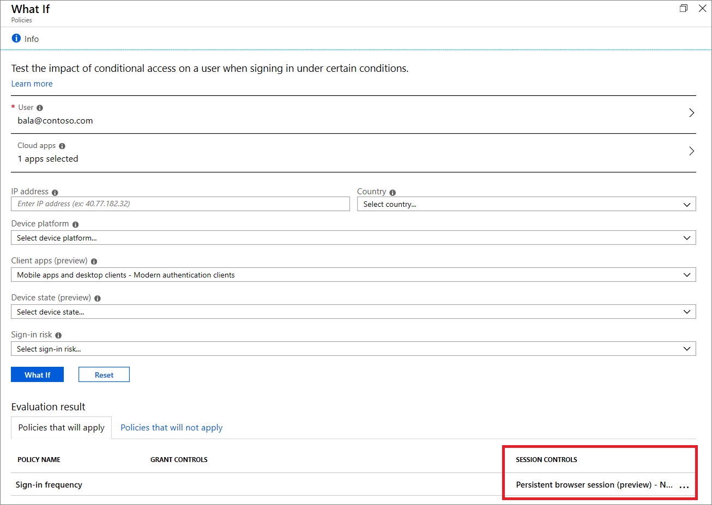

# Configure authentication session management with Conditional Access

In complex deployments, organizations might have a need to restrict authentication sessions. Some scenarios might include:

* Resource access from an unmanaged or shared device
* Access to sensitive information from an external network
* High impact users
* Critical business applications

Conditional Access controls allow you to create policies that target specific use cases within your organization without affecting all users.

Before diving into details on how to configure the policy, let’s examine the default configuration.

## User sign-in frequency

Sign-in frequency defines the time period before a user is asked to sign in again when attempting to access a resource.

The Azure Active Directory (Azure AD) default configuration for user sign in frequency is a rolling window of 90 days. Asking users for credentials often seems like a sensible thing to do, but it can backfire: users that are trained to enter their credentials without thinking can unintentionally supply them to a malicious credential prompt.

It might sound alarming to not ask for a user to sign back in for 90 days, in reality any violation of IT policies will revoke the session. Some examples include (but are not limited to) a password change, an incompliant device, or account disable. You can also explicitly [revoke users’ sessions using PowerShell](https://docs.microsoft.com/powershell/module/azuread/revoke-azureaduserallrefreshtoken?view=azureadps-2.0). The Azure AD default configuration comes down to “don’t ask users to provide their credentials if security posture of their sessions has not changed”.

Sign-in frequency setting works with apps that have implemented OATH2 or OIDC protocols according to the standards. Most Microsoft native apps for Windows, Mac, and Mobile comply with the setting.

## Persistence of browsing sessions

A persistent browser session allows users to remain signed in after closing and reopening their browser window.

The Azure AD default for browser session persistence allows users on personal devices to choose whether to persist the session by showing a “Stay signed in?” prompt after successful authentication. If browser persistence is configured in AD FS using the guidance in the article [AD FS Single Sign-On Settings](https://docs.microsoft.com/windows-server/identity/ad-fs/operations/ad-fs-single-sign-on-settings#enable-psso-for-office-365-users-to-access-sharepoint-online
), we will comply with that policy and persist the Azure AD session as well. You can also configure whether users in your tenant see the “Stay signed in?” prompt by changing the appropriate setting in the company branding pane in Azure portal using the guidance in the article [Customize your Azure AD sign-in page](../fundamentals/customize-branding.md).

## Configuring authentication session controls

Conditional Access is an Azure AD Premium capability and requires a premium license. If you would like to learn more about Conditional Access, see [What is Conditional Access in Azure Active Directory?](overview.md#license-requirements)

> [!WARNING]
> If you are using the [configurable token lifetime](../develop/active-directory-configurable-token-lifetimes.md) feature currently in public preview, please note that we don’t support creating two different policies for the same user or app combination: one with this feature and another one with configurable token lifetime feature. Microsoft plans to retire the configurable token lifetime feature on November 1 and replace it with the Conditional Access authentication session management feature.  

### Policy 1: Sign-in frequency control

1. Create new policy
1. Choose all required conditions for customer’s environment, including the target cloud apps.

   > [!NOTE]
   > It is recommended to set equal authentication prompt frequency for key Microsoft Office apps such as Exchange Online and SharePoint Online for best user experience.

1. Go to **Access Controls** > **Session** and click **Sign-in frequency**
1. Enter the required value of days and hours in the first text box
1. Select a value of **Hours** or **Days** from dropdown
1. Save your policy

On Azure AD registered Windows devices sign in to the device is considered a prompt. For example, if you have configured the Sign in frequency to 24 hours for Office apps, users on Azure AD registered Windows devices will satisfy the Sign in frequency policy by signing in to the device and will be not prompted again when opening Office apps.

If you have configured different Sign-in frequency for different web apps that are running in the same browser session, the strictest policy will be applied to both apps because all apps running in the same browser session share a single session token.

### Policy 2: Persistent browser session

1. Create new policy
1. Choose all required conditions.

   > [!NOTE]
   > Please note that this control requires to choose “All Cloud Apps” as a condition. Browser session persistence is controlled by authentication session token. All tabs in a browser session share a single session token and therefore they all must share persistence state.

1. Go to **Access Controls** > **Session** and click **Persistent browser session**
1. Select a value from dropdown
1. Save you policy

> [!NOTE]
> Persistent Browser Session configuration in Azure AD Conditional Access will overwrite the “Stay signed in?” setting in the company branding pane in the Azure portal for the same user if you have configured both policies.

## Validation

Use the What-If tool to simulate a login from the user to the target application and other conditions based on how you configured your policy. The authentication session management controls show up in the result of the tool.

## Policy deployment

To make sure that your policy works as expected, the recommended best practice is to test it before rolling it out into production. Ideally, use a test tenant to verify whether your new policy works as intended. For more information, see the article [Best practices for Conditional Access in Azure Active Directory](best-practices.md).

## Next steps

* If you want to know how to configure a Conditional Access policy, see the article [Require MFA for specific apps with Azure Active Directory Conditional Access](app-based-mfa.md).
* If you are ready to configure Conditional Access policies for your environment, see the article [Best practices for Conditional Access in Azure Active Directory](best-practices.md).
