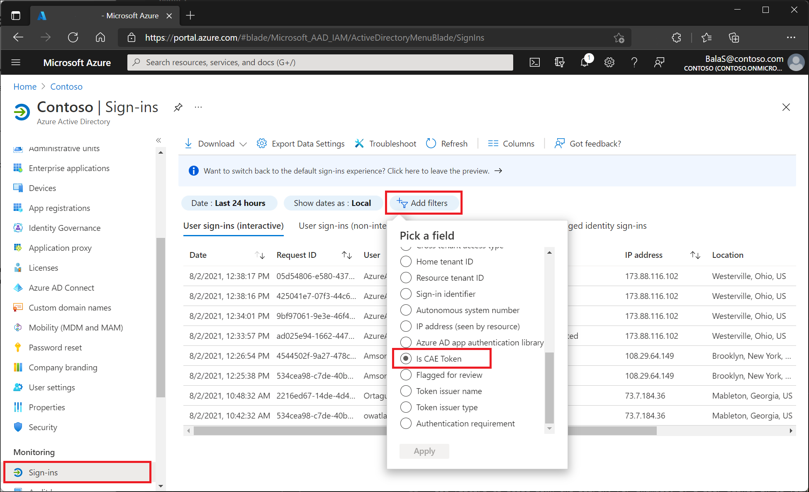
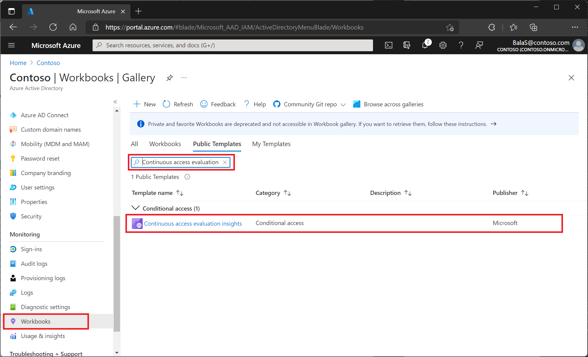
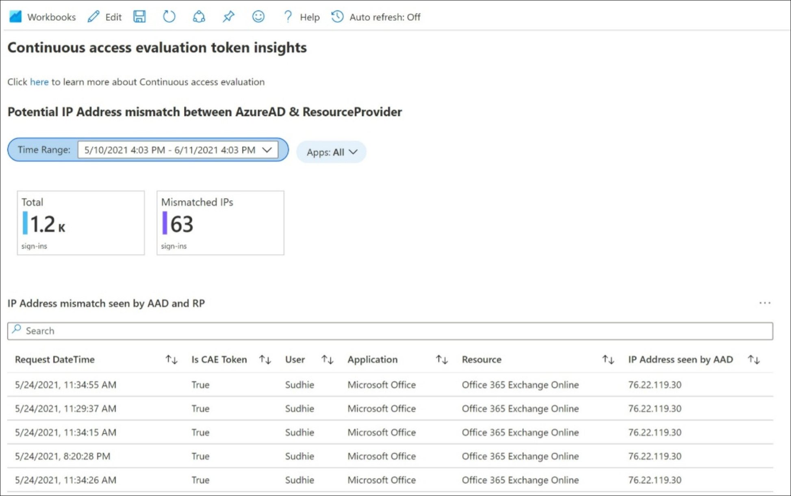

# Monitor and troubleshoot continuous access evaluation

Administrators can monitor and troubleshoot sign in events where [continuous access evaluation (CAE)](concept-continuous-access-evaluation.md) is applied in multiple ways.

## Continuous access evaluation sign-in reporting

Administrators will have the opportunity to monitor user sign-ins where CAE is applied. This pane can be located by via the following instructions:

1.	Sign in to the **Azure portal** as a Conditional Access Administrator, Security Administrator, or Global Administrator.
1.	Browse to **Azure Active Directory** > **Sign-ins**. 
1.	Apply the **Is CAE Token** filter. 

From here, admins will be presented with information about their user’s sign-in events. Select any sign-in to see details about the session, like which Conditional Access policies were applied and is CAE enabled. 

A given sign-in attempt may display on either the interactive or non-interactive tab. Administrators may need to check both tabs as they track their user’s sign-ins.

### Searching for specific sign-in attempts

Use filters to narrow your search. For example, if a user signed in to Teams, use the Application filter and set it to Teams. Admins may need to check the sign-ins from both interactive and non-interactive tabs to locate the specific sign-in. To further narrow the search, admins may apply multiple filters.

## Continuous access evaluation workbooks

The continuous access evaluation insights workbook allows administrators to view and monitor CAE usage insights for their tenants. The first table displays authentication attempts with IP mismatches. The second table displays the support status of CAE across various applications. This workbook can be found as template under the Conditional Access category. 

### Accessing the CAE workbook template
 
1.	Sign in to the **Azure portal** as a Conditional Access Administrator, Security Administrator, or Global Administrator. 
1.	Browse to **Azure Active Directory** > **Workbooks**.
1.	Under **Public Templates**, search for **Continuous access evaluation insights**.

> [!NOTE]
> For more information about how to stream Azure AD sign-in logs to a Log Analytics workspace, see the article [Integrate Azure AD logs with Azure Monitor logs](../reports-monitoring/howto-integrate-activity-logs-with-log-analytics.md).

The **Continuous access evaluation insights** workbook contains two tables:

### Table 1: Potential IP address mismatch between Azure AD and resource provider  

The potential IP address mismatch between Azure AD & resource provider table allows admins to investigate sessions where the IP address detected by Azure AD doesn't match with the IP address detected by the Resource Provider. 

This workbook table sheds light on these scenarios by displaying the respective IP addresses and whether a CAE token was issued during the session. 

#### IP address configuration

Your identity provider and resource providers may see different IP addresses. This mismatch may happen because of the following examples:

- Your network implements split tunneling.
- Your resource provider is using an IPv4 address and Azure AD is using an IPv6 address.
- Your identity provider sees one IP address from the client and your resource provider sees a different IP address from the client.
- The IP address your identity provider sees is part of an allowed IP range in policy but the IP address from the resource provider isn't.

If this scenario exists in your environment, to avoid infinite loops, Azure AD will issue a one hour CAE token and won't enforce client location change. Even in this case, security is improved compared to traditional one hour tokens since we are still evaluating the other events besides client location change events.

Admins can view records filtered by time range and application. Admins can compare the number of mismatched IPs detected with the total number of sign-ins during a specified time period. 

With CAE, IP based Conditional Access policies are evaluated on the resource end and the client side. When the IP seen on the resource end is to be blocked, then the token is rejected by the resource with claims challenge having IP address seen on the resource side. The request is redirected to Azure AD for a new token and Azure AD does Conditional Access policy validation not only on the IP address seen by it but also IP address in the claims challenge (resource’s IP address). Consider the IP address seen on the RP side results in “block”. If the customer has not enabled the strict location enforcement, then Azure AD will issue short lived CAE token. The request is blocked when strict location enforcement is enabled.

To unblock users, administrators can add specific IP addresses to a trusted named location.

1.	Sign in to the **Azure portal** as a Conditional Access Administrator, Security Administrator, or Global Administrator. 
1.	Browse to **Azure Active Directory** > **Security** > **Conditional Access** > **Named locations**. Here you can create trusted IP locations.

Before adding an IP address as a trusted named location, confirm that the IP address does in fact belong to the intended tenant.

For more information about named locations, see the article [Using the location condition](location-condition.md#named-locations)
 
### Table 2: Continuous access evaluation support status

The continuous access evaluation support status table allows admins to differentiate between client applications that support CAE and those client applications that don't support CAE. The table displays the number of user sign-ins for each client application. 

You may notice that the same application may appear as both supported and not supported. This duplication is because of a concept called client capability. Not all clients are CAE supported and capable. For example, if a customer has some users using the latest version of Outlook and others still using an older unsupported version, that customer will see Outlook instances as supported and non supported. The older version of Outlook isn't CAE capable can't do continuous access evaluation. For users that are using the most recent version of Outlook, the admin will see supported CAE status.

Based on analysis, admins may choose to turn on strict enforcement within a Conditional Access policy. When strict enforcement is turned on, any client that isn't CAE capable will be rejected entirely. Admins can view records filtered by time range, application, and resource.

## Next steps

- [Integrate Azure AD logs with Azure Monitor logs](../reports-monitoring/howto-integrate-activity-logs-with-log-analytics.md)
- [Using the location condition](location-condition.md#named-locations)
- [Continuous access evaluation](concept-continuous-access-evaluation.md)
