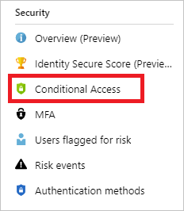
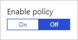
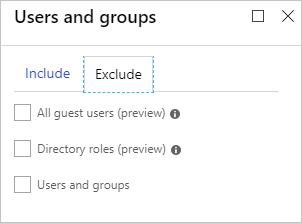

# How To: Plan your Conditional Access deployment in Azure Active Directory

Planning your Conditional Access deployment is critical to make sure you achieve the required access strategy for apps and resources in your organization. Spend most of your time during the planning phase of your deployment to design the various policies you require to grant or block access to your users under the conditions you choose. This document explains the steps you should take to implement secure and effective Conditional Access policies. Before you begin, make sure you understand how [Conditional Access](overview.md) works and when you should use it.

## What you should know

Think of Conditional Access as a framework that allows you to control access to your organization’s apps and resources, instead of a stand-alone feature. Consequently, some Conditional Access settings require additional features to be configured. For example, you can configure a policy that responds to a specific [sign-in risk level](../identity-protection/howto-sign-in-risk-policy.md#what-is-the-sign-in-risk-policy). However, a policy that is based on a sign-in risk level requires [Azure Active Directory identity protection](../identity-protection/overview.md) to be enabled.

If additional features are required, you might also need to get related licenses. For example, while Conditional Access is Azure AD Premium P1 feature, identity protection requires an Azure AD Premium P2 license.

There are two types of Conditional Access policies: baseline and standard. A [baseline policy](baseline-protection.md) is a predefined Conditional Access policy. The goal of these policies is to make sure that you have at least the baseline level of security enabled. Baseline policies. Baseline policies are available in all editions of Azure AD, and they provide only limited customization options. If a scenario requires more flexibility, disable the baseline policy, and implement your requirements in a custom standard policy.

In a standard Conditional Access policy, you can customize all settings to adjust the policy to your business requirements. Standard policies require an Azure AD Premium P1 license.

## Draft policies

Azure Active Directory Conditional Access enables you to bring the protection of your cloud apps to a new level. In this new level, how you can access a cloud app is based on a dynamic policy evaluation instead of a static access configuration. With a Conditional Access policy, you define a response (**do this**) to an access condition (**when this happens**).

Define every Conditional Access policy you want to implement using this planning model. The planning exercise:

- Helps you to outline the responses and conditions for each policy.
- Results in a well-documented Conditional Access policy catalog for your organization. 

You can use your catalog to assess whether your policy implementation reflects your organization's business requirements. 

Use the following example template to create Conditional Access policies for your organization:

|When *this* happens:|Then do *this*:|
|-|-|
|An access attempt is made: - To a cloud app* - By users and groups* Using: - Condition 1 (for example, outside Corp network) - Condition 2 (for example, device platforms)|Block access to the application|
|An access attempt is made: - To a cloud app* - By users and groups* Using: - Condition 1 (for example, outside Corp network) - Condition 2 (for example, device platforms)|Grant access with (AND): - Requirement 1 (for example, MFA) - Requirement 2 (for example, Device compliance)|
|An access attempt is made: - To a cloud app* - By users and groups* Using: - Condition 1 (for example, outside Corp network) - Condition 2 (for example, device platforms)|Grant access with (OR): - Requirement 1 (for example, MFA) - Requirement 2 (for example, Device compliance)|

At a minimum, **when this happens** defines the principal (**who**) that attempts to access a cloud app (**what**). If necessary, you can also include **how** an access attempt is performed. In Conditional Access, the elements that define the who, what, and how are known as conditions. For more information, see [What are conditions in Azure Active Directory Conditional Access?](conditions.md) 

With **then do this**, you define the response of your policy to an access condition. In your response, you either block or grant access with additional requirements, for example, multi-factor authentication (MFA). For a complete overview, see [What are access controls in Azure Active Directory Conditional Access?](controls.md)  

The combination of conditions with your access controls represents a Conditional Access policy.

For more information, see [what's required to make a policy work](best-practices.md#whats-required-to-make-a-policy-work).

At this point, it's a good time to decide on a naming standard for your policies. The naming standard helps you to find policies and understand their purpose without opening them in the Azure admin portal. Name your policy to show:

- A sequence number
- The cloud app it applies to
- The response
- Who it applies to
- When it applies (if applicable)
 

While a descriptive name helps you to keep an overview of your Conditional Access implementation, the sequence number is helpful if you need to reference a policy in a conversation. For example, if you talk a fellow administrator on the phone, you can ask them to open policy EM063 to solve an issue.

For example, the following name states that the policy requires MFA for marketing users on external networks using the Dynamics CRP app:

`CA01 - Dynamics CRP: Require MFA For marketing When on external networks`

In addition to your active policies, it is advisable to also implement disabled policies that act as secondary [resilient access controls in outage/emergency scenarios](../authentication/concept-resilient-controls.md). Your naming standard for the contingency policies should include a few more items: 

- `ENABLE IN EMERGENCY` at the beginning to make the name stand out among the other policies.
- The name of disruption it should apply to.
- An ordering sequence number to help the administrator to know in which order policies should be enabled. 

For example, the following name indicates that this policy is the first policy out of four you should enable if there is an MFA disruption:

`EM01 - ENABLE IN EMERGENCY, MFA Disruption[1/4] - Exchange SharePoint: Require hybrid Azure AD join For VIP users`

## Plan policies

When planning your Conditional Access policy solution, assess whether you need to create policies to achieve the following outcomes. 

### Block access

The option to block access is powerful because it:

- Trumps all other assignments for a user
- Has the power to block your entire organization from signing on to your tenant
 
If you want to block access for all users, you should at least exclude one user (typically emergency access accounts) from the policy. For more information, see [select users and groups](block-legacy-authentication.md#select-users-and-cloud-apps).  

### Require MFA

To simplify the sign-in experience of your users, you might want to allow them to sign in to your cloud apps using a user name and a password. However, typically, there are at least some scenarios for which it is advisable to require a stronger form of account verification. With a Conditional Access policy, you can limit the requirement for MFA to certain scenarios. 

Common use cases to require MFA are access:

- [By admins](howto-baseline-protect-administrators.md)
- [To specific apps](app-based-mfa.md) 
- [From network locations, you don't trust](untrusted-networks.md).

### Respond to potentially compromised accounts

With Conditional Access policies, you can implement automated responses to sign-ins from potentially compromised identities. The probability that an account has been compromised is expressed in form of risk levels. There are two risk levels calculated by identity protection: sign-in risk and user risk. To implement a response to a sign-in risk, you have two options:

- [The sign-in risk condition](conditions.md#sign-in-risk) in Conditional Access policy
- [The sign-in risk policy](../identity-protection/howto-sign-in-risk-policy.md) in identity protection 

Addressing the sign-in risk as condition is the preferred method because it gives you more customization options.

The user risk level is only available as [user risk policy](../identity-protection/howto-user-risk-policy.md) in identity protection. 

For more information, see [What is Azure Active Directory Identity Protection?](../identity-protection/overview.md) 

### Require managed devices

The proliferation of supported devices to access your cloud resources helps to improve the productivity of your users. On the flip side, you probably don't want certain resources in your environment to be accessed by devices with an unknown protection level. For the affected resources, you should require that users can only access them using a managed device. For more information, see [How to require managed devices for cloud app access with Conditional Access](require-managed-devices.md). 

### Require approved client apps

One of the first decisions you need to make for bring your own devices (BYOD) scenarios, is whether you need to manage the entire device or just the data on it. Your employees use mobile devices for both personal and work tasks. While making sure your employees can be productive, you also want to prevent data loss. With Azure Active Directory (Azure AD) Conditional Access, you can restrict access to your cloud apps to approved client apps that can protect your corporate data. For more information, see [How to require approved client apps for cloud app access with Conditional Access](app-based-conditional-access.md).

### Block legacy authentication

Azure AD supports several of the most widely used authentication and authorization protocols including legacy authentication. How can you prevent apps using legacy authentication from accessing your tenant's resources? The recommendation is to just block them with a Conditional Access policy. If necessary, you allow only certain users and specific network locations to use apps that are based on legacy authentication. For more information, see [How to block legacy authentication to Azure AD with Conditional Access](block-legacy-authentication.md).

## Test your policy

Before rolling out a policy into production, you should test is to verify that it behaves as expected.

1. Create test users
1. Create a test plan
1. Configure the policy
1. Evaluate a simulated sign-in
1. Test your policy
1. Cleanup

### Create test users

To test a policy, create a set of users that is similar to the users in your environment. Creating test users allows you to verify that your policies work as expected before you impact real users and potentially disrupt their access to apps and resources. 

Some organizations have test tenants for this purpose. However, it can be difficult to recreate all conditions and apps in a test tenant to fully test the outcome of a policy. 

### Create a test plan

The test plan is important to have a comparison between the expected results and the actual results. You should always have an expectation before testing something. The following table outlines example test cases. Adjust the scenarios and expected results based on how your CA policies are configured.

|Policy |Scenario |Expected Result | Result |
|---|---|---|---|
|[Require MFA when not at work](https://docs.microsoft.com/azure/active-directory/conditional-access/untrusted-networks)|Authorized user signs into *App* while on a trusted location / work|User isn't prompted to MFA| |
|[Require MFA when not at work](https://docs.microsoft.com/azure/active-directory/conditional-access/untrusted-networks)|Authorized user signs into *App* while not on a trusted location / work|User is prompted to MFA and can sign in successfully| |
|[Require MFA (for admin)](https://docs.microsoft.com/azure/active-directory/conditional-access/howto-baseline-protect-administrators)|Global Admin signs into *App*|Admin is prompted to MFA| |
|[Risky sign-ins](https://docs.microsoft.com/azure/active-directory/identity-protection/howto-sign-in-risk-policy)|User signs into *App* using a [Tor browser](https://docs.microsoft.com/azure/active-directory/active-directory-identityprotection-playbook)|Admin is prompted to MFA| |
|[Device management](https://docs.microsoft.com/azure/active-directory/conditional-access/require-managed-devices)|Authorized user attempts to sign in from an authorized device|Access Granted| |
|[Device management](https://docs.microsoft.com/azure/active-directory/conditional-access/require-managed-devices)|Authorized user attempts to sign in from an unauthorized device|Access blocked| |
|[Password change for risky users](https://docs.microsoft.com/azure/active-directory/identity-protection/howto-user-risk-policy)|Authorized user attempts to sign in with compromised credentials (high risk sign in)|User is prompted to change password or access is blocked based on your policy| |

### Configure the policy

Managing Conditional Access policies is a manual task. In the Azure portal, you can manage your Conditional Access policies in one central location - the Conditional Access page. One entry point to the Conditional Access page is the **Security** section in the **Active Directory** navigation pane. 

If you want to learn more about how to create Conditional Access policies, see [Require MFA for specific apps with Azure Active Directory Conditional Access](app-based-mfa.md). This quickstart helps you to:

- Become familiar with the user interface.
- Get a first impression of how Conditional Access works. 

### Evaluate a simulated sign-in

Now that you have configured your Conditional Access policy, you probably want to know whether it works as expected. As a first step, use the Conditional Access [what if policy tool](what-if-tool.md) to simulate a sign-in of your test user. The simulation estimates the impact this sign-in has on your policies and generates a simulation report.

>[!NOTE]
> While a simulated run gives you impression of the impact a Conditional Access policy has, it does not replace an actual test run.

### Test your policy

Run test cases according to your test plan. In this step, you run through an end-to-end test of each policy for your test users to make sure each policy behaves correctly. Use the scenarios created above to execute each test.

It is important to make sure you test the exclusion criteria of a policy. For example, you may exclude a user or group from a policy that requires MFA. Test if the excluded users are prompted for MFA, because the combination of other policies might require MFA for those users.

### Cleanup

The cleanup procedure consists of the following steps:

1. Disable the policy.
1. Remove the assigned users and groups.
1. Delete the test users.  

## Move to production

When new policies are ready for your environment, deploy them in phases:

- Provide internal change communication to end users.
- Start with a small set of users and verify that the policy behaves as expected.
- When you expand a policy to include more users, continue to exclude all administrators. Excluding administrators ensures that someone still has access to a policy if a change is required.
- Apply a policy to all users only if it's required.

As a best practice, create at least one user account that is:

- Dedicated to policy administration
- Excluded from all your policies

## Rollback steps

In case you need to roll back your newly implemented policies, use one or more of the following options to roll back:

1. **Disable the policy** - Disabling a policy makes sure it doesn't apply when a user tries to sign in. You can always come back and enable the policy when you’d like to use it.

   

1. **Exclude a user / group from a policy** - If a user is unable to access the app, you can choose to exclude the user from the policy

   

   > [!NOTE]
   > This option should be used sparingly, only in situations where the user is trusted. The user should be added back into the policy or group as soon as possible.

1. **Delete the policy** - If the policy is no longer required, delete it.

## Next steps

Check out [Azure AD Conditional Access Documentation](index.yml) to get an overview of the available information.
