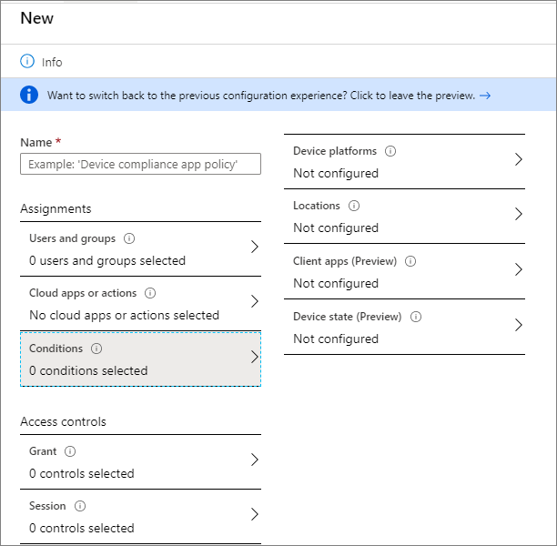
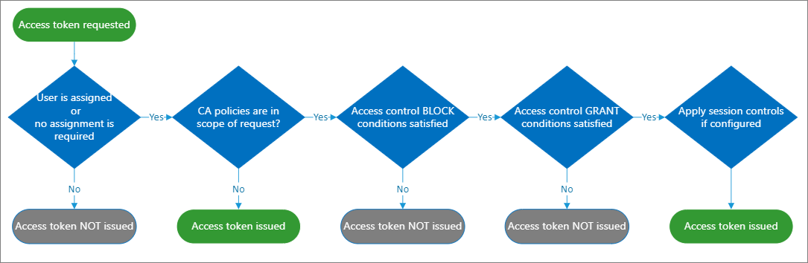
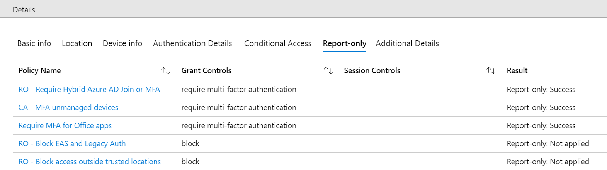
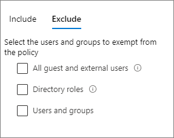
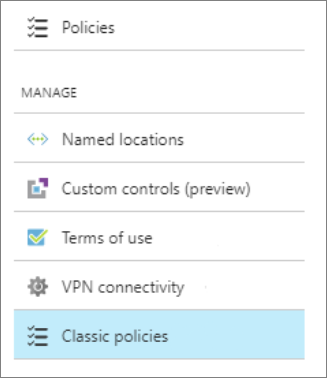

# Plan a Conditional Access deployment

Planning your Conditional Access deployment is critical to achieving your organization's access strategy for apps and resources.

In a mobile-first, cloud-first world, your users access your organization's resources from anywhere using a variety of devices and apps. As a result, focusing on who can access a resource is no longer enough. You also need to consider where the user is, the device being used, the resource being accessed, and more. 

Azure Active Directory (Azure AD) Conditional Access (CA) analyses signals such as user, device, and location to automate decisions and enforce organizational access policies for resource. You can use CA policies to apply access controls like Multi-Factor Authentication (MFA). CA policies allow you to prompt users for MFA when needed for security, and stay out of users’ way when not needed.

Microsoft provides standard conditional policies called [security defaults](../fundamentals/concept-fundamentals-security-defaults.md) that ensure a basic level of security. However, your organization may need more flexibility than security defaults offer. You can use Conditional Access to customize security defaults with more granularity and to configure new policies that meet your requirements.

## Learn

Before you begin, make sure you understand how [Conditional Access](overview.md) works and when you should use it.

### Benefits

The benefits of deploying Conditional Access are:

* Increase productivity. Only interrupt users with a sign-in condition like MFA when one or more signals warrants it. CA policies allow you to control when users are prompted for MFA, when access is blocked, and when they must use a trusted device.

* Manage risk. Automating risk assessment with policy conditions means risky sign-ins are at once identified and remediated or blocked. Coupling Conditional Access with [Identity Protection](../identity-protection/overview-identity-protection.md), which detects anomalies and suspicious events, allows you to target when access to resources is blocked or gated. 

* Address compliance and governance. Conditional Access enables you to audit access to applications, present terms of use for consent, and restrict access based on compliance policies.

* Manage cost. Moving access policies to Azure AD reduces the reliance on custom or on-premises solutions for Conditional Access, and their infrastructure costs.

### License requirements

See [Conditional Access license requirements](overview.md).

If additional features are required, you might also need related licenses. For more information, see [Azure Active Directory pricing](https://azure.microsoft.com/pricing/details/active-directory/).

### Prerequisites

* A working Azure AD tenant with Azure AD Premium or trial license enabled. If needed, [create one for free](https://azure.microsoft.com/free/?WT.mc_id=A261C142F).

* An account with Conditional Access administrator privileges.

* A non-administrator user with a password you know, such as testuser. If you need to create a user, see [Quickstart: Add new users to Azure Active Directory](../fundamentals/add-users-azure-active-directory.md).

* A group that the non-administrator user is a member of. If you need to create a group, see [Create a group and add members in Azure Active Directory](../fundamentals/active-directory-groups-create-azure-portal.md).

### Training resources

The following resources may be useful as you learn about Conditional Access:

#### Videos

* [What is Conditional Access?](https://youtu.be/ffMAw2IVO7A)
* [How to deploy Conditional Access?](https://youtu.be/c_izIRNJNuk)
* [How to roll out CA policies to end users?](https://youtu.be/0_Fze7Zpyvc)
* [Conditional Access with device controls](https://youtu.be/NcONUf-jeS4)
* [Conditional Access with Azure MFA](https://youtu.be/Tbc-SU97G-w)
* [Conditional Access in Enterprise Mobility + Security](https://youtu.be/A7IrxAH87wc)

#### Online courses on PluralSight

* [Design Identity Management in Microsoft Azure](https://www.pluralsight.com/courses/microsoft-azure-identity-management-design)
* [Design Authentication for Microsoft Azure](https://www.pluralsight.com/courses/microsoft-azure-authentication-design)
* [Design Authorization for Microsoft Azure](https://www.pluralsight.com/courses/microsoft-azure-authorization-design)

## Plan the deployment project

Consider your organizational needs while you determine the strategy for this deployment in your environment.

### Engage the right stakeholders

When technology projects fail, they typically do so due to mismatched expectations on impact, outcomes, and responsibilities. To avoid these pitfalls, [ensure that you're engaging the right stakeholders](https://aka.ms/deploymentplans) and that project roles are clear.

### Plan communications

Communication is critical to the success of any new service. Proactively communicate with your users how their experience will change, when it will change, and how to gain support if they experience issues.

### Plan a pilot

When new policies are ready for your environment, deploy them in phases in the production environment. First apply a policy to a small set of users in a test environment and verify if the policy behaves as expected. See [Best practices for a pilot](../fundamentals/active-directory-deployment-plans.md).

> [!NOTE]
> For rolling out new policies not specific to administrators, exclude all administrators. This ensures that administrators can still access the policy and make changes or revoke it if there's a significant impact. Always validate the policy with smaller user groups before you apply to all users.

## Understand CA policy components
CA policies are if-then statements: If an assignment is met, then apply these access controls.

When configuring CA policies, conditions are called *assignments*. CA policies allow you to enforce access controls on your organization’s apps based on certain assignments.

For more information, see [Building a CA policy](concept-conditional-access-policies.md).

[Assignments](concept-conditional-access-policies.md#assignments) define the

* [Users and groups](concept-conditional-access-users-groups.md) to be affected by the policy

* [Cloud apps or actions](concept-conditional-access-cloud-apps.md) to which the policy will apply 

* [Conditions](concept-conditional-access-conditions.md) under which the policy will apply.

[Access controls](concept-conditional-access-policies.md) settings determine how to enforce a policy:

* [Grant or Block](concept-conditional-access-grant.md) access to cloud apps.

* [Session controls](concept-conditional-access-session.md) enable limited experiences within specific cloud apps.

### Ask the right questions to build your policies

Policies answer questions about who should access your resources, what resources they should access, and under what conditions. Policies can be designed to grant access, or to block access. Be sure to ask the right questions about what your policy is trying to achieve. 

Document the answers to questions for each policy before building it out. 

#### Common questions about Assignments

[Users and Groups](concept-conditional-access-users-groups.md)

* Which users and groups will be included in or excluded from the policy?

* Does this policy include all users, specific group of users, directory roles, or external users?

[Cloud apps or actions](concept-conditional-access-cloud-apps.md)

* What application(s) will the policy apply to?

* What user actions will be subject to this policy?

[Conditions](concept-conditional-access-conditions.md)

* Which device platforms will be included in or excluded from the policy?

* What are the organization’s trusted locations?

* What locations will be included in or excluded from the policy?

* What client app types (browser, mobile, desktop clients, apps with legacy authentication methods) will be included in or excluded from the policy?

* Do you have policies that would drive excluding Azure AD Joined devices or Hybrid Azure AD joined devices from policies? 

* If using [Identity Protection](../identity-protection/concept-identity-protection-risks.md), do you want to incorporate sign-in risk protection?

#### Common questions about access controls

[Grant or Block ](concept-conditional-access-grant.md) 

Do you want to grant access to resources by requiring one or more of the following?

* Require MFA

* Require device to be marked as compliant

* Require hybrid Azure AD joined device

* Require approved client app

* Require app protection policy

[Session control](concept-conditional-access-session.md)

Do you want to enforce any of the following access controls on cloud apps?

* Use app enforced permissions

* Use Conditional Access App Control

* Enforce sign-in frequency

* Use persistent browser sessions

### Access token issuance

It’s important to understand how access tokens are issued. 

> [!NOTE]
> If no assignment is required, and no CA policy is in effect, that the default behavior is to issue an access token. 

For example, consider a policy where:

IF user is in Group 1, THEN force MFA to access App 1.

If a user not in Group 1 attempts to access the app no “if’ condition is met, and a token is issued. To exclude users outside of Group 1 requires a separate policy to block all other users.

## Follow best practices

The Conditional Access framework provides you with a great configuration flexibility. However, great flexibility also means you should carefully review each configuration policy before releasing it to avoid undesirable results.

### Apply CA policies to every app

Access tokens are by default issued if a CA Policy condition does not trigger an access control. Ensure that every app has at least one conditional access policy applied

> [!IMPORTANT]
> Be very careful in using block and all apps in a single policy. This could lock admins out of the Azure Administration Portal, and exclusions cannot be configured for important end-points such as Microsoft Graph.

### Minimize the number of CA policies

Creating a policy for each app isn't efficient and leads to difficult administration. Conditional Access will only apply the first 195 policies per user. We recommend that you analyze your apps and group them into applications that have the same resource requirements for the same users. For example, if all Office 365 apps or all HR apps have the same requirements for the same users, create a single policy and include all of the apps to which it applies. 

### Set up emergency access accounts

If you misconfigure a policy, it can lock the organizations out of the Azure portal. Mitigate the impact of accidental administrator lock out by creating two or more [emergency access accounts](../users-groups-roles/directory-emergency-access.md) in your organization.

* Create a user account dedicated to policy administration and excluded from all your policies.

* Break glass scenario for hybrid environments:

  * Create an on-premises security group and sync it to Azure AD. The security group should contain your dedicated policy administration account. 

   * EXEMPT this security group form all CA policies.

   * When a service outage occurs, add your other administrators to the on-premises group as appropriate, and force a sync. This animates their exemption to CA policies.

### Set up report-only mode

It can be difficult to predict the number and names of users affected by common deployment initiatives such as:

* blocking legacy authentication
* requiring MFA
* implementing sign-in risk policies

[Report-only mode ](concept-conditional-access-report-only.md) allows administrators to evaluate the impact of CA policies before enabling them in their environment.

Learn how to [configure report-only mode on a CA policy](howto-conditional-access-report-only.md).

### Plan for disruption

If you rely on a single access control, such as MFA or a network location, to secure your IT systems, you are susceptible to access failures if that single access control becomes unavailable or misconfigured. To reduce the risk of lockout during unforeseen disruptions, [plan strategies](../authentication/concept-resilient-controls.md) to adopt for your organization.

### Set naming standards for your policies

The naming standard helps you to find policies and understand their purpose without opening them in the Azure admin portal. We recommend that you name your policy to show:

* A Sequence Number

* The cloud app(s) it applies to

* The response

* Who it applies to

* When it applies (if applicable)

**Example**; A policy to require MFA for marketing users accessing the Dynamics CRP app from external networks might be:

A descriptive name helps you to keep an overview of your Conditional Access implementation. The Sequence Number is helpful if you need to reference a policy in a conversation. For example, when you talk to an administrator on the phone, you can ask them to open policy CA01 to solve an issue.

#### Naming standards for emergency access controls

In addition to your active policies, implement disabled policies that act as secondary [resilient access controls in outage or emergency scenarios](../authentication/concept-resilient-controls.md). Your naming standard for the contingency policies should include:
* ENABLE IN EMERGENCY at the beginning to make the name stand out among the other policies.

* The name of disruption it should apply to.

* An ordering sequence number to help the administrator to know in which order policies should be enabled.

**Example**

The following name indicates that this policy is the first of four policies to enable if there's an MFA disruption:

EM01 - ENABLE IN EMERGENCY: MFA Disruption [1/4] - Exchange SharePoint: Require hybrid Azure AD join For VIP users.

### Exclude countries from which you never expect a sign-in.

Azure active directory allows you to create [named locations](location-condition.md). Create a named location that includes all of the countries from which you would never expect a sign-in to occur. Then create a policy for All apps that blocks sign in from that named location. **Be sure to exempt your administrators from this policy**.

### Plan your policy deployment

When new policies are ready for your environment, make sure that you review each policy before releasing it to avoid undesirable results. See the following documentation to understand important information on how policies are applied and how to avoid issues

* [What you should know](best-practices.md)

* [What you should avoid doing](best-practices.md)

## Common policies

When planning your CA policy solution, assess whether you need to create policies to achieve the following outcomes.

* [Require MFA](#require-mfa)
* [Respond to potentially compromised accounts](#respond-to-potentially-compromised-accounts)
* [Require managed devices](#require-managed-devices)
* [Require approved client applications](#require-approved-client-apps)
* [Block access](#block-access)

### Require MFA

Common use cases to require MFA access:

* [By admins](howto-conditional-access-policy-admin-mfa.md)

* [To specific apps](app-based-mfa.md)

* [For all users](howto-conditional-access-policy-all-users-mfa.md)

* [From network locations, you don't trust](untrusted-networks.md)

* [For Azure Management](howto-conditional-access-policy-azure-management.md)

### Respond to potentially compromised accounts

With CA policies, you can implement automated responses to sign-ins by potentially compromised identities. The probability that an account is compromised is expressed in the form of risk levels. There are two risk levels calculated by Identity Protection: sign-in risk and user risk. The following three default policies that can be enabled.

* [Require all users to register for MFA](howto-conditional-access-policy-risk.md)

* [Require a password change for users that are high-risk](howto-conditional-access-policy-risk.md)

* [Require MFA for users with medium or high sign-in risk](howto-conditional-access-policy-risk.md)

### Require managed devices

The proliferation of supported devices to access your cloud resources helps to improve the productivity of your users. You probably don't want certain resources in your environment to be accessed by devices with an unknown protection level. For those resources, [require that users can only access them using a managed device](require-managed-devices.md).

### Require approved client apps

Employees use their mobile devices for both personal and work tasks. For BYOD scenarios you must decide whether to manage the entire device or just the data on it. if managing only data and access, you can [require approved cloud apps](app-based-conditional-access.md) that can protect your corporate data. for example, you can require email only be accessed via Outlook mobile, and not via a generic mail program.

### Block access

The option to [block all access](howto-conditional-access-policy-block-access.md) is powerful. It can be used, for example, when you are migrating an app to Azure AD, but are not ready for anyone to sign-in to it yet. Block access: 

* Overrides all other assignments for a user

* Has the power to block your entire organization from signing on to your tenant

> [!IMPORTANT]
> If you create a policy to block access for all users, be sure to exclude emergency access accounts, and consider excluding all administrators, from the policy.

Other common scenarios where you can block access for your users are:

* [Block certain network locations](howto-conditional-access-policy-location.md) to access your cloud apps. You can use this policy to block certain countries where you know traffic shouldn't come from.

* Azure AD supports legacy authentication. However, legacy authentication doesn't support MFA and many environments require it to address identity security. In this case, you can [block apps using legacy authentication ](block-legacy-authentication.md) from accessing your tenant resources.

## Build and test policies

At each stage of your deployment ensure that you're evaluating that results are as expected. 

When new policies are ready, deploy them in phases in the production environment:

* Provide internal change communication to end users.

* Start with a small set of users and verify that the policy behaves as expected.

* When you expand a policy to include more users, continue to exclude all administrators. Excluding administrators ensures that someone still has access to a policy if a change is required.

* Apply a policy to all users only after it's thoroughly tested. Ensure you have at least one administrator account to which a policy doesn't apply.

### Create test users

Create a set of test users that reflect the users in your production environment. Creating test users allows you to verify policies work as expected before you impact real users and potentially disrupt their access to apps and resources.

Some organizations have test tenants for this purpose. However, it can be difficult to recreate all conditions and apps in a test tenant to fully test the outcome of a policy.

### Create a test plan

The test plan is important to have a comparison between the expected results and the actual results. You should always have an expectation before testing something. The following table outlines example test cases. Adjust the scenarios and expected results based on how your CA policies are configured.

| Policy| Scenario| Expected Result |
| - | - | - |
| [Require MFA when not at work](untrusted-networks.md)| Authorized user signs into App while on a trusted location / work| User is not prompted to MFA |
| [Require MFA when not at work](untrusted-networks.md)| Authorized user signs into App while not on a trusted location / work| User is prompted to MFA and can sign in successfully |
| [Require MFA (for admin)](howto-baseline-protect-administrators.md)| Global Admin signs into App| Admin is prompted to MFA |
| [Risky sign-ins](https://docs.microsoft.com/azure/active-directory/identity-protection/howto-sign-in-risk-policy)| User signs into App using an unapproved browser| Admin is prompted to MFA |
| [Device management](require-managed-devices.md)| Authorized user attempts to sign in from an authorized device| Access Granted |
| [Device management](require-managed-devices.md)| Authorized user attempts to sign in from an unauthorized device| Access blocked |
| [Password change for risky users](https://docs.microsoft.com/azure/active-directory/identity-protection/howto-user-risk-policy)| Authorized user attempts to sign in with compromised credentials (high risk sign in)| User is prompted to change password or access is blocked based on your policy |

### Configure the test policy

In the [Azure portal](https://portal.azure.com/), you configure CA policies under Azure Active Directory > Security > Conditional Access.

If you want to learn more about how to create CA policies, see this example: [CA policy to prompt for MFA when a user signs in to the Azure portal](https://docs.microsoft.com/azure/active-directory/authentication/tutorial-enable-azure-mfa?toc=/azure/active-directory/conditional-access/toc.json&bc=/azure/active-directory/conditional-access/breadcrumb/toc.json). This quickstart helps you to:

* Become familiar with the user interface

* Get a first impression of how Conditional Access works

### Enable the policy in report-only mode

To assess the impact of your policy, start by enabling the policy in [report-only mode](concept-conditional-access-report-only.md). Report-only policies are evaluated during sign-in but grant controls and session controls aren't enforced. Once you save the policy in report-only mode, you can see the impact on real-time sign-ins in the sign-in logs. From the sign-in logs, select an event and navigate to the Report-only tab to see the result of each report-only policy.

Selecting the policy, you can also see how the assignments and access controls of the policy were evaluated using the Policy details screen. In order for a policy to apply to a sign-in, each of the configured assignments must be satisfied. 

### Understand the impact of your policies using the Insights and Reporting workbook

You can view the aggregate impact of your Conditional Access policies in the Insights and Reporting workbook. To access the workbook, you need an Azure Monitor subscription and you will need to [stream your Sign-in logs to a Log Analytics workspace](../reports-monitoring/howto-integrate-activity-logs-with-log-analytics.md). 

### Simulate sign-ins using the what-if tool

Another way to validate your Conditional Access policy is by using the [what-if tool](troubleshoot-conditional-access-what-if.md), which simulates which policies would apply to a user signing in under hypothetical circumstances. Select the sign-in attributes you want to test (such as user, application, device platform, and location) and see which policies would apply.

> [!NOTE] 
> While a simulated run gives you a good idea of the impact a CA policy has, it does not replace an actual test run.

### Test your policy

Perform each test in your test plan with test users.

**Ensure you test the exclusion criteria of a policy**. For example, you may exclude a user or group from a policy that requires MFA. Test if the excluded users are prompted for MFA, because the combination of other policies might require MFA for those users.

### Roll back policies

In case you need to roll back your newly implemented policies, use one or more of the following options:

* **Disable the policy.** Disabling a policy makes sure it does not apply when a user tries to sign in. You can always come back and enable the policy when you would like to use it.

* **Exclude a user or group from a policy.** If a user is unable to access the app, you can choose to exclude the user from the policy.

> [!NOTE]
>  This option should be used sparingly, only in situations where the user is trusted. The user should be added back into the policy or group as soon as possible.

* **Delete the policy.** If the policy is no longer required, [delete](https://docs.microsoft.com/azure/active-directory/authentication/tutorial-enable-azure-mfa?toc=/azure/active-directory/conditional-access/toc.json&bc=/azure/active-directory/conditional-access/breadcrumb/toc.json) it.

## Manage access to cloud apps

Use the following Manage options to control and manage your CA policies:

### Named locations

The location condition of a CA policy enables you to tie access controls settings to the network locations of your users. With [Named Locations](location-condition.md), you can create logical groupings of IP address ranges or countries and regions.

### Custom controls

[Custom controls](controls.md) redirect your users to a compatible service to satisfy authentication requirements outside of Azure AD. To satisfy this control, a user's browser is redirected to the external service, performs any required authentication, and is then redirected back to Azure AD. Azure AD verifies the response and, if the user was successfully authenticated or validated, the user continues in the Conditional Access flow.

### Terms of use

Before accessing certain cloud apps in your environment, you can get consent from the users by them accepting your Terms of use (ToU). Follow this [Quickstart to create Terms of Use](require-tou.md).

### Classic policies

In the [Azure portal](https://portal.azure.com/), you can find your CA policies under Azure Active Directory > Security > Conditional Access. Your organization might also have older CA policies not created using this page. These policies are known as classic policies. We recommend that you [consider migrating these classic policies in the Azure portal](best-practices.md).

## Troubleshoot Conditional Access

When a user is having an issue with a CA policy, collect the following information to facilitate troubleshooting.

* User principle Name

* User display name

* Operating system name

* Time stamp (approximate is ok)

* Target application

* Client application type (browser vs client)

* Correlation ID (this is unique to the sign-in)

If the user received a message with a More details link, they can collect most of this information for you.

Once you have collected the information, See the following resources:

* [Sign-in problems with Conditional Access](troubleshoot-conditional-access.md) – Understand unexpected sign-in outcomes related to Conditional Access using error messages and Azure AD sign-ins log.

* [Using the What-If tool](troubleshoot-conditional-access-what-if.md) - Understand why a policy was or wasn't applied to a user in a specific circumstance or if a policy would apply in a known state.

## Next Steps

[Learn more about Multi-factor authentication](../authentication/concept-mfa-howitworks.md)

[Learn more about Identity Protection](../identity-protection/overview-identity-protection.md)

[Manage CA policies with Microsoft Graph API](https://docs.microsoft.com/graph/api/resources/conditionalaccesspolicy?view=graph-rest-beta.md)
