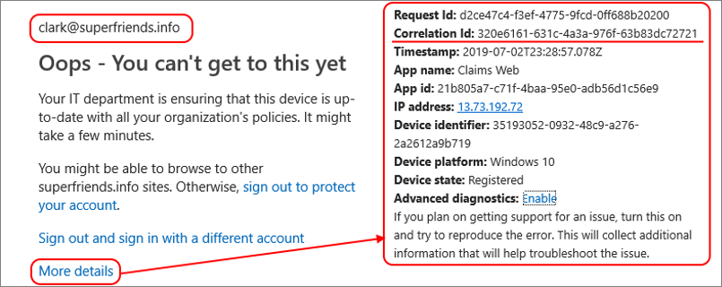

# Plan a Conditional Access deployment

Planning your Conditional Access deployment is critical to achieving your organization's access strategy for apps and resources. Conditional Access policies provide great configuration flexibility. However, this flexibility also means you should plan carefully to avoid undesirable results.

[Microsoft Entra Conditional Access](overview.md) analyses signals such as user, device, and location to automate decisions and enforce organizational access policies for resources. Conditional Access policies allow you to build conditions that manage security controls that can block access, require multifactor authentication, or restrict the user’s session when needed and stay out of the user’s way when not.

With this evaluation and enforcement, Conditional Access defines the basis of [Microsoft’s Zero Trust security posture management](https://www.microsoft.com/security/business/zero-trust).

Microsoft provides [security defaults](../fundamentals/security-defaults.md) that ensure a basic level of security enabled in tenants that don't have Microsoft Entra ID P1 or P2. With Conditional Access, you can create policies that provide the same protection as security defaults, but with granularity. Conditional Access and security defaults aren't meant to be combined as creating Conditional Access policies will prevent you from enabling security defaults.

## Prerequisites

* A working Microsoft Entra tenant with Microsoft Entra ID P1, P2, or trial license enabled. If needed, [create one for free](https://azure.microsoft.com/free/?WT.mc_id=A261C142F).
   * Microsoft Entra ID P2 is required to include Identity Protection risk in Conditional Access policies.
* Administrators who interact with Conditional Access must have one or more of the following role assignments depending on the tasks they're performing. To follow the [Zero Trust principle of least privilege](/security/zero-trust/), consider using [Privileged Identity Management (PIM)](../privileged-identity-management/pim-configure.md) to just-in-time activate privileged role assignments.
   * Read Conditional Access policies and configurations 
      * [Security Reader](../roles/permissions-reference.md#security-reader)
      * [Global Reader](../roles/permissions-reference.md#global-reader)
   * Create or modify Conditional Access policies 
      * [Conditional Access Administrator](../roles/permissions-reference.md#conditional-access-administrator)
      * [Security Administrator](../roles/permissions-reference.md#security-administrator)
* A test user (non-administrator) that allows you to verify policies work as expected before deploying to real users. If you need to create a user, see [Quickstart: Add new users to Microsoft Entra ID](../fundamentals/add-users.md).
* A group that the non-administrator user is a member of. If you need to create a group, see [Create a group and add members in Microsoft Entra ID](../fundamentals/how-to-manage-groups.md).

### Communicating change

Communication is critical to the success of any new functionality. You should proactively communicate with your users how their experience will change, when it will change, and how to get support if they experience issues.

## Conditional Access policy components

Conditional Access policies answer questions about who can access your resources, what resources they can access, and under what conditions. Policies can be designed to grant access, limit access with session controls, or to block access. You [build a Conditional Access policy](concept-conditional-access-policies.md) by defining the if-then statements like: 

| If an assignment is met | Apply the access controls |
| --- | --- |
| If you're a user in Finance accessing the Payroll application | Require multifactor authentication and a compliant device |
| If you aren't a member of Finance accessing the Payroll application | Block access |
| If your user risk is high | Require a multifactor authentication and a secure password change |

### User exclusions

[!INCLUDE [active-directory-policy-exclusions](../../../includes/active-directory-policy-exclude-user.md)]

### Ask the right questions

Here are some common questions about [Assignments and Access Controls](concept-conditional-access-cloud-apps.md). Document the answers to questions for each policy before building it out.

#### Users or workload identities

* Which users, groups, directory roles, or workload identities will be included in or excluded from the policy?
* What emergency access accounts or groups should be excluded from policy?

#### Cloud apps or actions

Will this policy apply to any application, user action, or authentication context? If yes-

*	What application(s) or services will the policy apply to?
*	What user actions will be subject to this policy?
*	What authentication contexts will this policy be applied to?

#### Conditions

* Which device platforms will be included in or excluded from the policy?
* What are the organization’s known network locations?
   * What locations will be included in or excluded from the policy?
* What client app types will be included in or excluded from the policy?
* Do you need to target specific device attributes? 
* If using [Identity Protection](../identity-protection/concept-identity-protection-risks.md), do you want to incorporate sign-in or user risk?

##### User and sign-in risk

For organizations with Microsoft Entra ID P2 licenses, they can include user and sign-in risk in their Conditional Access policies. These additions can help reduce the friction of security measures by requiring multifactor authentication or secure password change only when a user or sign-in is considered risky.

For more information about risk and its use in policy, see the article [What is risk](../identity-protection/concept-identity-protection-risks.md).

#### Block or grant controls

Do you want to grant access to resources by requiring one or more of the following?

* Multifactor authentication
* Device marked as compliant
* Using a Microsoft Entra hybrid joined device
* Using an approved client app
* App protection policy applied
* Password change
* Terms of Use accepted

**Block access** is a powerful control that you should apply with appropriate knowledge. Policies with block statements can have unintended side effects. Proper testing and validation are vital before you enable the control at scale. Administrators should use tools such as [Conditional Access report-only mode](concept-conditional-access-report-only.md) and [the What If tool in Conditional Access](what-if-tool.md) when making changes.

#### Session controls

Do you want to enforce any of the following access controls on cloud apps?

* Use app enforced restrictions
* Use Conditional Access App control
* Enforce sign-in frequency
* Use persistent browser sessions
* Customize continuous access evaluation

### Combining policies

When creating and assigning policies, you must take into account how access tokens work. [Access tokens](../develop/access-tokens.md) grant or deny access based on whether the users making a request have been authorized and authenticated. If the requestor can prove they're who they claim to be, they can access the protected resources or functionality. 

**Access tokens are issued by default if a Conditional Access policy condition does not trigger an access control**. 

This policy doesn’t prevent the app having its own ability to block access. 

For example, consider a simplified policy example where: 

Users: FINANCE GROUP  
Accessing: PAYROLL APP  
Access control: Multifactor authentication 
  
- User A is in the FINANCE GROUP, they're required to perform multifactor authentication to access the **PAYROLL APP**.
- User B is **not** in the FINANCE GROUP, is issued an access token and is allowed to access the **PAYROLL APP** without performing multifactor authentication.

To ensure users outside of finance group can't access the payroll app, a separate policy could be created to block all other users, like the following simplified policy:

Users: Include All Users / Exclude FINANCE GROUP  
Accessing: PAYROLL APP  
Access control: Block access  

Now when User B attempts to access the **PAYROLL APP** they're blocked.

## Recommendations

Taking into account our learnings in the use of Conditional Access and supporting other customers, here are a few recommendations based on our learnings.

### Apply Conditional Access policies to every app

**Ensure that every app has at least one Conditional Access policy applied**. From a security perspective it's better to create a policy that encompasses **All cloud apps**, and then exclude applications that you don't want the policy to apply to. This practice ensures you don't need to update Conditional Access policies every time you onboard a new application.

> [!TIP]
> Be very careful in using block and all apps in a single policy. This could lock admins out, and exclusions cannot be configured for important endpoints such as Microsoft Graph.

### Minimize the number of Conditional Access policies

Creating a policy for each app isn’t efficient and leads to difficult administration. Conditional Access has a limit of 195 policies per-tenant. We recommend that you **analyze your apps and group them into applications that have the same resource requirements for the same users**. For example, if all Microsoft 365 apps or all HR apps have the same requirements for the same users, create a single policy and include all the apps to which it applies.

### Configure report-only mode

By default, each policy created from template is created in report-only mode. We recommended organizations test and monitor usage, to ensure the intended result, before turning on each policy.

[Enable policies in report-only mode](howto-conditional-access-insights-reporting.md). Once you save a policy in report-only mode, you can see the effect on real-time sign-ins in the sign-in logs. From the sign-in logs, select an event and navigate to the **Report-only** tab to see the result of each report-only policy.

You can view the aggregate affects of your Conditional Access policies in the **Insights and Reporting workbook**. To access the workbook, you need an Azure Monitor subscription and you'll need to [stream your sign-in logs to a log analytics workspace](../reports-monitoring/howto-integrate-activity-logs-with-azure-monitor-logs.md).

### Plan for disruption

If you rely on a single access control such as multifactor authentication or a network location to secure your IT systems, you're susceptible to access failures if that single access control becomes unavailable or misconfigured. 

**To reduce the risk of lockout during unforeseen disruptions, [plan resilience strategies](../authentication/concept-resilient-controls.md) for your organization**.

### Set naming standards for your policies

**A naming standard helps you to find policies and understand their purpose without opening them in the Azure admin portal**. We recommend that you name your policy to show:

* A Sequence Number
* The cloud app(s) it applies to
* The response
* Who it applies to
* When it applies (if applicable)

**Example**: A policy to require MFA for marketing users accessing the Dynamics CRP app from external networks might be:

A descriptive name helps you to keep an overview of your Conditional Access implementation. The Sequence Number is helpful if you need to reference a policy in a conversation. For example, when you talk to an administrator on the phone, you can ask them to open policy CA01 to solve an issue.

#### Naming standards for emergency access controls

In addition to your active policies, implement disabled policies that act as secondary [resilient access controls in outage or emergency scenarios](../authentication/concept-resilient-controls.md). Your naming standard for the contingency policies should include:

* ENABLE IN EMERGENCY at the beginning to make the name stand out among the other policies.
* The name of disruption it should apply to.
* An ordering sequence number to help the administrator to know in which order policies should be enabled.

**Example**: The following name indicates that this policy is the first of four policies to enable if there's an MFA disruption:

* EM01 - ENABLE IN EMERGENCY: MFA Disruption [1/4] - Exchange SharePoint: Require Microsoft Entra hybrid join For VIP users.

### Block countries/regions from which you never expect a sign-in.

Microsoft Entra ID allows you to create [named locations](location-condition.md). Create the list of countries/regions that are allowed, and then create a network block policy with these "allowed countries/regions" as an exclusion. This is less overhead for customers who are based in smaller geographic locations. **Be sure to exempt your emergency access accounts from this policy**.

## Deploy Conditional Access policies

When you're ready, deploy your Conditional Access policies in phases.

### Build your Conditional Access policies

Refer to [Conditional Access policy templates](concept-conditional-access-policy-common.md) and [Common security policies for Microsoft 365 organizations](/microsoft-365/security/office-365-security/identity-access-policies) for a head start. These templates are convenient way to deploy Microsoft recommendations. Make sure you exclude your emergency access accounts.

#### Evaluate the policy impact

We recommend that you use the following tools to evaluate the effect of your policies both before and after making changes. A simulated run gives you a good idea of the effect a Conditional Access policy has, it doesn't replace an actual test run in a properly configured development environment.

- [Report-only mode](concept-conditional-access-report-only.md) and the Conditional Access insights and Reporting workbook.
- The [What If tool](concept-conditional-access-policies.md)

### Test your policies

**Ensure you test the exclusion criteria of a policy**. For example, you may exclude a user or group from a policy that requires MFA. Test if the excluded users are prompted for MFA, because the combination of other policies might require MFA for those users.

Perform each test in your test plan with test users. The test plan is important to have a comparison between the expected results and the actual results. The following table outlines some example test cases. Adjust the scenarios and expected results based on how your Conditional Access policies are configured.

| Policy | Scenario | Expected Result |
|---|---|---|
| [Risky sign-ins](../identity-protection/howto-identity-protection-configure-risk-policies.md) | User signs into App using an unapproved browser | Calculates a risk score based on the probability that the sign-in wasn't performed by the user. Requires user to self-remediate using MFA |
| [Device management](./concept-conditional-access-grant.md) | Authorized user attempts to sign in from an authorized device | Access granted |
| [Device management](./concept-conditional-access-grant.md) | Authorized user attempts to sign in from an unauthorized device | Access blocked |
| [Password change for risky users](../identity-protection/howto-identity-protection-configure-risk-policies.md) | Authorized user attempts to sign in with compromised credentials (high risk sign-in) | User is prompted to change password or access is blocked based on your policy |

### Deploy in production

After you confirm impact using **report-only mode**, an administrator can move the **Enable policy** toggle from **Report-only** to **On**.

#### Roll back policies

In case you need to roll back your newly implemented policies, use one or more of the following options:

* **Disable the policy.** Disabling a policy makes sure it doesn't apply when a user tries to sign in. You can always come back and enable the policy when you would like to use it.
* **Exclude a user or group from a policy.** If a user is unable to access the app, you can choose to exclude the user from the policy.

   > [!CAUTION]
   > **Exclusions should be used sparingly**, only in situations where the user is trusted. Users should be added back into the policy or group as soon as possible.

* If a policy is disabled and no longer required, **delete it**.

## Troubleshoot Conditional Access policies

If a user has an issue with a Conditional Access policy, collect the following information to facilitate troubleshooting.

* User Principal Name
* User display name
* Operating system name
* Time stamp (approximate is ok)
* Target application
* Client application type (browser vs client)
* Correlation ID (this ID is unique to the sign-in)

If the user received a message with a More details link, they can collect most of this information for you.

Once you've collected the information, See the following resources:

* [Sign-in problems with Conditional Access](troubleshoot-conditional-access.md) – Understand unexpected sign-in outcomes related to Conditional Access using error messages and Microsoft Entra sign-in log.
* [Using the What-If tool](troubleshoot-conditional-access-what-if.md) - Understand why a policy was or wasn't applied to a user in a specific circumstance or if a policy would apply in a known state.

## Next Steps

[Learn more about Multifactor authentication](../authentication/concept-mfa-howitworks.md)

[Learn more about Identity Protection](../identity-protection/overview-identity-protection.md)

[Manage Conditional Access policies with Microsoft Graph API](/graph/api/resources/conditionalaccesspolicy)
