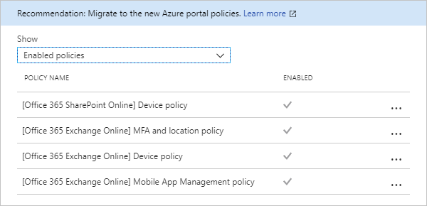
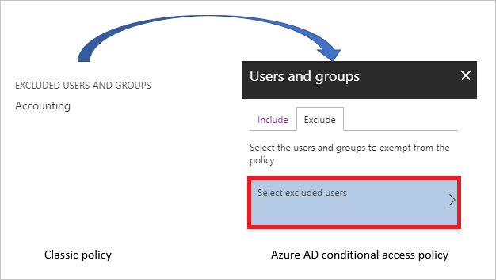
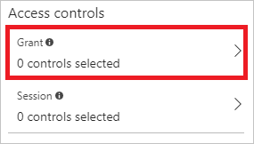
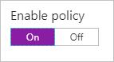

# Migrate a classic policy that requires multi-factor authentication in the Azure portal 

This article shows how to migrate a classic policy that requires **multi-factor authentication** for a cloud app. Although it is not a prerequisite, we recommend that you read [Migrate classic policies in the Azure portal](policy-migration.md) before you start migrating your classic policies.

 
## Overview 

The scenario in this article shows how to migrate a classic policy that requires **multi-factor authentication** for a cloud app. 

The migration process consist of the following steps:

1. [Open the classic policy](#open-a-classic-policy) to get the configuration settings.
2. Create a new Azure AD conditional access policy to replace your classic policy. 
3. Disable the classic policy.

## Open a classic policy

1. In the [Azure portal](https://portal.azure.com), on the left navbar, click **Azure Active Directory**.

    

2. On the **Azure Active Directory** page, in the **Manage** section, click **Conditional access**.

    

3. In the **Manage** section, click **Classic policies (preview)**.

    

4. In the list of classic policies, click the policy that requires **multi-factor authentication** for a cloud app.

    

## Create a new conditional access policy

1. In the [Azure portal](https://portal.azure.com), on the left navbar, click **Azure Active Directory**.

    

2. On the **Azure Active Directory** page, in the **Manage** section, click **Conditional access**.

    

3. On the **Conditional Access** page, to open the **New** page, in the toolbar on the top, click **Add**.

    

4. On the **New** page, in the **Name** textbox, type a name for your policy.

    

5. In the **Assignments** section, click **Users and groups**.

    

    a. If you have all users selected in your classic policy, click **All users**. 

    

    b. If you have groups selected in your classic policy, click **Select users and groups**, and then select the required users and groups.

    

    c. If you have the excluded groups, click the **Exclude** tab, and then select the required users and groups. 

    

6. On the **New** page, to open the **Cloud apps** page, in the **Assignment** section, click **Cloud apps**.

8. On the **Cloud apps** page, perform the following steps:

    

    a. Click **Select apps**.

    b. Click **Select**.

    c. On the **Select** page, select your cloud app, and then click **Select**.

    d. On the **Cloud apps** page, click **Done**.

9. If you have **Require multi-factor authentication** selected:

    

    a. In the **Access controls** section, click **Grant**.

    

    b. On the **Grant** page, click **Grant access**, and then click **Require multi-factor authentication**.

    c. Click **Select**.

10. Click **On** to enable your policy.

    

## Disable the classic policy

To disable your classic policy, click **Disable** in the **Details** view.

## Next steps

- For more information about the classic policy migration, see [Migrate classic policies in the Azure portal](policy-migration.md).

- If you want to know how to configure a conditional access policy, see [Require MFA for specific apps with Azure Active Directory conditional access](app-based-mfa.md).

- If you are ready to configure conditional access policies for your environment, see the [best practices for conditional access in Azure Active Directory](best-practices.md). 
