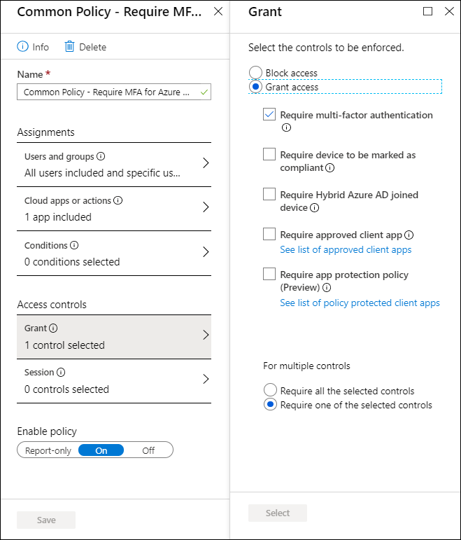

# Migrate a classic policy in the Azure portal

This article shows how to migrate a classic policy that requires **multi-factor authentication** for a cloud app. Although it is not a prerequisite, we recommend that you read [Migrate classic policies in the Azure portal](policy-migration.md) before you start migrating your classic policies.

The migration process consists of the following steps:

1. [Open the classic policy](#open-a-classic-policy) to get the configuration settings.
1. Create a new Azure AD Conditional Access policy to replace your classic policy. 
1. Disable the classic policy.

## Open a classic policy

1. In the [Azure portal](https://portal.azure.com), navigate to **Azure Active Directory** > **Security** > **Conditional Access**.
1. Select, **Classic policies**.

   

1. In the list of classic policies, select the policy you wish to migrate. Document the configuration settings so that you can re-create with a new Conditional Access policy.

## Create a new Conditional Access policy

1. In the [Azure portal](https://portal.azure.com), navigate to **Azure Active Directory** > **Security** > **Conditional Access**.
1. To create a new Conditional Access policy, select **New policy**.
1. On the **New** page, in the **Name** textbox, type a name for your policy.
1. In the **Assignments** section, click **Users and groups**.
   1. If you have all users selected in your classic policy, click **All users**. 
   1. If you have groups selected in your classic policy, click **Select users and groups**, and then select the required users and groups.
   1. If you have the excluded groups, click the **Exclude** tab, and then select the required users and groups. 
   1. Select **Done**
1. In the **Assignment** section, click **Cloud apps or actions**.
1. On the **Cloud apps or actions** page, perform the following steps:
   1. Click **Select apps**.
   1. Click **Select**.
   1. On the **Select** page, select your cloud app, and then click **Select**.
   1. On the **Cloud apps** page, click **Done**.
1. If you have **Require multi-factor authentication** selected:
   1. In the **Access controls** section, click **Grant**.
   1. On the **Grant** page, click **Grant access**, and then click **Require multi-factor authentication**.
   1. Click **Select**.
1. Click **On** to enable your policy then select **Save**.

   

## Disable the classic policy

To disable your classic policy, click **Disable** in the **Details** view.

## Next steps

- For more information about the classic policy migration, see [Migrate classic policies in the Azure portal](policy-migration.md).
- [Use report-only mode for Conditional Access to determine the impact of new policy decisions.](concept-conditional-access-report-only.md)