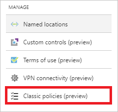
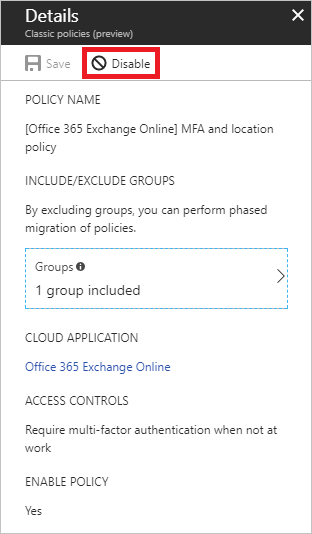

# Migrate a classic policy in the Azure portal

This article shows how to migrate a classic policy that requires **multifactor authentication** for a cloud app. Although it isn't a prerequisite, we recommend that you read [Migrate classic policies in the Azure portal](policy-migration.md) before you start migrating your classic policies.

The migration process consists of the following steps:

1. [Open the classic policy](#open-a-classic-policy) to get the configuration settings.
1. Create a new Azure AD Conditional Access policy to replace your classic policy. 
1. Disable the classic policy.

## Open a classic policy

[!INCLUDE [portal updates](~/articles/active-directory/includes/portal-update.md)]

1. Sign in to the [Azure portal](https://portal.azure.com).

1. Navigate to **Azure Active Directory** > **Security** > **Conditional Access**.

1. Select, **Classic policies**.

   

1. In the list of classic policies, select the policy you wish to migrate. Document the configuration settings so that you can re-create with a new Conditional Access policy.

For examples of common policies and their configuration in the Azure portal, see the article [Common Conditional Access policies](concept-conditional-access-policy-common.md).

## Disable the classic policy

To disable your classic policy, select **Disable** in the **Details** view.

## Next steps

- For more information about the classic policy migration, see [Migrate classic policies in the Azure portal](policy-migration.md).
- [Use report-only mode for Conditional Access to determine the impact of new policy decisions.](concept-conditional-access-report-only.md)