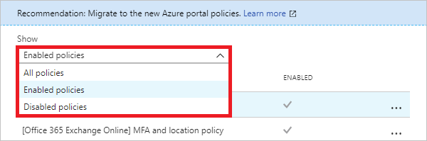
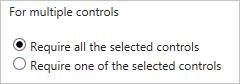

# What is a policy migration in Azure Active Directory Conditional Access? 

[Conditional Access](../active-directory-conditional-access-azure-portal.md) is a capability of Azure Active directory (Azure AD) that enables you to control how authorized users access your cloud apps. While the purpose is still the same, the release of the new Azure portal has introduced significant improvements to how Conditional Access works.

Consider migrating the policies you have not created in the Azure portal because:

- You can now address scenarios you could not handle before.
- You can reduce the number of policies you have to manage by consolidating them.   
- You can manage all your Conditional Access policies in one central location.
- The Azure classic portal will be retired.   

This article explains what you need to know to migrate your existing Conditional Access policies to the new framework.
 
## Classic policies

In the [Azure portal](https://portal.azure.com), the [Conditional Access - Policies](https://portal.azure.com/#blade/Microsoft_AAD_IAM/ConditionalAccessBlade/Policies) page is your entry point to your Conditional Access policies. However, in your environment, you might also have Conditional Access policies you have not created using this page. These policies are known as *classic policies*. Classic policies are Conditional Access policies, you have created in:

- The Azure classic portal
- The Intune classic portal
- The Intune App Protection portal

On the **Conditional Access** page, you can access your classic policies by clicking [**Classic policies (preview)**](https://portal.azure.com/#blade/Microsoft_AAD_IAM/ConditionalAccessBlade/ClassicPolicies) in the **Manage** section. 

The **Classic policies** view provides you with an option to:

- Filter your classic policies.
 
   

- Disable classic policies.

   
   
- Review the settings of a classic policy (and to disable it).

   

If you have disabled a classic policy, you can't revert this step anymore. This is why you can modify the group membership in a classic policy using the **Details** view. 

By either changing the selected groups or by excluding specific groups, you can test the effect of a disabled classic policy for a few test users before disabling the policy for all included users and groups. 

## Azure AD Conditional Access policies

With Conditional Access in the Azure portal, you can manage all your policies in one central location. Because the implementation of how Conditional Access has changed, you should familiarize yourself with the basic concepts before migrating your classic policies.

See:

- [What is Conditional Access in Azure Active Directory](../active-directory-conditional-access-azure-portal.md) to learn about the basic concepts and the terminology.
- [Best practices for Conditional Access in Azure Active Directory](best-practices.md) to get some guidance on deploying Conditional Access in your organization.
- [Require MFA for specific apps with Azure Active Directory Conditional Access](app-based-mfa.md) to familiarize yourself with the user interface in the Azure portal.
 
## Migration considerations

In this article, Azure AD Conditional Access policies are also referred to as *new policies*.
Your classic policies continue to work side by side with your new policies until you disable or delete them. 

The following aspects are important in the context of a policy consolidation:

- While classic policies are tied to a specific cloud app, you can select as many cloud apps as you need to in a new policy.
- Controls of a classic policy and a new policy for a cloud app require all controls (*AND*) to be fulfilled. 
- In a new policy, you can:
   - Combine multiple conditions if required by your scenario. 
   - Select several grant requirements as access control and combine them with a logical *OR* (require one of the selected controls) or with a logical *AND* (require all of the selected controls).

   

### Office 365 Exchange online

If you want to migrate classic policies for **Office 365 Exchange online** that include **Exchange Active Sync** as client apps condition, you might not be able to consolidate them into one new policy. 

This is, for example, the case if you want to support all client app types. In a new policy that has **Exchange Active Sync** as client apps condition, you can't select other client apps.

A consolidation into one new policy is also not possible if your classic policies contain several conditions. A new policy that has **Exchange Active Sync** as client apps condition configured does not support other conditions:   

If you have a new policy that has **Exchange Active Sync** as client apps condition configured, you need to make sure that all other conditions are not configured. 

 
[App-based](technical-reference.md#approved-client-app-requirement) classic policies for Office 365 Exchange Online that include **Exchange Active Sync** as client apps condition allow **supported** and **unsupported** [device platforms](technical-reference.md#device-platform-condition). While you can't configure individual device platforms in a related new policy, you can limit the support to [supported device platforms](technical-reference.md#device-platform-condition) only. 

You can consolidate multiple classic policies that include **Exchange Active Sync** as client apps condition if they have:

- Only **Exchange Active Sync** as condition 
- Several requirements for granting access configured

One common scenario is the consolidation of:

- A device-based classic policy from the Azure classic portal 
- An app-based classic policy in the Intune app protection portal 
 
In this case, you can consolidate your classic policies into one new policy that has both requirements selected.

### Device platforms

Classic policies with [app-based controls](technical-reference.md#approved-client-app-requirement) are pre-configured with iOS and Android as the [device platform condition](technical-reference.md#device-platform-condition). 

In a new policy, you need to select the [device platforms](technical-reference.md#device-platform-condition) you want to support individually.

## Next steps

- If you want to know how to configure a Conditional Access policy, see [Require MFA for specific apps with Azure Active Directory Conditional Access](app-based-mfa.md).
- If you are ready to configure Conditional Access policies for your environment, see the [best practices for Conditional Access in Azure Active Directory](best-practices.md). 
