# Quickstart: Require terms of use to be accepted before accessing cloud apps

Before accessing certain cloud apps in your environment, you might want to get consent from users in form of accepting your terms of use (ToU). Azure Active Directory (Azure AD) Conditional Access provides you with:

- A simple method to configure ToU
- The option to require accepting your terms of use through a Conditional Access policy  

This quickstart shows how to configure an [Azure AD Conditional Access policy](../active-directory-conditional-access-azure-portal.md) that requires a ToU to be accepted for a selected cloud app in your environment.

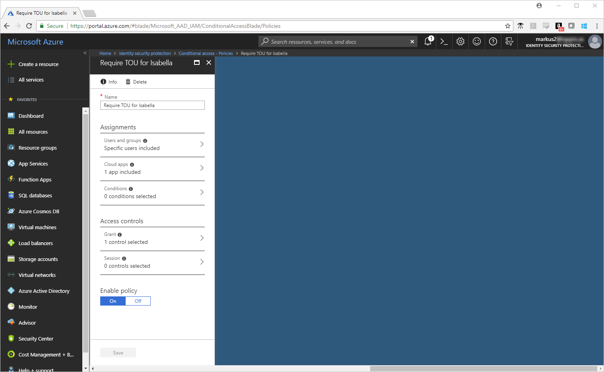

If you don't have an Azure subscription, create a [free account](https://azure.microsoft.com/free/?WT.mc_id=A261C142F) before you begin.

## Prerequisites

To complete the scenario in this quickstart, you need:

- **Access to an Azure AD Premium edition** - Azure AD Conditional Access is an Azure AD Premium capability.
- **A test account called Isabella Simonsen** - If you don't know how to create a test account, see [Add cloud-based users](../fundamentals/add-users-azure-active-directory.md#add-a-new-user).

## Test your sign-in

The goal of this step is to get an impression of the sign-in experience without a Conditional Access policy.

**To test your sign-in:**

1. Sign in to your [Azure portal](https://portal.azure.com/) as Isabella Simonsen.
1. Sign out.

## Create your terms of use

This section provides you with the steps to create a sample ToU. When you create a ToU, you select a value for **Enforce with Conditional Access policy templates**. Selecting **Custom policy** opens the dialog to create a new Conditional Access policy as soon as your ToU has been created.

**To create your terms of use:**

1. In Microsoft Word, create a new document.
1. Type **My terms of use**, and then save the document on your computer as **mytou.pdf**.
1. Sign in to your [Azure portal](https://portal.azure.com) as global administrator, security administrator, or a Conditional Access administrator.
1. In the Azure portal, on the left navbar, click **Azure Active Directory**.

   

1. On the **Azure Active Directory** page, in the **Security** section, click **Conditional Access**.

   

1. In the **Manage** section, click **Terms of use**.

   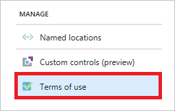

1. In the menu on the top, click **New terms**.

   

1. On the **New terms of use** page:

   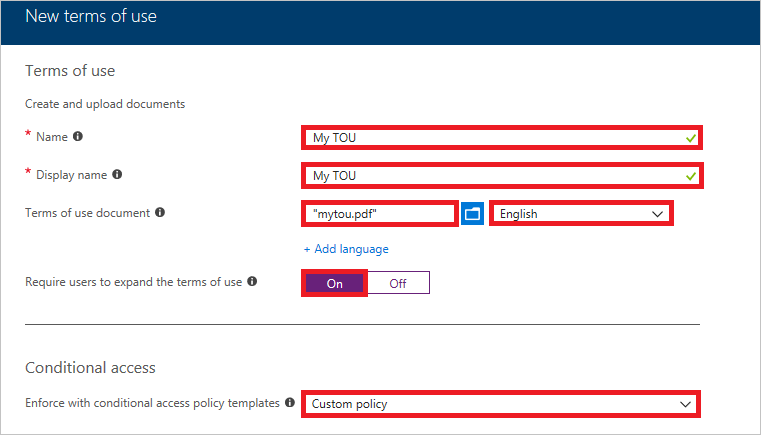

   1. In the **Name** textbox, type **My TOU**.
   1. In the **Display name** textbox, type **My TOU**.
   1. Upload your terms of use PDF file.
   1. As **Language**, select **English**.
   1. As **Require users to expand the terms of use**, select **On**.
   1. As **Enforce with Conditional Access policy templates**, select **Custom policy**.
   1. Click **Create**.

## Create your Conditional Access policy

This section shows how to create the required Conditional Access policy. The scenario in this quickstart uses:

- The Azure portal as placeholder for a cloud app that requires your ToU to be accepted. 
- Your sample user to test the Conditional Access policy.  

In your policy, set:

| Setting | Value |
| --- | --- |
| Users and groups | Isabella Simonsen |
| Cloud apps | Microsoft Azure Management |
| Grant access | My TOU |

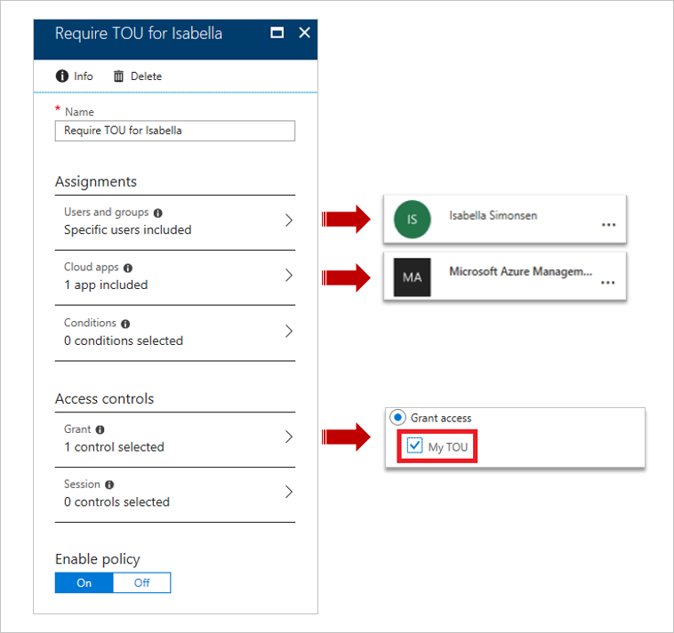

**To configure your Conditional Access policy:**

1. On the **New** page, in the **Name** textbox, type **Require TOU for Isabella**.

   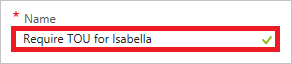

1. In the **Assignment** section, click **Users and groups**.

   

1. On the **Users and groups** page:

   

   1. Click **Select users and groups**, and then select **Users and groups**.
   1. Click **Select**.
   1. On the **Select** page, select **Isabella Simonsen**, and then click **Select**.
   1. On the **Users and groups** page, click **Done**.
1. Click **Cloud apps**.

   

1. On the **Cloud apps** page:

   

   1. Click **Select apps**.
   1. Click **Select**.
   1. On the **Select** page, select **Microsoft Azure Management**, and then click **Select**.
   1. On the **Cloud apps** page, click **Done**.
1. In the **Access controls** section, click **Grant**.

   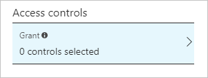

1. On the **Grant** page:

   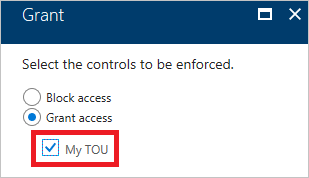

   1. Select **Grant access**.
   1. Select **My TOU**.
   1. Click **Select**.
1. In the **Enable policy** section, click **On**.

   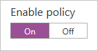

1. Click **Create**.

## Evaluate a simulated sign-in

Now that you have configured your Conditional Access policy, you probably want to know whether it works as expected. As a first step, use the Conditional Access what if policy tool to simulate a sign-in of your test user. The simulation estimates the impact this sign-in has on your policies and generates a simulation report.  

To initialize the **What If** policy evaluation tool, set:

- **Isabella Simonsen** as user
- **Microsoft Azure Management** as cloud app

Clicking **What If** creates a simulation report that shows:

- **Require TOU for Isabella** under **Policies that will apply**
- **My TOU** as **Grant Controls**.

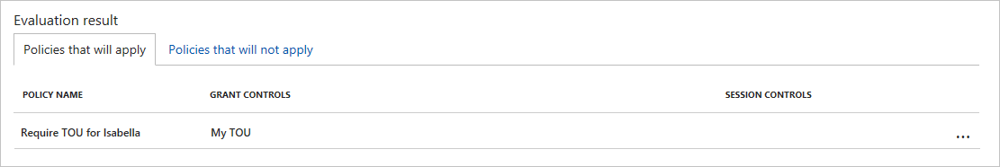

**To evaluate your Conditional Access policy:**

1. On the [Conditional Access - Policies](https://portal.azure.com/#blade/Microsoft_AAD_IAM/ConditionalAccessBlade/Policies) page, in the menu on the top, click **What If**.  

   

1. Click **Users**, select **Isabella Simonsen**, and then click **Select**.

   

1. To select a cloud app:

   

   1. Click **Cloud apps**.
   1. On the **Cloud apps page**, click **Select apps**.
   1. Click **Select**.
   1. On the **Select** page, select **Microsoft Azure Management**, and then click **Select**.
   1. On the cloud apps page, click **Done**.
1. Click **What If**.

## Test your Conditional Access policy

In the previous section, you have learned how to evaluate a simulated sign-in. In addition to a simulation, you should also test your Conditional Access policy to ensure that it works as expected.

To test your policy, try to sign-in to your [Azure portal](https://portal.azure.com) using your **Isabella Simonsen** test account. You should see a dialog that requires you to accept your terms of use.

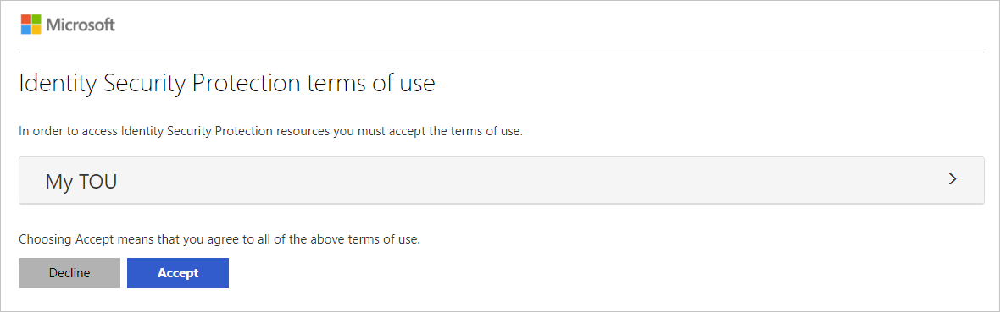

## Clean up resources

When no longer needed, delete the test user and the Conditional Access policy:

- If you don't know how to delete an Azure AD user, see [Delete users from Azure AD](../fundamentals/add-users-azure-active-directory.md#delete-a-user).
- To delete your policy, select your policy, and then click **Delete** in the quick access toolbar.

    

- To delete your terms of use, select it, and then click **Delete terms** in the toolbar on top.

    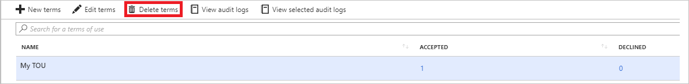

## Next steps

> [!div class="nextstepaction"]
> [Require MFA for specific apps](app-based-mfa.md)
> [Block access when a session risk is detected](app-sign-in-risk.md)
