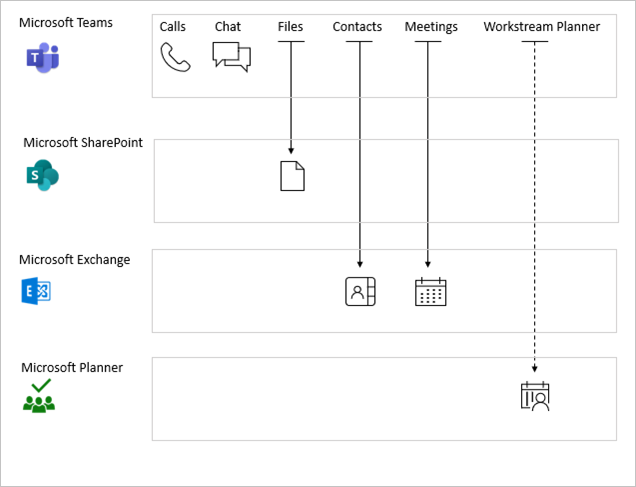

# What are service dependencies in Azure Active Directory Conditional Access? 

With Conditional Access policies, you can specify access requirements to websites and services. For example, your access requirements can include requiring multi-factor authentication (MFA) or [managed devices](require-managed-devices.md). 

When you access a site or service directly, the impact of a related policy is typically easy to assess. For example, if you have a policy that requires multi-factor authentication (MFA) for SharePoint Online configured, MFA is enforced for each sign-in to the SharePoint web portal. However, it is not always straight-forward to assess the impact of a policy because there are cloud apps with dependencies to other cloud apps. For example, Microsoft Teams can provide access to resources in SharePoint Online. So, when you access Microsoft Teams in our current scenario, you are also subject to the SharePoint MFA policy. 

> [!TIP]
> Using the [Office 365 (preview)](concept-conditional-access-cloud-apps.md#office-365-preview) app will target all Office apps to avoid issues with service dependencies in the Office stack.

## Policy enforcement 

If you have a service dependency configured, the policy may be applied using early-bound or late-bound enforcement. 

- **Early-bound policy enforcement** means a user must satisfy the dependent service policy before accessing the calling app. For example, a user must satisfy SharePoint policy before signing into MS Teams. 
- **Late-bound policy enforcement** occurs after the user signs into the calling app. Enforcement is deferred to when calling app requests, a token for the downstream service. Examples include MS Teams accessing Planner and Office.com accessing SharePoint. 

The diagram below illustrates MS Teams service dependencies. Solid arrows indicate early-bound enforcement the dashed arrow for Planner indicates late-bound enforcement. 

As a best practice, you should set common policies across related apps and services whenever possible. Having a consistent security posture provides you with the best user experience. For example, setting a common policy across Exchange Online, SharePoint Online, Microsoft Teams, and Skype for business significantly reduces unexpected prompts that may arise from different policies being applied to downstream services. 

A great way to accomplish this with applications in the Office stack is to use the [Office 365 (preview)](concept-conditional-access-cloud-apps.md#office-365-preview) instead of targeting individual applications.

The below table lists additional service dependencies, where the client apps must satisfy  

| Client apps         | Downstream service                          | Enforcement |
| :--                 | :--                                         | ---         | 
| Azure Data Lake     | Microsoft Azure Management (portal and API) | Early-bound |
| Microsoft Classroom | Exchange                                    | Early-bound |
|                     | SharePoint                                  | Early-bound |
| Microsoft Teams     | Exchange                                    | Early-bound |
|                     | MS Planner                                  | Late-bound  |
|                     | SharePoint                                  | Early-bound |
|                     | Skype for Business Online                   | Early-bound |
| Office Portal       | Exchange                                    | Late-bound  |
|                     | SharePoint                                  | Late-bound  |
| Outlook groups      | Exchange                                    | Early-bound |
|                     | SharePoint                                  | Early-bound |
| PowerApps           | Microsoft Azure Management (portal and API) | Early-bound |
|                     | Windows Azure Active Directory              | Early-bound |
| Project             | Dynamics CRM                                | Early-bound |
| Skype for Business  | Exchange                                    | Early-bound |
| Visual Studio       | Microsoft Azure Management (portal and API) | Early-bound |
| Microsoft Forms     | Exchange                                    | Early-bound |
|                     | SharePoint                                  | Early-bound |
| Microsoft To-Do     | Exchange                                    | Early-bound |

## Next steps

To learn how to implement Conditional Access in your environment, see [Plan your Conditional Access deployment in Azure Active Directory](plan-conditional-access.md).
