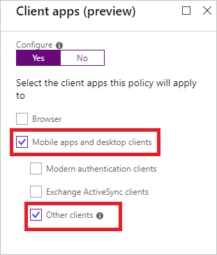

# Azure Active Directory Conditional Access settings reference

You can use [Azure Active Directory (Azure AD) Conditional Access](../active-directory-conditional-access-azure-portal.md) to control how authorized users can access your resources.

This article provides you with support information for the following configuration options in a Conditional Access policy:

- Cloud applications assignments
- Device platform condition
- Client applications condition
- Approved client application requirement

## Cloud apps assignments

With Conditional Access policies, you control how your users access your [cloud apps](conditions.md#cloud-apps-and-actions). When you configure a Conditional Access policy, you need to select at least one cloud app. 

### Microsoft cloud applications

You can assign a Conditional Access policy to the following cloud apps from Microsoft:

- Office 365 (preview)
- Azure Analysis Services
- Azure DevOps
- Azure SQL Database and Data Warehouse - [Learn more](https://docs.microsoft.com/azure/sql-database/sql-database-conditional-access)
- Dynamics CRM Online
- Microsoft Application Insights Analytics
- Microsoft Azure Information Protection - [Learn more](https://docs.microsoft.com/azure/information-protection/faqs#i-see-azure-information-protection-is-listed-as-an-available-cloud-app-for-conditional-accesshow-does-this-work)
- Microsoft Azure Management - [Learn more](https://docs.microsoft.com/azure/role-based-access-control/conditional-access-azure-management)
- Microsoft Azure Subscription Management
- Microsoft Cloud App Security
- Microsoft Commerce Tools Access Control Portal
- Microsoft Commerce Tools Authentication Service
- Microsoft Flow
- Microsoft Forms
- Microsoft Intune
- Microsoft Intune Enrollment
- Microsoft Planner
- Microsoft PowerApps
- Microsoft Search in Bing
- Microsoft StaffHub
- Microsoft Stream
- Microsoft Teams
- Office 365 Exchange Online
- Office 365 SharePoint Online
- Office 365 Yammer
- Office Delve
- Office Sway
- Outlook Groups
- Power BI Service
- Project Online
- Skype for Business Online
- Virtual Private Network (VPN)
- Windows Defender ATP

### Office 365 (preview)

Office 365 provides cloud-based productivity and collaboration services like Exchange, SharePoint, and Microsoft Teams. Office 365 cloud services are deeply integrated to ensure smooth and collaborative experiences. The Office 365 (preview) app makes it possible to target these services all at once. We recommend using the new Office 365 (preview) app, instead of targeting individual cloud apps like Office 365 Exchange Online and Office 365 SharePoint Online to avoid issues that may arise due to inconsistent policies and service dependencies.

Key applications that are included in the Office 365 (preview) client app:

- Office 365 Exchange Online
- Office 365 SharePoint Online
- Microsoft Teams
- Office 365 Yammer
- Office.com
- Microsoft Forms
- Microsoft Power Automate
- Microsoft Planner
- Microsoft PowerApps

### Other applications

In addition to the Microsoft cloud apps, you can assign a Conditional Access policy to the following types of cloud apps:

- Azure AD-connected applications
- Pre-integrated federated software as a service (SaaS) application
- Applications that use password single sign-on (SSO)
- Line-of-business applications
- Applications that use Azure AD Application Proxy

## Device platform condition

In a Conditional Access policy, you can configure the device platform condition to tie the policy to the operating system on a client. Azure AD Conditional Access supports the following device platforms:

- Android
- iOS
- Windows Phone
- Windows
- macOS

If you block legacy authentication using the **Other clients** condition, you can also set the device platform condition.

## Client apps condition

In your Conditional Access policy, you can configure the [client apps](conditions.md#client-apps) condition to tie the policy to the client app that has initiated an access attempt. Set the client apps condition to grant or block access when an access attempt is made from the following types of client apps:

- Browser
- Mobile apps and desktop apps

### Supported browsers

In your Conditional Access policy, you can select **Browsers** as client app.

This setting works with all browsers. However, to satisfy a device policy, like a compliant device requirement, the following operating systems and browsers are supported:

| OS                     | Browsers                                        |
| :--                    | :--                                             |
| Windows 10             | Microsoft Edge, Internet Explorer, Chrome       |
| Windows 8 / 8.1        | Internet Explorer, Chrome                       |
| Windows 7              | Internet Explorer, Chrome                       |
| iOS                    | Microsoft Edge, Intune Managed Browser, Safari  |
| Android                | Microsoft Edge, Intune Managed Browser, Chrome  |
| Windows Phone          | Microsoft Edge, Internet Explorer               |
| Windows Server 2019    | Microsoft Edge, Internet Explorer, Chrome       |
| Windows Server 2016    | Internet Explorer |
| Windows Server 2012 R2 | Internet Explorer                       |
| Windows Server 2008 R2 | Internet Explorer                       |
| macOS                  | Chrome, Safari                                  |

#### Why do I see a certificate prompt in the browser

On Windows 7, iOS, Android, and macOS Azure AD identifies the device using a client certificate that is provisioned when the device is registered with Azure AD.  When a user first signs in through the browser the user is prompted to select the certificate. The user must select this certificate before using the browser.

#### Chrome support

For Chrome support in **Windows 10 Creators Update (version 1703)** or later, install the [Windows 10 Accounts extension](https://chrome.google.com/webstore/detail/windows-10-accounts/ppnbnpeolgkicgegkbkbjmhlideopiji). This extension is required when a Conditional Access policy requires device specific details.

To automatically deploy this extension to Chrome browsers, create the following registry key:

|    |    |
| --- | --- |
| Path | HKEY_LOCAL_MACHINE\Software\Policies\Google\Chrome\ExtensionInstallForcelist |
| Name | 1 |
| Type | REG_SZ (String) |
| Data | ppnbnpeolgkicgegkbkbjmhlideopiji;https\://clients2.google.com/service/update2/crx |

For Chrome support in **Windows 8.1 and 7**, create the following registry key:

|    |    |
| --- | --- |
| Path | HKEY_LOCAL_MACHINE\SOFTWARE\Policies\Google\Chrome\AutoSelectCertificateForUrls |
| Name | 1 |
| Type | REG_SZ (String) |
| Data | {"pattern":"https://device.login.microsoftonline.com","filter":{"ISSUER":{"CN":"MS-Organization-Access"}}} |

These browsers support device authentication, allowing the device to be identified and validated against a policy. The device check fails if the browser is running in private mode.

### Supported mobile applications and desktop clients

In your Conditional Access policy, you can select **Mobile apps and desktop clients** as client app.

This setting has an impact on access attempts made from the following mobile apps and desktop clients:

| Client apps | Target Service | Platform |
| --- | --- | --- |
| Dynamics CRM app | Dynamics CRM | Windows 10, Windows 8.1, iOS, and Android |
| Mail/Calendar/People app, Outlook 2016, Outlook 2013 (with modern authentication)| Office 365 Exchange Online | Windows 10 |
| MFA and location policy for apps. Device based policies are not supported.| Any My Apps app service| Android and iOS |
| Microsoft Teams Services - this controls all services that support Microsoft Teams and all its Client Apps - Windows Desktop, iOS, Android, WP, and web client | Microsoft Teams | Windows 10, Windows 8.1, Windows 7, iOS, Android, and macOS |
| Office 2016 apps, Office 2013 (with modern authentication), OneDrive sync client (see [notes](https://support.office.com/en-US/article/Azure-Active-Directory-conditional-access-with-the-OneDrive-sync-client-on-Windows-028d73d7-4b86-4ee0-8fb7-9a209434b04e)) | Office 365 SharePoint Online | Windows 8.1, Windows 7 |
| Office 2016 apps, Universal Office apps, Office 2013 (with modern authentication), OneDrive sync client (see [notes](https://support.office.com/en-US/article/Azure-Active-Directory-conditional-access-with-the-OneDrive-sync-client-on-Windows-028d73d7-4b86-4ee0-8fb7-9a209434b04e)), Office Groups support is planned for the future, SharePoint app support is planned for the future | Office 365 SharePoint Online | Windows 10 |
| Office 2016 (Word, Excel, PowerPoint, OneNote only). OneDrive for Business support planned for the future| Office 365 SharePoint Online| macOS|
| Office 2019| Office 365 SharePoint Online | Windows 10, macOS |
| Office mobile apps | Office 365 SharePoint Online | Android, iOS |
| Office Yammer app | Office 365 Yammer | Windows 10, iOS, Android |
| Outlook 2019 | Office 365 SharePoint Online | Windows 10, macOS |
| Outlook 2016 (Office for macOS) | Office 365 Exchange Online | macOS |
| Outlook 2016, Outlook 2013 (with modern authentication), Skype for Business (with modern authentication) | Office 365 Exchange Online | Windows 8.1, Windows 7 |
| Outlook mobile app | Office 365 Exchange Online | Android, iOS |
| Power BI app | Power BI service | Windows 10, Windows 8.1, Windows 7, Android, and iOS |
| Skype for Business | Office 365 Exchange Online| Android, IOS |
| Visual Studio Team Services app | Visual Studio Team Services | Windows 10, Windows 8.1, Windows 7, iOS, and Android |

## Support for legacy authentication

By selecting **Other clients**, you can specify a condition that affects apps that use basic authentication with mail protocols like IMAP, MAPI, POP, SMTP, and older Office apps that don't use modern authentication.  

For more information, see [Client apps](conditions.md#client-apps).

## Approved client app requirement

In your Conditional Access policy, you can require that an access attempt to the selected cloud apps needs to be made from an approved client app. 

This setting applies to the following client apps:

- Microsoft Azure Information Protection
- Microsoft Bookings
- Microsoft Cortana
- Microsoft Dynamics 365
- Microsoft Edge
- Microsoft Excel
- Microsoft Flow
- Microsoft Intune Managed Browser
- Microsoft Invoicing
- Microsoft Kaizala
- Microsoft Launcher
- Microsoft OneDrive
- Microsoft OneNote
- Microsoft Outlook
- Microsoft Planner
- Microsoft PowerApps
- Microsoft Power BI
- Microsoft PowerPoint
- Microsoft SharePoint
- Microsoft Skype for Business
- Microsoft StaffHub
- Microsoft Stream
- Microsoft Teams
- Microsoft To-Do
- Microsoft Visio
- Microsoft Word
- Microsoft Yammer

**Remarks**

- The approved client apps support the Intune mobile application management feature.
- The **Require approved client app** requirement:
   - Only supports the iOS and Android for [device platform condition](#device-platform-condition).
- Conditional Access cannot consider Microsoft Edge in InPrivate mode an approved client app.

## App protection policy requirement 

In your Conditional Access policy, you can require an app protection policy be present on the client app before access is available to the selected cloud apps. 

This setting applies to the following client apps:

- Microsoft Cortana
- Microsoft OneDrive
- Microsoft Outlook
- Microsoft Planner

**Remarks**

- Apps for app protection policy support the Intune mobile application management feature with policy protection.
- The **Require app protection policy** requirements:
    - Only supports the iOS and Android for [device platform condition](#device-platform-condition).

## Next steps

- For an overview of Conditional Access, see [What is Conditional Access in Azure Active Directory?](../active-directory-conditional-access-azure-portal.md)
- If you are ready to configure Conditional Access policies in your environment, see the [recommended practices for Conditional Access in Azure Active Directory](best-practices.md).

<!--Image references-->
[1]: ./media/technical-reference/01.png
