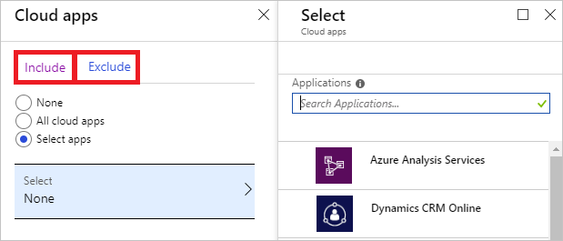
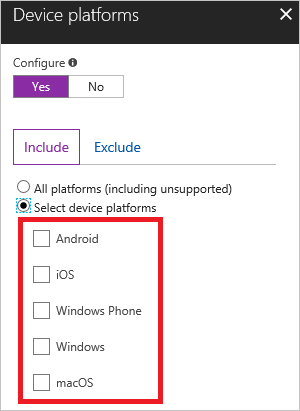
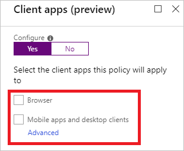
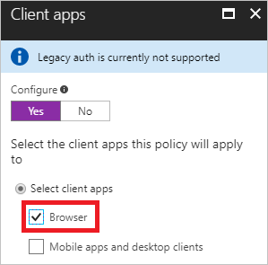
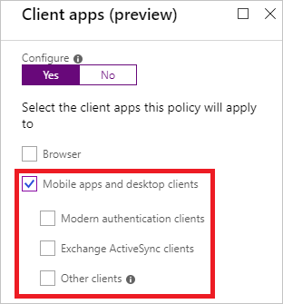
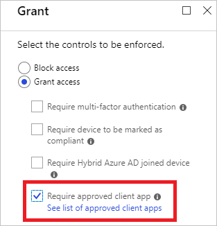

# Azure Active Directory conditional access settings reference

You can use [Azure Active Directory (Azure AD) conditional access](../active-directory-conditional-access-azure-portal.md) to control how authorized users can access your resources.   

This article provides you with support information for the following configuration options in a conditional access policy: 

- Cloud applications assignments

- Device platform condition 

- Client applications condition

- Approved client application requirement

If this is not the information you are looking for, please leave a comment at the end of this article.

## Cloud apps assignments

With conditional access policies, you control how your users access your [cloud apps](conditions.md#cloud-apps). When you configure a conditional access policy, you need to select at least one cloud app. 

### Microsoft cloud applications

You can assign a conditional access policy to the following cloud apps from Microsoft:

- Azure Information Protection - [Learn more](/azure/information-protection/faqs#i-see-azure-information-protection-is-listed-as-an-available-cloud-app-for-conditional-accesshow-does-this-work)

- Azure RemoteApp

- Microsoft Dynamics 365

- Microsoft Office 365 Yammer

- Microsoft Office 365 Exchange Online

- Microsoft Office 365 SharePoint Online (includes OneDrive for Business and Project Online)

- Microsoft Power BI 

- Azure DevOps

- Microsoft Teams

### Other applications 

In addition to the Microsoft cloud apps, you can assign a conditional access policy to the following types of cloud apps:

- Azure AD-connected applications

- Pre-integrated federated software as a service (SaaS) application

- Applications that use password single sign-on (SSO)

- Line-of-business applications

- Applications that use Azure AD Application Proxy

## Device platform condition

In a conditional access policy, you can configure the device platform condition to tie the policy to the operating system on a client. Azure AD conditional access supports the following device platforms:

- Android

- iOS

- Windows Phone

- Windows

- macOS

## Client apps condition 

In your conditional access policy, you can configure the [client apps](conditions.md#client-apps) condition to tie the policy to the client app that has initiated an access attempt. Set the client apps condition to grant or block access when an access attempt is made from the following types of client apps:

- Browser
- Mobile apps and desktop apps

### Supported browsers 

In your conditional access policy, you can select **Browsers** as client app.

This setting works with all browsers. However, to satisfy a device policy, like a compliant device requirement, the following operating systems and browsers are supported:

| OS                     | Browsers                            | Support     |
| :--                    | :--                                 | :-:         |
| Windows 10             | Internet Explorer, Edge, Chrome     | ![Check][1] |
| Windows 8 / 8.1        | Internet Explorer, Chrome           | ![Check][1] |
| Windows 7              | Internet Explorer, Chrome           | ![Check][1] |
| iOS                    | Safari, Intune Managed Browser      | ![Check][1] |
| Android                | Chrome, Intune Managed Browser      | ![Check][1] |
| Windows Phone          | Internet Explorer, Edge             | ![Check][1] |
| Windows Server 2016    | Internet Explorer, Edge             | ![Check][1] |
| Windows Server 2016    | Chrome                              | Coming soon |
| Windows Server 2012 R2 | Internet Explorer, Chrome           | ![Check][1] |
| Windows Server 2008 R2 | Internet Explorer, Chrome           | ![Check][1] |
| macOS                  | Chrome, Safari                      | ![Check][1] |

#### Chrome support

For Chrome support in **Windows 10 Creators Update (version 1703)** or later, install [this extension](https://chrome.google.com/webstore/detail/windows-10-accounts/ppnbnpeolgkicgegkbkbjmhlideopiji).

To automatically deploy this extension to Chrome browsers, create the following registry key:

|    |    |
|--- | ---|
|Path | HKEY_LOCAL_MACHINE\Software\Policies\Google\Chrome\ExtensionInstallForcelist |
|Name | 1 |
|Type | REG_SZ (String) |
|Data | ppnbnpeolgkicgegkbkbjmhlideopiji;https://clients2.google.com/service/update2/crx

For Chrome support in **Windows 8.1 and 7**, create the following registry key:

|    |    |
|--- | ---|
|Path | HKEY_LOCAL_MACHINE\SOFTWARE\Policies\Google\Chrome\AutoSelectCertificateForUrls |
|Name | 1 |
|Type | REG_SZ (String) |
|Data | {"pattern":"https://device.login.microsoftonline.com","filter":{"ISSUER":{"CN":"MS-Organization-Access"}}}|

These browsers support device authentication, allowing the device to be identified and validated against a policy. The device check fails if the browser is running in private mode. 

### Supported mobile applications and desktop clients

In your conditional access policy, you can select **Mobile apps and desktop clients** as client app.

This setting has an impact on access attempts made from the following mobile apps and desktop clients: 

|Client apps|Target Service|Platform|
|---|---|---|
|Azure Remote app|Azure Remote App service|Windows 10, Windows 8.1, Windows 7, iOS, Android, and Mac OS X|
|Dynamics CRM app|Dynamics CRM|Windows 10, Windows 8.1, iOS, and Android|
|Mail/Calendar/People app, Outlook 2016, Outlook 2013 (with modern authentication)|Office 365 Exchange Online|Windows 10|
|MFA and location policy for apps. Device based policies are not supported. |Any My Apps app service|Android and iOS|
|Microsoft Teams Services - this controls all services that support Microsoft Teams and all its Client Apps - Windows Desktop, iOS, Android, WP, and web client|Microsoft Teams|Windows 10, Windows 8.1, Windows 7, iOS, Android and macOS |
|Office 2016 apps, Office 2013 (with modern authentication), OneDrive sync client (see [notes](https://support.office.com/en-US/article/Azure-Active-Directory-conditional-access-with-the-OneDrive-sync-client-on-Windows-028d73d7-4b86-4ee0-8fb7-9a209434b04e))|Office 365 SharePoint Online|Windows 8.1, Windows 7|
|Office 2016 apps, Universal Office apps, Office 2013 (with modern authentication), OneDrive sync client (see [notes](https://support.office.com/en-US/article/Azure-Active-Directory-conditional-access-with-the-OneDrive-sync-client-on-Windows-028d73d7-4b86-4ee0-8fb7-9a209434b04e)), Office Groups support is planned for the future, SharePoint app support is planned for the future|Office 365 SharePoint Online|Windows 10|
|Office 2016 for macOS (Word, Excel, PowerPoint, OneNote only). OneDrive for Business support planned for the future|Office 365 SharePoint Online|Mac OS X|
|Office mobile apps|Office 365 SharePoint Online|Android, iOS|
|Office Yammer app|Office 365 Yammer|Windows 10, iOS, Android|
|Outlook 2016 (Office for macOS)|Office 365 Exchange Online|Mac OS X|
|Outlook 2016, Outlook 2013 (with modern authentication), Skype for Business (with modern authentication)|Office 365 Exchange Online|Windows 8.1, Windows 7|
|Outlook mobile app|Office 365 Exchange Online|Android, iOS|
|PowerBI app|PowerBI service|Windows 10, Windows 8.1, Windows 7, Android and iOS|
|Skype for Business|Office 365 Exchange Online|Android, IOS |
|Azure DevOps app|Azure DevOps|Windows 10, Windows 8.1, Windows 7, iOS, and Android|

## Approved client app requirement 

In your conditional access policy, you can require that an access attempt to the selected cloud apps needs to be made from an approved client app. 

This setting applies to the following client apps:

- Microsoft Intune Managed Browser
- Microsoft PowerBI
- Microsoft Invoicing
- Microsoft Launcher
- Microsoft Azure Information Protection
- Microsoft Excel
- Microsoft Kaizala 
- Microsoft OneDrive
- Microsoft OneNote
- Microsoft Outlook
- Microsoft Planner
- Microsoft PowerPoint
- Microsoft SharePoint
- Microsoft Skype for Business
- Microsoft StaffHub
- Microsoft Teams
- Microsoft Visio
- Microsoft Word
- Microsoft To-Do
- Microsoft Stream
- Microsoft Edge

**Remarks**

- The approved client apps support the Intune mobile application management feature.

- The **Require approved client app** requirement:

    - Only supports the iOS and Android for [device platform condition](#device-platforms-condition).

## Next steps

- For an overview of conditional access, see [What is conditional access in Azure Active Directory?](../active-directory-conditional-access-azure-portal.md)
- If you are ready to configure conditional access policies in your environment, see the [recommended practices for conditional access in Azure Active Directory](best-practices.md).

<!--Image references-->
[1]: ./media/technical-reference/01.png

