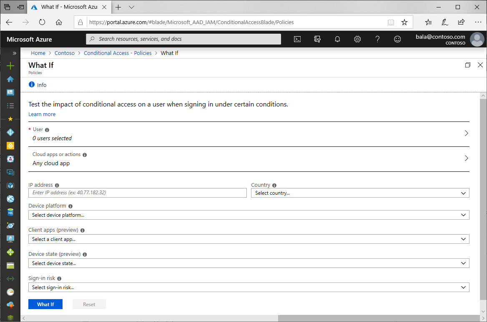
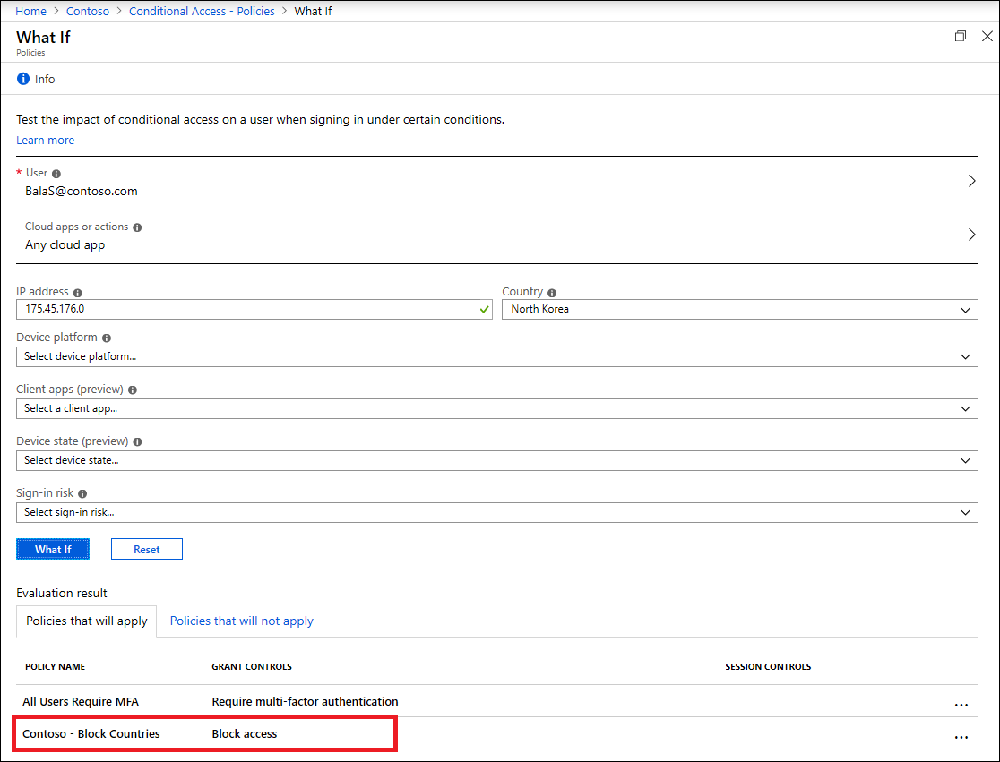

# Troubleshooting Conditional Access using the What If tool

The [What If tool](what-if-tool.md) in Conditional Access is powerful when trying to understand why a policy was or wasn't applied to a user in a specific circumstance or if a policy would apply in a known state.

The What If tool is located in the **Microsoft Entra admin center** > **Protection** > **Conditional Access** > **Policies** > **What If**.

## Gathering information

The What If tool requires only a **User** or **Workload identity** to get started. 

The following additional information is optional but helps narrow the scope for specific cases.

* Cloud apps, actions, or authentication context
* IP address 
* Country/Region
* Device platform
* Client apps
* Device state
* Sign-in risk
* User risk level
* Service principal risk (Preview)
* Filter for devices

This information can be gathered from the user, their device, or the Microsoft Entra sign-in log.

## Generating results

Input the criteria gathered in the previous section and select **What If** to generate a list of results. 

At any point, you can select **Reset** to clear any criteria input and return to the default state.

## Evaluating results

### Policies that will apply

This list shows which Conditional Access policies would apply given the conditions. The list includes both the grant and session controls that apply including policies in report-only mode. Examples include requiring multifactor authentication to access a specific application. 

### Policies that won't apply

This list shows Conditional Access policies that wouldn't apply if the conditions applied. The list includes any policies and the reason why they don't apply including policies in report-only mode. Examples include users and groups that may be excluded from a policy.

## Use case

Many organizations create policies based on network locations, permitting trusted locations and blocking locations where access shouldn't occur.

To validate that a configuration has been made appropriately, an administrator could use the What If tool to mimic access, from a location that should be allowed and from a location that should be denied.

In this instance, the user would be blocked from accessing any cloud app on their trip to North Korea as Contoso has blocked access from that location.

This test could be expanded to incorporate other data points to narrow the scope.

## Next steps

* [What is Conditional Access report-only mode?](concept-conditional-access-report-only.md)
* [What is Microsoft Entra ID Protection?](../identity-protection/overview-identity-protection.md)
* [What is a device identity?](../devices/overview.md)
* [How it works: Microsoft Entra multifactor authentication](../authentication/concept-mfa-howitworks.md)
