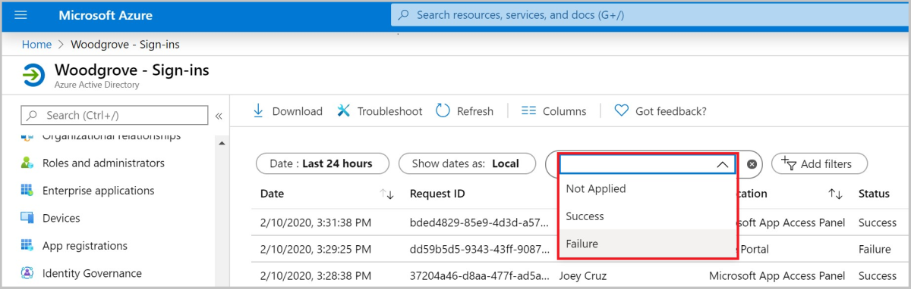

# Troubleshooting sign-in problems with Conditional Access

The information in this article can be used to troubleshoot unexpected sign in outcomes related to Conditional Access using error messages and Azure AD sign-ins log.

## Conditional Access sign-in interruption

The first way is to review the error message that appears. For problems signing in when using a web browser, the error page itself has detailed information. This information alone may describe what the problem is and that may suggest a solution.

In the above error, the message states that the application can only be accessed from devices or client applications that meet the company's mobile device management policy. In this case, the application and device do not meet that policy.

## Azure AD Sign In events

The second method to get detailed information about the sign-in interruption is to review the Azure AD Sign In events to see which Conditional Access policy or policies were applied and why.

More information can be found about the problem by clicking **More Details** in the initial error page. Clicking **More Details** will reveal troubleshooting information that is helpful when searching the Azure AD Sign In events for the specific failure event the user saw or when opening a support incident with Microsoft.

> [!NOTE]
> The Azure AD Sign-ins log is accessible to Global Admin, Global Reader and Security Administrator role members.

To find out which Conditional Access policy or policies applied and why do the following.

1. 
1. First, navigate to the **Azure AD Sign-ins blade**. The Azure AD Sign-In reports can be found in the **Monitoring** section of the Azure AD portal or directly from this link <https://portal.azure.com/#blade/Microsoft_AAD_IAM/ActiveDirectoryMenuBlade/SignIns>.
1. Next, update the **filters** to find the event for the sign-in you are reviewing. It is easy to find the event you are looking for by adjusting the filters.
1. Update the **Date** filter to include the date and time the event occurred and then add the Conditional access field. Once, the **Conditional Access** field is added, click on it and select **Failure**. Then add username as an additional filter. Type in the **user principal name (UPN)** of the user and click **Apply**.

   

   

1. Update the **Date** filter to include the date and time the event occurred and then add **Correlation ID** as an additional filter. Paste in the **Correlation ID** from the failure event and then click **apply**.
1. Once the sign-in event that corresponds to the user's sign-in failure has been found select the **Conditional Access** tab. The Conditional Access tab will show the specific policy or policies that resulted in the sign-in interruption.
1. To investigate further, drill down into the configuration of the policies by clicking on the **Policy Name**. Clicking the **Policy Name** will show the policy configuration user interface for the selected policy for review and editing.
1. The **client user** and **device details** that were used for the Conditional Access policy assessment are also available in the **Basic Info**, **Location**, **Device Info**, **Authentication Details**, and **Additional Details** tabs of the sign-in event.

   

If the information in the event isn't enough to understand the sign-in results or adjust the policy to get wanted results, then a support incident may be opened. Navigate to that sign in event's **Troubleshooting and support** tab and select Create New Support Request.

When submitting the incident, provide the request ID and time and date from the sign-in event in the incident submission details. This information will allow Microsoft support to find the event you're concerned about.

### Conditional Access error codes

| Sign-in Error Code | Error String |
| --- | --- |
| 53000 | DeviceNotCompliant |
| 53001 | DeviceNotDomainJoined |
| 53002 | ApplicationUsedIsNotAnApprovedApp |
| 53003 | BlockedByConditionalAccess |
| 53004 | ProofUpBlockedDueToRisk |

## Next steps

- [Sign-in activity reports in the Azure Active Directory portal](https://docs.microsoft.com/azure/active-directory/reports-monitoring/concept-sign-ins)
- [Troubleshooting Conditional Access using the What If tool](troubleshoot-conditional-access-what-if.md)
- Best practices for [Conditional Access in Azure Active Directory](https://docs.microsoft.com/azure/active-directory/conditional-access/best-practices)
- [How to roll out Conditional Access](https://www.youtube.com/watch?v=0_Fze7Zpyvc)
