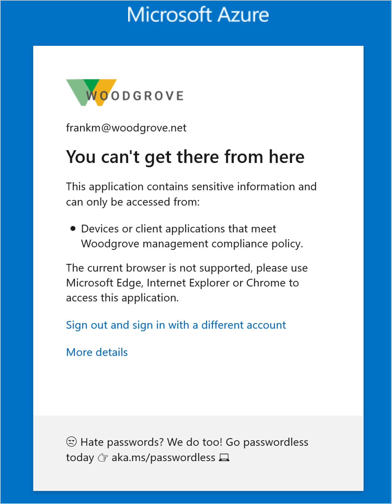
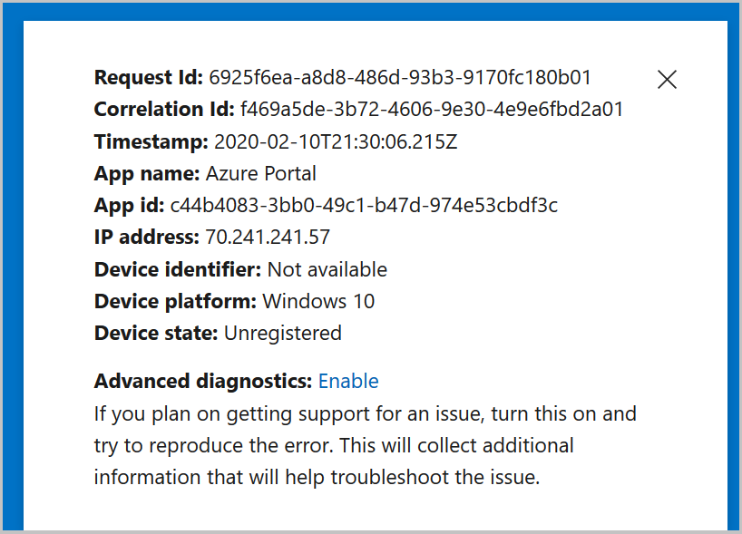
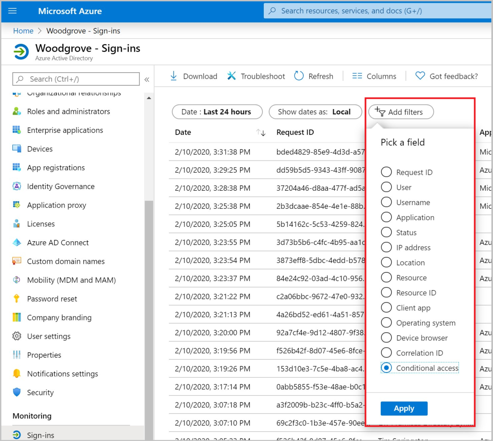
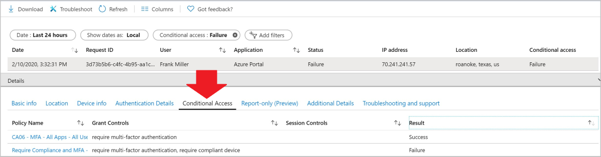
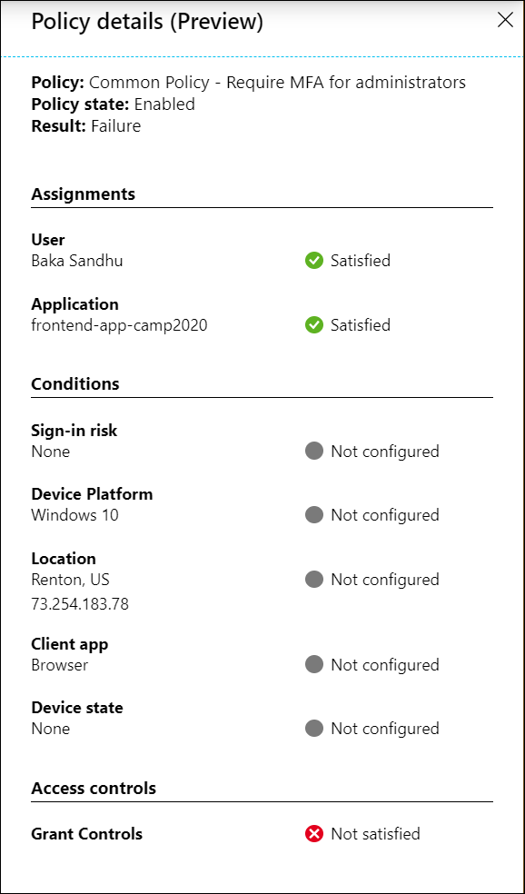
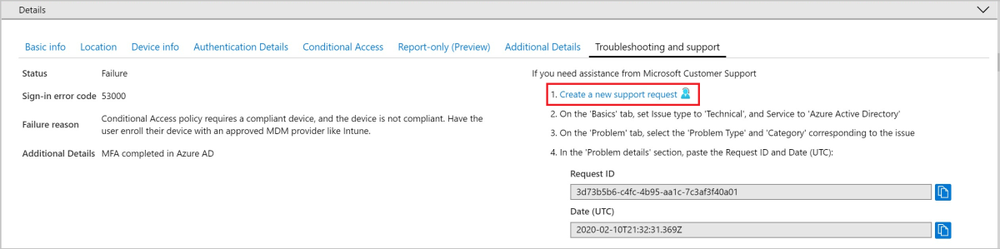

# Troubleshooting sign-in problems with Conditional Access

The information in this article can be used to troubleshoot unexpected sign-in outcomes related to Conditional Access using error messages and Azure AD sign-ins log.

## Conditional Access sign-in interrupt

The first way is to review the error message that appears. For problems signing in when using a web browser, the error page itself has detailed information. This information alone may describe what the problem is and that may suggest a solution.

In the above error, the message states that the application can only be accessed from devices or client applications that meet the company's mobile device management policy. In this case, the application and device do not meet that policy.

## Azure AD sign-in events

The second method to get detailed information about the sign-in interruption is to review the Azure AD sign-in events to see which Conditional Access policy or policies were applied and why.

More information can be found about the problem by clicking **More Details** in the initial error page. Clicking **More Details** will reveal troubleshooting information that is helpful when searching the Azure AD sign-in events for the specific failure event the user saw or when opening a support incident with Microsoft.

To find out which Conditional Access policy or policies applied and why do the following.

1. Sign in to the **Azure portal** as a global administrator, security administrator, or global reader.
1. Browse to **Azure Active Directory** > **Sign-ins**.
1. Find the event for the sign-in to review. Add or remove filters and columns to filter out unnecessary information.
   1. Add filters to narrow the scope:
      1. **Correlation ID** when you have a specific event to investigate.
      1. **Conditional access** to see policy failure and success. Scope your filter to show only failures to limit results.
      1. **Username** to see information related to specific users.
      1. **Date** scoped to the time frame in question.

   

1. Once the sign-in event that corresponds to the user's sign-in failure has been found select the **Conditional Access** tab. The Conditional Access tab will show the specific policy or policies that resulted in the sign-in interruption.
   1. Information in the **Troubleshooting and support** tab may provide a clear reason as to why a sign-in failed such as a device that did not meet compliance requirements.
   1. To investigate further, drill down into the configuration of the policies by clicking on the **Policy Name**. Clicking the **Policy Name** will show the policy configuration user interface for the selected policy for review and editing.
   1. The **client user** and **device details** that were used for the Conditional Access policy assessment are also available in the **Basic Info**, **Location**, **Device Info**, **Authentication Details**, and **Additional Details** tabs of the sign-in event.
   1. Selecting the ellipsis on the right side of the policy brings up policy details. This gives administrators additional information about why a policy was successfully applied or not.

   

   

If the information in the event isn't enough to understand the sign-in results or adjust the policy to get desired results, then a support incident may be opened. Navigate to that sign-in event's **Troubleshooting and support** tab and select **Create a new support request**.

When submitting the incident, provide the request ID and time and date from the sign-in event in the incident submission details. This information will allow Microsoft support to find the event you're concerned about.

### Conditional Access error codes

| Sign-in Error Code | Error String |
| --- | --- |
| 53000 | DeviceNotCompliant |
| 53001 | DeviceNotDomainJoined |
| 53002 | ApplicationUsedIsNotAnApprovedApp |
| 53003 | BlockedByConditionalAccess |
| 53004 | ProofUpBlockedDueToRisk |

## Next steps

- [Sign-in activity reports in the Azure Active Directory portal](../reports-monitoring/concept-sign-ins.md)
- [Troubleshooting Conditional Access using the What If tool](troubleshoot-conditional-access-what-if.md)
- Best practices for [Conditional Access in Azure Active Directory](best-practices.md)
