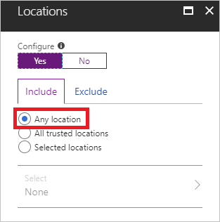
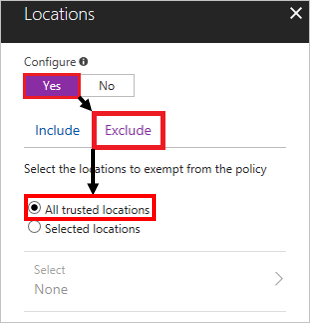

# How to: Configure conditional access policies for access attempts from untrusted networks   

In a mobile-first, cloud-first world, Azure Active Directory (Azure AD) enables single sign-on to devices, apps, and services from anywhere. As a result of this, your users can access your cloud apps not only from your organization's network, but also from any untrusted Internet location. With [Azure Active Directory (Azure AD) conditional access](../active-directory-conditional-access-azure-portal.md), you can control how authorized users can access your cloud apps. One common requirement in this context is to control access attempts initiated from untrusted networks. This article provides you with the information you need to configure a conditional access policy that handles this requirement. 

## Prerequisites

This article assumes that you are familiar with: 

- The basic concepts of Azure AD conditional access 
- Configuring conditional access policies in the Azure portal

See:

- [What is conditional access in Azure Active Directory](../active-directory-conditional-access-azure-portal.md) - for an overview of conditional access 

- [Quickstart: Require MFA for specific apps with Azure Active Directory conditional access](app-based-mfa.md) - to get some experience with configuring conditional access policies. 

## Scenario description

To master the balance between security and productivity, it might be sufficient for you to only require your user to be authenticated using a password. However, when an access attempt is made from an untrusted network location, there is an increased risk that sign-ins are not performed by legitimate users. To address this concern, you can block access attempts from untrusted networks. Alternatively, you can also require multi-factor authentication (MFA) to gain back additional assurance that an attempt was made by the legitimate owner of the account. 

With Azure AD conditional access, you can address this requirement with a single policy that grants access: 

- To selected cloud apps

- For selected users and groups  

- Requiring multi-factor authentication 

- When an access attempt is made from: 

    - A location that is not trusted

## Considerations

The challenge of this scenario is to translate *when an access attempt is made from a location that is not trusted* into a conditional access condition. In a conditional access policy, you can configure the [locations condition](location-condition.md) to address scenarios that are related to network locations. The locations condition enables you to select named locations, which represent logical groupings of IP address ranges, countries and regions.  

Typically, your organization owns one or more address ranges, for example, 199.30.16.0 - 199.30.16.24.
You can configure a named location by:

- Specifying this range (199.30.16.0/24) 

- Assigning a descriptive name such as **Corporate Network** 

Instead of trying to define what all locations are that are not trusted, you can:

- Include 

    

- Exclude all trusted locations 

    

## Implementation

With the approach outlined in this article, you can now configure a conditional access policy for untrusted locations. You should always test your policy before rolling it out into production to make sure that it works as expected. Ideally, you should do your initial tests in a test tenant if possible. For more information, see [How should you deploy a new policy](best-practices.md#how-should-you-deploy-a-new-policy). 

## Next steps

If you would like to learn more about conditional access, see [What is conditional access in Azure Active Directory?](../active-directory-conditional-access-azure-portal.md)