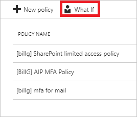
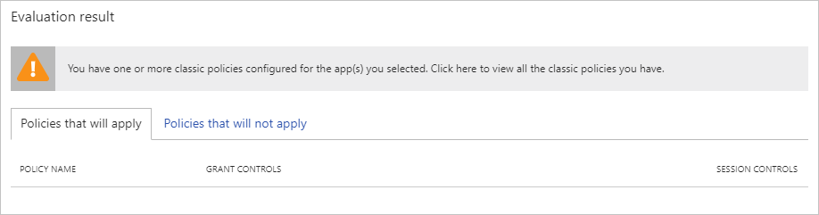

# What is the what if tool in Azure Active Directory conditional access?

[Conditional access](../active-directory-conditional-access-azure-portal.md) is a capability of Azure Active Directory (Azure AD) that enables you to control how authorized users access your cloud apps. How do you know what to expect form the conditional access policies in your environment? To answer this question, you can use the **conditional access what if tool**.

This article explains how you can use this tool to test your conditional access policies.

## What it is

The **conditional access what if policy tool** allows you to understand the impact of your conditional access policies on your environment. Instead of test driving your policies by performing multiple sign-ins manually, this tool enables you to evaluate a simulated sign-in of a user. The simulation estimates the impact this sign-in has on your policies and generates a simulation report. The report does not only list the applied conditional access policies but also [classic policies](policy-migration.md#classic-policies) if they exist.    

The what if tools also provides a way to quickly determine the policies that apply to a specific user. You can use the information, for example, if you need to troubleshoot an issue.	

## How it works

In the **conditional access what if tool**, you first need to configure the settings of the sign-in scenario you want to simulate. These settings include:

- The user you want to test 

- The cloud apps the user would attempt to access

- The conditions under which access to the configures cloud apps is performed
     
As a next step, you can initiate a simulation run that evaluates your settings. Only policies that are enabled are part of an evaluation run.

When the evaluation has finished, the tool generates a report of the affected policies.

> [!NOTE]
> Currently, the What If tool does not support nested groups. If a user is in a group and that group is member of another group that is used in a conditional access policy, then the what if tool does not correctly display the effect of that policy to the user. 

## Running the tool

You can find the **what if** tool on the **[Conditional access - Policies](https://portal.azure.com/#blade/Microsoft_AAD_IAM/ConditionalAccessBlade/Policies)** page in the Azure portal.

To start the tool, in the toolbar on top of the list of policies, click **What if**.

Before you can run an evaluation, you must configure the settings.

## Settings

This section provides you with information about the settings of simulation run.

### User

You can only select one user. This is the only required field.

### Cloud apps

The default for this setting is **All cloud apps**. The default setting performs an evaluation of all available policies in your environment. You can narrow down the scope to policies affecting specific cloud apps.

### IP address

The IP address is a single IPv4 address to mimic the [location condition](location-condition.md). The address represents Internet facing address of the device used by your user to sign in. You can verify the IP address of a device by, for example, navigating to [What is my IP address](https://whatismyipaddress.com).    

### Device platforms

This setting mimics the [device platforms condition](conditions.md#device-platforms) and represents the equivalent of **All platforms (including unsupported)**. 
### Client apps

This setting mimics the [client apps condition](conditions.md#client-apps).
By default, this setting causes an evaluation of all policies having **Browser** or **Mobile apps and desktop clients** either individually or both selected. It also detects policies that enforce **Exchange ActiveSync (EAS)**. You can narrow this setting down by selecting:

- **Browser** to evaluate all policies having at least **Browser** selected. 

- **Mobile apps and desktop clients** to evaluate all policies having at least **Mobile apps and desktop clients** selected. 

### Sign-in risk

This setting mimics the [sign-in risk condition](conditions.md#sign-in-risk).   

## Evaluation 

You start an evaluation by clicking **What if**. The evaluation result provides you with a report that consists of: 

- An indicator whether classic policies exist in your environment
- Policies that apply to your user
- Policies that don't apply to your user

If [classic policies](policy-migration.md#classic-policies) exist for the selected cloud apps, an indicator is presented to you. By clicking the indicator, you are redirected to the classic policies page. On the classic policies page, you can migrate a classic policy or just disable it. You can return to your evaluation result by closing this page.

On the list of policies that apply to your selected user, you can also find a list of [grant controls](controls.md#grant-controls) and [session](controls.md#session-controls) controls your user must satisfy.

On the list of policies that don't apply to your user, you can and also find the reasons why these policies don't apply. For each listed policy, the reason represents the first condition that was not satisfied. A possible reason for a policy that is not applied is a disabled policy because they are not further evaluated.   

## Next steps

- If you want to know how to configure a conditional access policy, see [Require MFA for specific apps with Azure Active Directory conditional access](app-based-mfa.md).

- If you are ready to configure conditional access policies for your environment, see the [best practices for conditional access in Azure Active Directory](best-practices.md). 

- if you want to migrate classic policies, see [Migrate classic policies in the Azure portal](policy-migration.md)  
