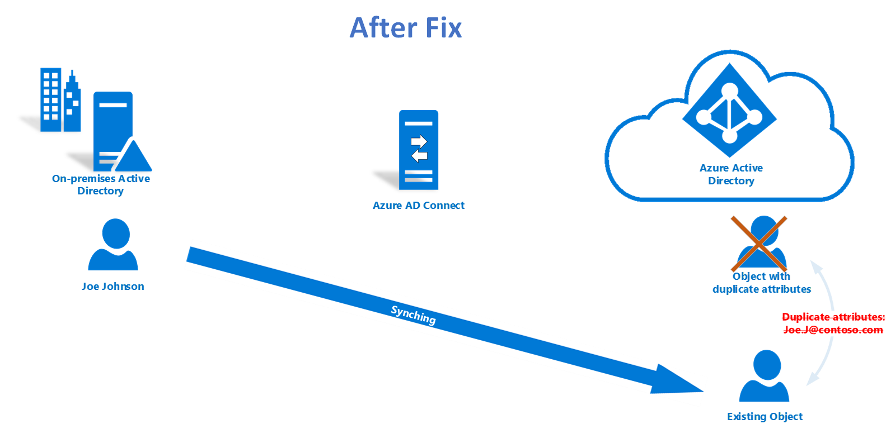

# Duplicate attribute sync errors diagnosis and remediation 

## Overview
Taking one step further of highlighting sync errors, Azure Active Directory Connect Health is introducing a self-service remediation experience to troubleshoot duplicated attribute sync errors and fix orphaned objects from Azure AD. 
The key benefit from the diagnosis feature:
- Provide diagnostic procedure to narrow down duplicated attribute sync error scenarios and indicate specific resolutions
- Apply fix for dedicated scenarios from Azure AD to resolve the error in single click
- No upgrade or configuration is required to enable this feature.
Read more details about Azure AD [duplicated resilience](https://aka.ms/dupattributeresdocs).

## Problems
### Common scenario
When **QuarantinedAttributeValueMustBeUnique** and **AttributeValueMustBeUnique** sync errors happen, it is common to see User Principal Name or Proxy Addresses conflict in Azure AD. You may solve the sync errors by updating the conflicting source object from on premises side. The sync error will be resolved after the following synchronization. 
For example, the picture below indicates that two users are having conflict of their UserPrincipalName as *Joe.J@contoso.com*. The conflicting objects are quarantined in Azure AD. 

### Orphaned object scenario
Occasionally you may find an existing user loses the Source Anchor. The deletion of source object happened in on premises AD, but the change of deletion signal never got synchronized to Azure AD. It can happen due to reasons such as sync engine issue or domain migration. When same object got restored or recreated, logically existing user should be the user to synchronize from the Source Anchor. For existing user as cloud only object, you can also see conflicting user synchronized to Azure AD and cannot be matched in sync to the existing object. There is no direct way to remap the Source Anchor. Read more about the [existing KB](https://support.microsoft.com/help/2647098). 
For example, the existing object in Azure AD preserves the license of Joe. Newly synchronized object with different source anchor occurred in duplicated attribute state in Azure AD. Changes of Joe in on-premises AD will not be able to be applied to Joe’s original user (existing object) in Azure AD.  

## Diagnostic and troubleshooting steps in Connect Health 
Diagnose feature supports User objects with following duplicated attributes:

| Attribute Name | Synchronization Error Types|
| ------------------ | -----------------|
| UserPrincipalName | QuarantinedAttributeValueMustBeUnique or AttributeValueMustBeUnique | 
| ProxyAddresses | QuarantinedAttributeValueMustBeUnique or AttributeValueMustBeUnique | 
| SipProxyAddress | AttributeValueMustBeUnique | 
| OnPremiseSecurityIdentifier |  AttributeValueMustBeUnique |

>[!IMPORTANT]
> It requires **Global Admin** permission or **Contributor** from RBAC settings to be able to access this feature. 
>

Following the steps from Azure portal, you will be able to narrow down the sync error details and provide more specific solutions:

From the Azure portal, you will be able to go through a few steps to identify specific fixable scenarios:  
1.	In Diagnose status column, the status will show if there is a potential troubleshooting flows to narrow down the error case and potentially fix directly from Azure Active Directory.
| Status | What does it mean? |
| ------------------ | -----------------|
| Not Started | You have not visited this diagnosis process. Depends on the diagnostic result, there is potentially a way to fix the sync error from the portal directly. |
| Manual Fix Required | The error does not fit into the criteria of available fix from the portal. The case can be (1) Conflicting object types are not users (2) You already went through the diagnostic steps and no fix resolution available from the portal. In this case, fix from on-prem side will still be one of the solutions. [Read more about on-premises fix](https://support.microsoft.com/help/2647098) | 
| Pending Sync | Fix was applied. Waiting for the next sync cycle to clear the error. |
>[!IMPORTANT]
> The diagnostic status column will be reset after each sync cycle. 
>

2.	By clicking **Diagnose** button in the error details blade, you will have to answer a few questions and identify the sync error details. Answering the questions will help identify the case of orphaned object scenario. 

3.	If there is a **Close** button at the end of the diagnostics, it means there is no quick fix available from the portal based on the given answers. Refer to the solution shown in the last step. Fix from on premises will still be the solutions. After clicking on close button, you will find the status of the current sync error will switch to be **Manual fix required**. The status will retain during the current synchronization cycle.

4.	Once orphaned object case is identified, you will be able to fix the duplicated attributes sync errors directly from the portal. Click on the **Apply Fix** button to trigger the process. The status of the current sync error will update to be **Pending sync**.

5.	After the following sync cycle, the error should be removed from the list.

## How to answer the diagnosis questions 
### Does the user exist in your on premises Active Directory?

The question is trying to identify source object of existing user from on-prem Active Directory.  
1.	Check if your Active Directory has an object with the provided UserPrincipalName. If No, answer No.
2.	If Yes, check if the object is still in scope for Syncing.  
  - Search in the Azure AD Connector Space with the DN.
  - If the object is found with the **Pending Add** state, answer No. Azure AD Connect is not able to connect the object to the right AD Object.
  - If the object is not found, answer Yes.

> Taking the following diagram, for example, the question is trying to identify if *Joe Jackson* still exist in on-prem Active Directory.
For **common scenario**, both user *Joe Johnson* and *Joe Jackson* will be present in your on-prem Active Directory. The quarantined objects are two different users.

> For **orphaned object scenario**, only single user – *Joe Johnson* will be present from the on-prem Active Directory:

### Do both these accounts belong to the same user?
The question is checking incoming conflicting user and the existing user object in Azure AD to see if they belong to the same user.  
1.	Conflicting object is newly synced to Azure Active Directory. Compare the object from its:  
  - Display Name
  - User Principal Name
  - Object ID
2.	If failed to compare them, check your Active Directory has objects with the provided UserPrincipalNames. Answer NO if both are found.  

> In the case below, the two objects belongs to the same user *Joe Johnson*.

## What happened after fix is applied for orphaned object scenario
Based on the answers of raised questions, you will be able to see **Apply Fix** button when there is a fix available from the Azure AD. In this case, the on premises object is synchronizing with an unexpected Azure AD object. The two objects are mapped using the "Source Anchor". The apply change will perform steps such as:
- Update the Source Anchor to the correct object in Azure AD.
- Delete the conflicting object in Azure AD if it presents.

>[!IMPORTANT]
> The Apply Fix change will only apply to the orphaned object cases.
>

After the steps above, the user will be able to access to original resource, which is link to existing object. 
The **Diagnose status** value in the list view will be updated to be **Pending Sync**.
Sync error will be resolved after the following synchronization. Connect Health will not show resolved sync error from the list view anymore. 

## FAQ
 -	What happened if execution of the apply failed?  
If execution fails, it is possible Azure AD Connect is running export error at the time. Refresh the portal page and retry after the following synchronization. The default synchronization cycle is 30 minutes. 

 -	What if the **existing object** should be the object to be deleted?  
If existing object should be deleted in this case, the process does not involve change of Source Anchor. You should be able to fix it from your on-prem AD.  

 -	What is the permission for user to be able to apply the fix?  
Global Admin or Contributor from RBAC settings will have the permission to access the diagnostic and troubleshooting process.

 -	Do I have to config AAD Connect or update Azure AD Connect Health agent for this feature?  
No, diagnosis process is a complete cloud-based feature.

 - 	If the existing object is soft deleted, will the Diagnose process restore the object to be active again?  
No, the fix will not update object attribute other than Source Anchor. 
