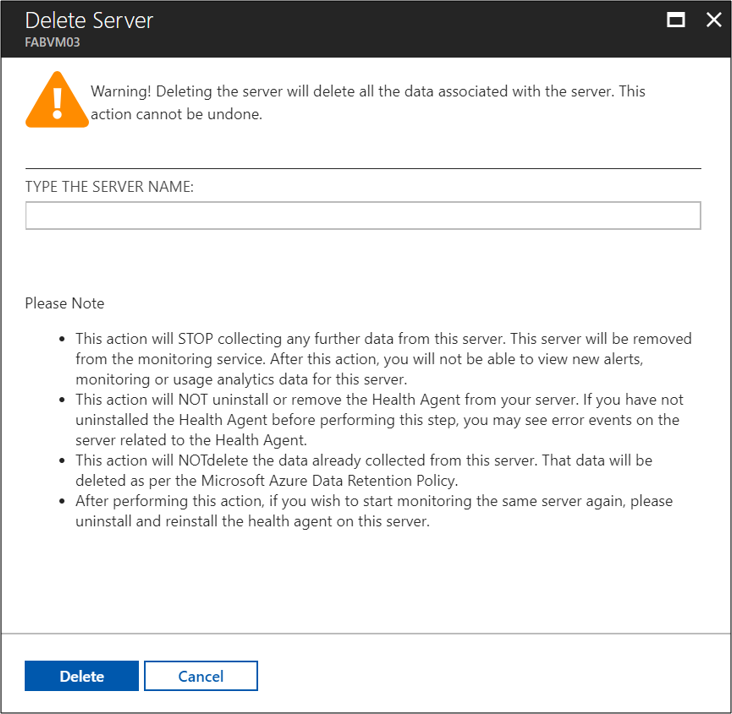
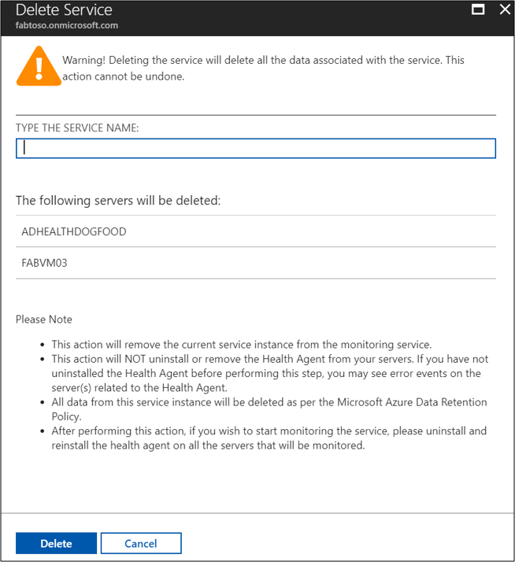

# Azure AD Connect Health and GDPR compliance 

In May 2018, a European privacy law, the [General Data Protection Regulation (GDPR)](http://ec.europa.eu/justice/data-protection/reform/index_en.htm), is due to take effect. The GDPR imposes new rules on companies, government agencies, non-profits, and other organizations that offer goods and services to people in the European Union (EU), or that collect and analyze data tied to EU residents. The GDPR applies no matter where you are located. 

Microsoft products and services are available today to help you meet the GDPR requirements. Read more about Microsoft Privacy policy at [Trust Center](https://www.microsoft.com/trustcenter)

Azure AD Connect Health provides monitoring, insights, and alert functionality to on-premises identity infrastructure and synchronization service. We are committed to GDPR compliance across our cloud services when enforcement begins May 2018 and provide GDPR related assurances in our contractual commitments. 

>[!NOTE] 
>This article deals with Azure AD Connect Health and GDPR compliance.  For information on Azure AD Connect and GDPR compliance see the article [here](../../active-directory/connect/active-directory-aadconnect-gdpr.md).

## Update in Azure AD Connect Health 
Azure AD Connect Health falls into the data **Processor** category of GDPR classification. As a data processor pipeline, we provide data processing services to key partners and end consumers. Azure AD Connect Health has no independent control over what personal data is collected and how it is used.

Azure AD Connect Health does not generate user data. Data retrieval, aggregation, analysis and reporting in Azure AD Connect Health are based on existing on-premises data. 

Currently, Azure AD Connect Health does not generate reports, provide analytics/insights beyond 30 days. In order to comply to the GDPR as well as Azure data retention policies, the following changes have been made. 

## Data retention policy alignment
To align with GDPR Compliance, Microsoft privacy compliance and Azure AD data retention policy, Azure AD Connect Health has updated data storage and processing procedures to not retain any data beyond 30 days. 
 
## Disable Connect Health data collection and monitoring
Azure AD Connect Health provides capabilities to stop data collection at the server level and the service level. After stopping data collection, the target servers will be deleted from the Azure AD Connect Health portal. 

>[!IMPORTANT]
>Global Admin or Contributor and above in RBAC role permission are required to proceed the deletion action.
>
>The delete services action cannot be reverted.

### Deletion actions
You need to be aware of the following with regard to deletion actions.

- Deletion actions will remove the targeted service instances from Connect Health monitoring service list. Connect Health will stop collecting data once the deletions take place. 
- Deletion actions will NOT uninstall or remove the Health Agent from your servers. If you have not uninstalled the Health Agent before performing this step, you may see error events on the server(s) related to the Health Agent.
- All data from this service instance will be deleted as per the Microsoft Azure Data Retention Policy.
- After performing this action, if you wish to start monitoring the service, please uninstall and [reinstall the health agent](active-directory-aadconnect-health-agent-install.md) on all the servers that will be monitored.

### To delete server level
To remove a server from Azure AD Connect Health data collection use the following steps [here](active-directory-aadconnect-health-operations.md#to-delete-a-server-from-the-azure-ad-connect-health-service).

After clicking on **Delete** button you need to confirm the name of the server you wish to delete and click **Delete** again.

 

### To delete service level
To remove a service from Azure AD Connect Health data collection use the following steps [here](active-directory-aadconnect-health-operations.md#delete-a-service-instance-from-azure-ad-connect-health-service).

After clicking on **Delete** button you need to confirm the name of the service you wish to delete and click **Delete** again.

 

## Next Steps

* [Azure AD Connect and GDPR](../../active-directory/connect/active-directory-aadconnect-gdpr.md)
* [Azure AD Connect Health operations](active-directory-aadconnect-health-operations.md)