# Synchronizing guest user accounts that use email for sign-in (Preview)

>[!NOTE]
> This feature is currently in public preview.

The following scenario address the situation where you may have external users in your on-premises AD environment, such as partners, who use an alternate sign-in method.

In the preceding example, Nina Morin works for Fabrikam and she has the following email address: nmorin@fabrikam.com.  Nina is a partner with Contoso and she needs access to certain applications that Contoso has.  Contoso has created an account for Nina and has directed Nina to use her email address to sign-in to applications.

For their on-premises applications, this scenario has been working great.  But now, Contoso is moving these applications to the cloud and wants to have the same experience for their partners.

This scenario addresses this situation.


## Pre-requisites and assumptions
This section contains a  list of pre-requisites and assumptions you need to be aware of prior to attempting to set up this scenario.

### Pre-requisites
- Global administrator credentials to configure Azure AD Connect, verify domains, and configure domain federation settings
- Azure AD Connect version 1.1.524.0 or higher
- Verified domain to set the cloud UPN of external users (example: bmcontoso.com).
- Federation Service to authenticate your external users. If you use AD FS, it must be 2012 R2 or higher
- MSOL PowerShell v1.1 is installed on a machine to verify federation settings.  For more information, see [Azure ActiveDirectory (MSOnline)](https://docs.microsoft.com/en-us/powershell/azure/active-directory/overview?view=azureadps-1.0).


### Assumptions 
- Azure AD Connect has already been set up and installed successfully.  For information on how to install Azure AD Connect see.
This document makes the following assumptions:
- that you have a federation service set up and that it is successfully authenticating users.
- external users can authenticate using their external email address.
- - Using an alternate ID for sign-in has been set up and configured.  Users can authenticate using their alternate ID.  For additional information on setting up an alternate ID with AD FS, see [Configure Alternate Login ID](https://docs.microsoft.com/en-us/windows-server/identity/ad-fs/operations/configuring-alternate-login-id).

## Task 1:  Prepare the environment
The following task is more of an informational so that you are ready to begin synchronizing your external accounts so that they can sign-in using an alternate i such as the mail attribute.

Define the items in the table below before moving on to the second task.

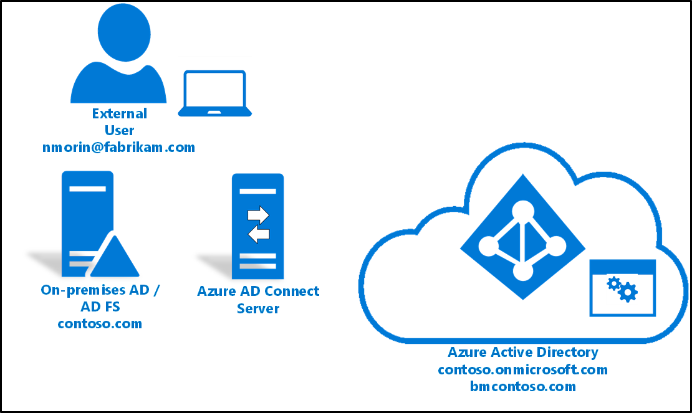

|Environment Aspect|What is it used for?|Implementation in your environment|
|-----|-----|-----|
|Cloud UPN Attribute|The attribute that will populate the UPN of the external user objects in the cloud. The UPN suffix for the external accounts must be the one defined in the pre-requisites.  This is the verified domain.|* Example: UserPrincipalName (nmorin@bmcontoso.com)|
|Sign-In Address|The attribute that external users will type in when logging in. This attribute must have an e-mail address format, and in most cases it coincides with the actual e-mail address of the external user.|* Example: mail (nmorin@fabrikam.com)|
|Azure AD Connect Scoped Filter|The filter that will allow targeting the external identities to scope the synchronization rules defined later in this guide. Typical ways to scope include: a pre-defined OU in the organization, a certain naming convention, a specific domain, etc.|* Example: OU contains Externals|
|Azure AD tenant|The name of the Azure AD tenant as it appears to Azure AD Connect.  The tenant will most likely be an *.onmicrosoft.com name and will be used as the connected system in the outbound synchronization rule created later.|Example:  contoso.onmicrosoft.com|

The following screen shot has three boxes outlined.
- The **Externals** OU which will be used in our Azure AD Connect Scoped Filter and is the location of our external users.
- The **mail** attribute which is used by our external users to sign-in.
- The **userPrincipalName** attribute which is our verified domain that our on-premises environment is federated with.

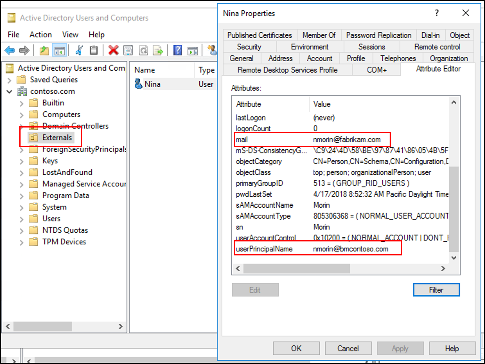

## Task 2:  Configure Azure AD Connect
Once you have the information above defined, we can move on to setting up the Azure AD Connect synchronization rules.  To do set up the rules, use the Azure AD Connect synch rules editor.  For more information on the editor see [Declaritive Provisioning](active-directory-aadconnectsync-understanding-declarative-provisioning.md).

### How to configure the synchronization rule
Use the following procedure to configure Azure AD Connect.

1. Open the Azure AD Connect synchronization rule editor by going to **Start - Azure AD Connect - Synchronization rules editor**.
2. On the **Synchronization Rules Editor** screen, ensure the direction is **inbound** and on the right, click **Add new rule**.
3. On the **Description** page configure the following and click **Next**.
    - **Name** - enter a name for the rule 
    - **Connected System:** - our on-premises AD environment
    - **Connected System Object Type:** - user
    - **Metaverse Object Type:** - person
    - **Link Type:** - Join
    - **Precedence:** - 90
    - 
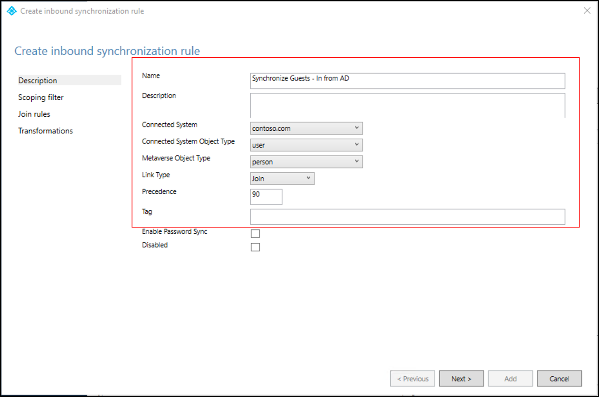

4. On the **Scoping Filter** screen, click **Add group**.
5. Use the drop-downs to configure the filter.  Enter the following and click **Next**.  This will create a filter that only applies to objects located in the external OU.
    - **Attribute** - dn
    - **Operator** - CONTAINS
    - **Value** - Externals
 
 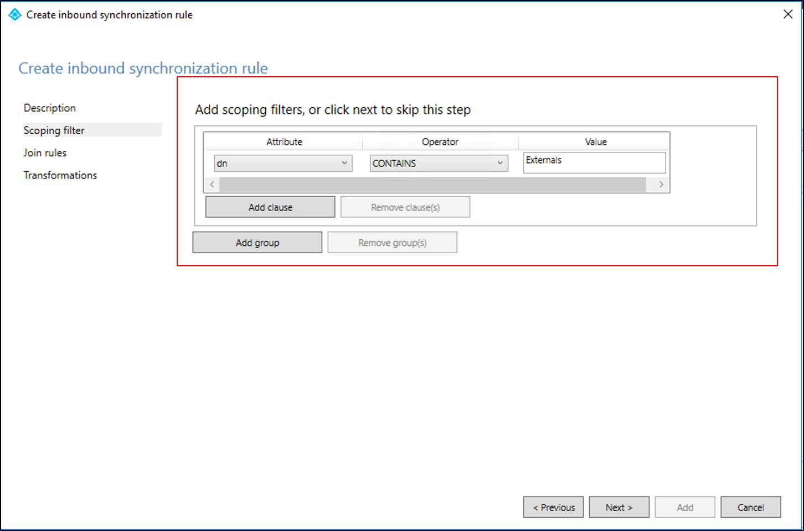

6. On the **Join Rules** screen click **Next**.
7. On the **Transformations** screen click **Add Transformation**.  Enter the following information:
    - **FlowType** - Constant
    - **Target Attribute** - userType
    - **Source** - Guest
8. On the **Transformations** screen click **Add Transformation**.  Enter the following information:
    - **FlowType** - Direct
    - **Target Attribute** - onPremisesUserPrincipalName
    - **Source** - mail
9. On the **Transformations** screen click **Add Transformation**.  Enter the following information:
    - **FlowType** - Direct
    - **Target Attribute** - userPrincipalName
    - **Source** - userPrincipalName
  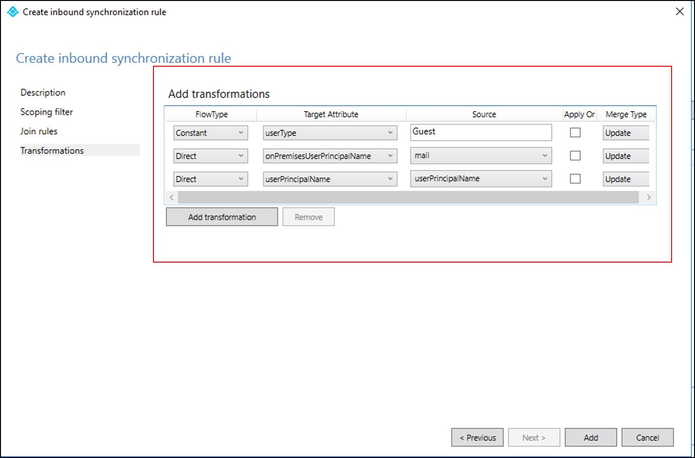
10. Click **Add**. 
11. On the **Synchronization Rules Editor** screen, ensure the direction is **outbound** and on the right, click **Add new rule**.
12. On the **Description** page configure the following and click **Next**.
    - **Name** - enter a name for the rule 
    - **Connected System:** - our Azure AD tenant
    - **Connected System Object Type:** - user
    - **Metaverse Object Type:** - person
    - **Link Type** - Join
    - **Precedence:** - 90
    - 
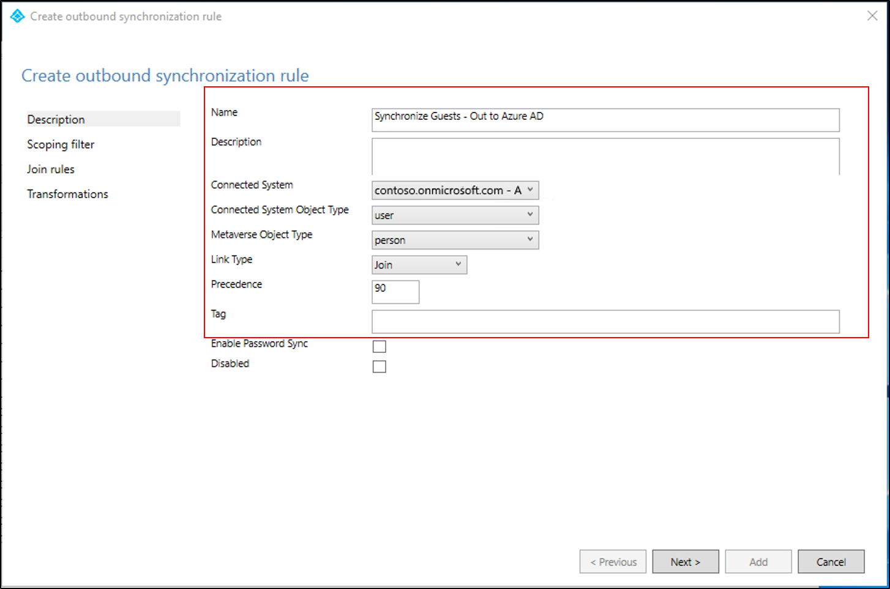

13. On the **Scoping filter** screen click **Next**.
14. On the **Join Rules** screen click **Next**.
15. On the **Transformations** screen click **Add Transformation**.  Enter the following information:
    - **FlowType** - Direct
    - **Target Attribute** - userType
    - **Source** - userType
9. On the **Transformations** screen click **Add Transformation**.  Enter the following information:
    - **FlowType** - Direct
    - **Target Attribute** - onPremisesUserPrincipalName
    - **Source** - onPremisesUserPrincipalName
  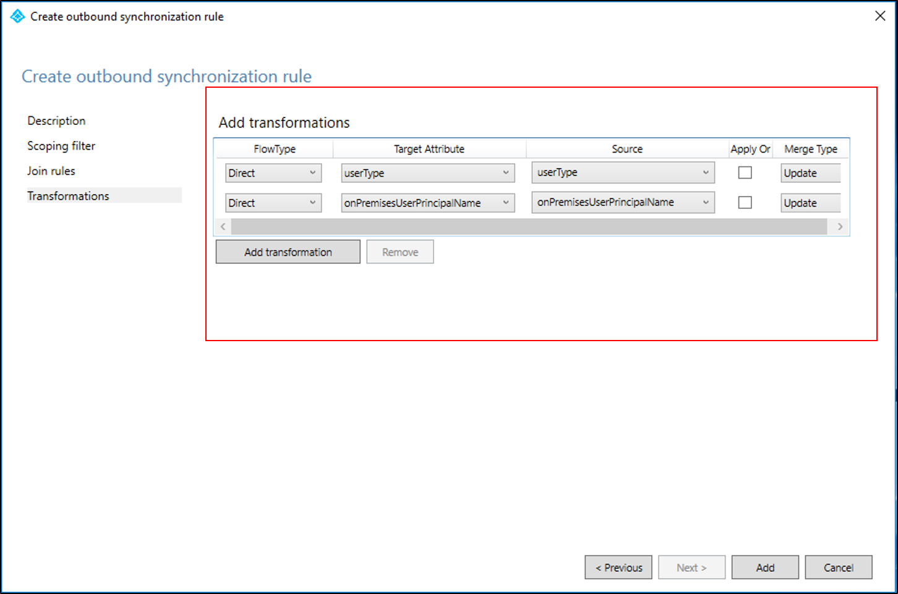
10. Click **Add**. 
11. Once you have configured these rules you need to run a full synchronization.  Use PowerShell to start a full synchronization.  Once the synchronization finishes you can proceed to the next step.

``` powershell
    Start-ADSyncSyncCycle -PolicyType Initial
```

## Task 3:  Federation
The following task is an informational on a few things that you need to have in-place in order for the scenario to work.

You can verify your federation settings with Azure using the Azure AD PowerShell.  This document uses the v1.1 of MSOL PowerShell.  You can install this version [here](https://docs.microsoft.com/en-us/powershell/azure/active-directory/overview?view=azureadps-1.0).

### Verify your federation settings
Use the following procedure to verify your federation settings.
1. Open Windows PowerShell and connect to Azure AD using the following command:
``` powershell
      Connect-MSOLservice
```
2.  Enter the global administrator credentials
3.  Now enter the following command:
  ``` powershell
      Get-MSOLDomainFederationSettings
  ```
4.   Notice your federation information should be returned.  Note the **ActiveLogonUri** is the URL of the federation server.

  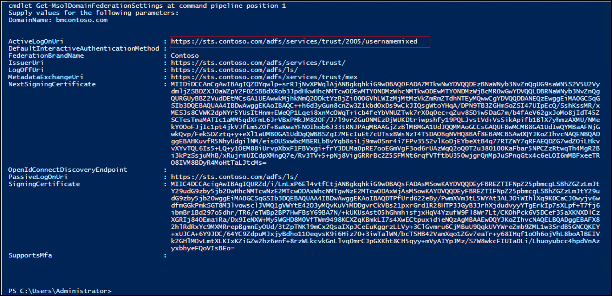

### Verify Alternate Login ID
This document uses AD FS as the identity provider (Idp).  If you are using a different Idp, these steps may very.

1. Open Windows PowerShell and enter the following command:
   ```powershell
    Get-ADFSClaimsProviderTrust
   ```
2. You should see the AD FS information.  Note the **AlternateLoginID** and **LookupForests**.

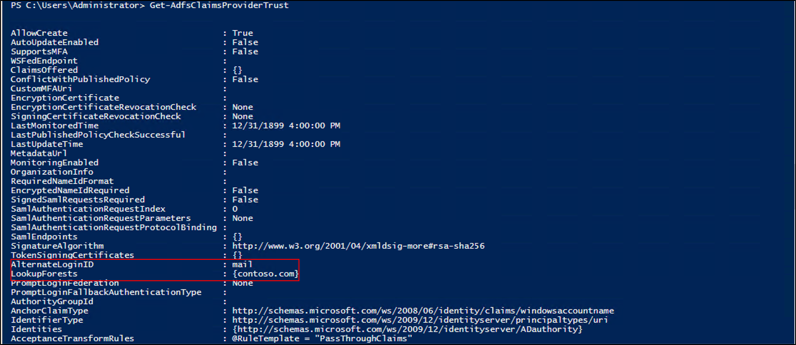

## Task 4:  Testing
In order to verify that this is working properly, you need to sign-in to a tenanted endpoint.  To test this, we deployed a website in Azure and are using the following url: contososampapp.azurewebsites.net

### Verify that you can sign-in with the alternate ID
1. Sign-in to the tenanted endpoint.</br>
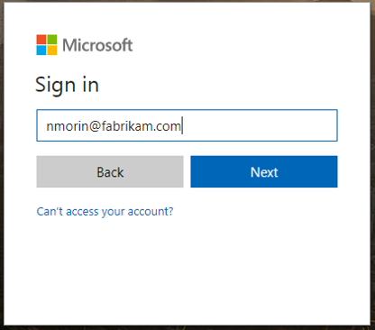
1. Enter your username and you will be re-directed to the federation sign-in page.
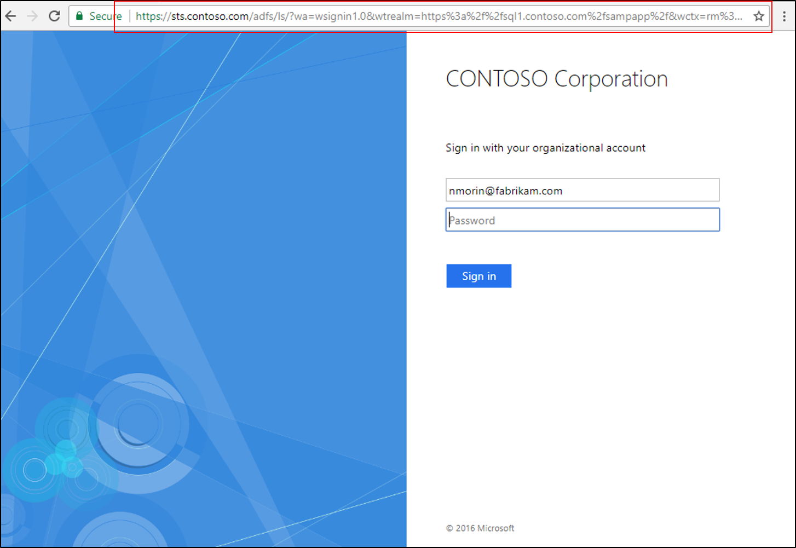
1. Enter your credentials.
2. You should now be successfully signed in.
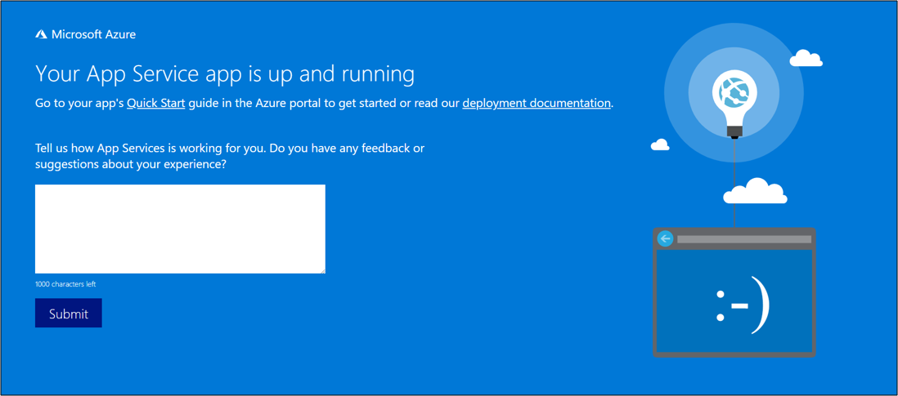

## Next Steps
- [Properties of an Azure Active Directory B2B collaboration user](../../active-directory/active-directory-b2b-user-properties.md#key-properties-of-the-azure-ad-b2b-collaboration-user)
- [Configuring Alternate Login ID](https://docs.microsoft.com/en-us/windows-server/identity/ad-fs/operations/configuring-alternate-login-id)
- [Azure AD Connect: Version release history](active-directory-aadconnect-version-history.md)
