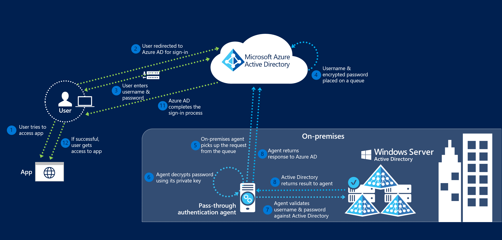

# Azure Active Directory Pass-through Authentication: Technical deep dive
The following article is a overview of how Azure AD Pass-through Authentication works.  For deep technical and security information see the [**security deep dive**](active-directory-aadconnect-pass-through-authentication-security-deep-dive.md) article.

## How does Azure Active Directory Pass-through Authentication work?

When a user attempts to sign into an application secured by Azure Active Directory (Azure AD), and if Pass-through Authentication is enabled on the tenant, the following steps occur:

1. The user tries to access an application (for example, the Outlook Web App - https://outlook.office365.com/owa/).
2. If the user is not already signed in, the user is redirected to the Azure AD sign-in page.
3. The user enters their username and password into the Azure AD sign-in page and clicks the "Sign in" button.
4. Azure AD, on receiving the sign-in request, places the username and password (encrypted using a public key) on a queue.
5. An on-premises Authentication Agent retrieves the username and encrypted password from the queue.
6. The agent decrypts the password using its private key.
7. The agent then validates the username and password against Active Directory using standard Windows APIs (a similar mechanism to what is used by Active Directory Federation Services). The username can be either the on-premises default username (usually `userPrincipalName`) or another attribute configured in Azure AD Connect (known as `Alternate ID`).
8. The on-premises Active Directory Domain Controller (DC) then evaluates the request and returns the appropriate response (success, failure, password expired or user locked out) to the agent.
9. The Authentication Agent, in turn, returns this response back to Azure AD.
10. Azure AD evaluates the response and responds to the user as appropriate - for example, it either signs the user in immediately or requests for Multi-Factor Authentication (MFA).
11. If the user sign-in is successful, the user is able to access the application.

The following diagram illustrates all the components and the steps involved.

## Next steps
- [**Current limitations**](active-directory-aadconnect-pass-through-authentication-current-limitations.md) - Learn which scenarios are supported and which ones are not.
- [**Quick Start**](active-directory-aadconnect-pass-through-authentication-quick-start.md) - Get up and running Azure AD Pass-through Authentication.
- [**Smart Lockout**](active-directory-aadconnect-pass-through-authentication-smart-lockout.md) - Configure Smart Lockout capability on your tenant to protect user accounts.
- [**Frequently Asked Questions**](active-directory-aadconnect-pass-through-authentication-faq.md) - Answers to frequently asked questions.
- [**Troubleshoot**](active-directory-aadconnect-troubleshoot-pass-through-authentication.md) - Learn how to resolve common issues with the feature.
- [**Security Deep Dive**](active-directory-aadconnect-pass-through-authentication-security-deep-dive.md) - Additional deep technical information on the feature.
- [**Azure AD Seamless SSO**](active-directory-aadconnect-sso.md) - Learn more about this complementary feature.
- [**UserVoice**](https://feedback.azure.com/forums/169401-azure-active-directory/category/160611-directory-synchronization-aad-connect) - For filing new feature requests.
