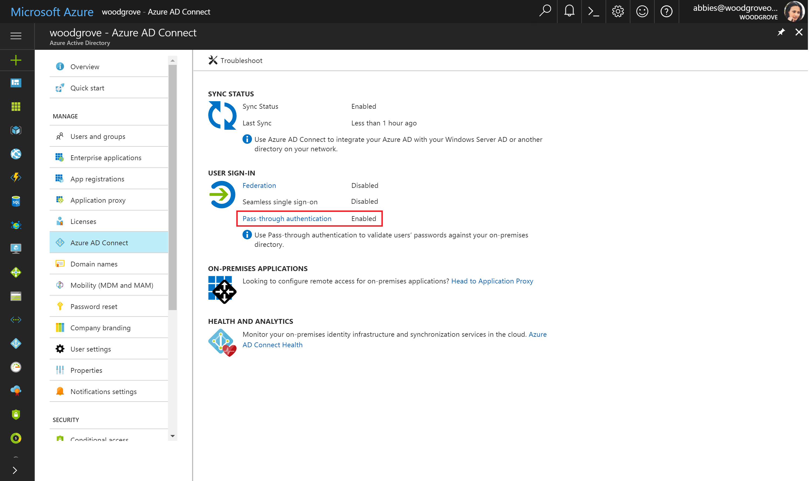
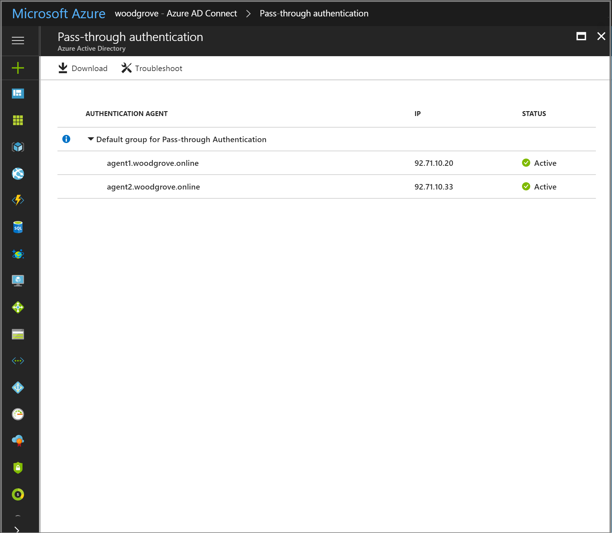
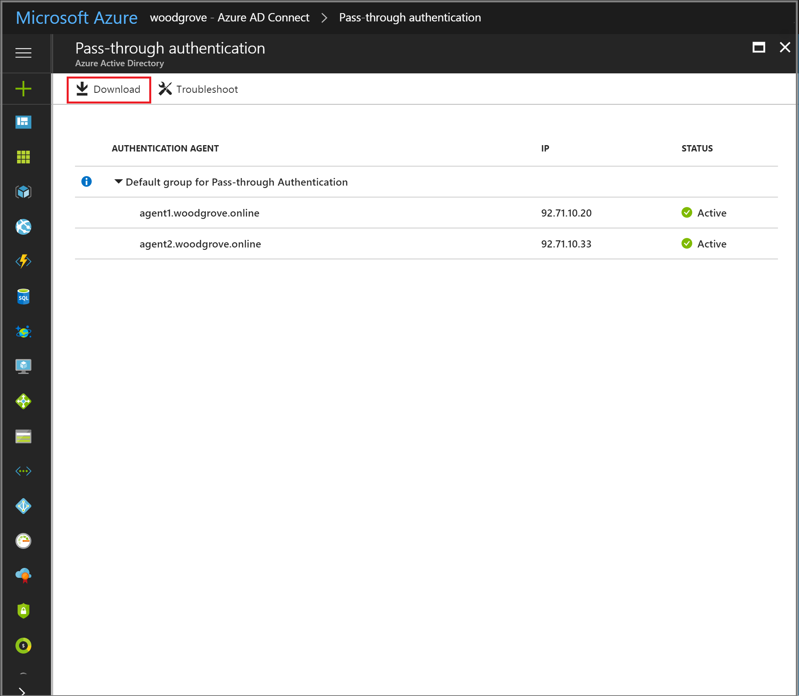
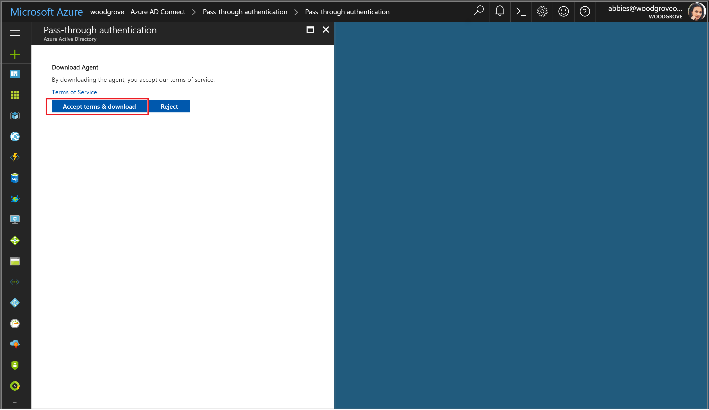

# Azure Active Directory Pass-through Authentication: Quick start

## How to deploy Azure AD Pass-through Authentication

Azure Active Directory (Azure AD) Pass-through Authentication allows your users to sign in to both on-premises and cloud-based applications using the same passwords. It signs users in by validating their passwords directly against your on-premises Active Directory.

>[!IMPORTANT]
>Azure AD Pass-through Authentication is currently in preview. If you have been using this feature through preview, you should ensure that you upgrade preview versions of the Authentication Agents using the instructions provided [here](./active-directory-aadconnect-pass-through-authentication-upgrade-preview-authentication-agents.md).

You need to follow these instructions to deploy Pass-through Authentication:

## Step 1: Check prerequisites

Ensure that the following prerequisites are in place:

### On the Azure Active Directory admin center

1. Create a cloud-only Global Administrator account on your Azure AD tenant. This way, you can manage the configuration of your tenant should your on-premises services fail or become unavailable. Learn about [adding a cloud-only Global Administrator account](../active-directory-users-create-azure-portal.md). Doing this step is critical to ensure that you don't get locked out of your tenant.
2. Add one or more [custom domain name(s)](../active-directory-add-domain.md) to your Azure AD tenant. Your users sign in using one of these domain names.

### In your on-premises environment

1. Identify a server running Windows Server 2012 R2 or later on which to run Azure AD Connect. Add the server to the same AD forest as the users whose passwords need to be validated.
2. Install the [latest version of Azure AD Connect](https://www.microsoft.com/download/details.aspx?id=47594) on the server identified in preceding step. If you already have Azure AD Connect running, ensure that the version is 1.1.557.0 or later.
3. Identify an additional server running Windows Server 2012 R2 or later on which to run a standalone Authentication Agent. The Authentication Agent version needs to be 1.5.193.0 or later. This server is needed to ensure high availability of sign-in requests. Add the server to the same AD forest as the users whose passwords need to be validated.
4. If there is a firewall between your servers and Azure AD, you need to configure the following items:
   - Ensure that Authentication Agents can make **outbound** requests to Azure AD over the following ports:
   
   | Port number | How it's used |
   | --- | --- |
   | **80** | Downloading certificate revocation lists (CRLs) while validating the SSL certificate |
   | **443** | All outbound communication with our service |
   
   If your firewall enforces rules according to originating users, open these ports for traffic from Windows services that run as  Network Service.
   - If your firewall or proxy allows DNS whitelisting, whitelist connections to **\*.msappproxy.net** and **\*.servicebus.windows.net**. If not, allow access to [Azure DataCenter IP ranges](https://www.microsoft.com/download/details.aspx?id=41653), which are updated weekly.
   - Your Authentication Agents need access to **login.windows.net** and **login.microsoftonline.com** for initial registration, so open your firewall for those URLs as well.
   - For certificate validation, unblock the following URLs: **mscrl.microsoft.com:80**, **crl.microsoft.com:80**, **ocsp.msocsp.com:80** and **www.microsoft.com:80**. These URLs are used for certificate validation with other Microsoft products, so you may already have these URLs unblocked.

## Step 2: Enable Exchange ActiveSync support (optional)

Follow these instructions to enable Exchange ActiveSync support:

1. Use [Exchange PowerShell](https://technet.microsoft.com/library/mt587043(v=exchg.150).aspx) to run the following command:
```
Get-OrganizationConfig | fl per*
```

2. Check the value of the `PerTenantSwitchToESTSEnabled` setting. If the value is **true**, your tenant is properly configured - this is generally the case for most customers. If the value is **false**, run the following command:
```
Set-OrganizationConfig -PerTenantSwitchToESTSEnabled:$true
```

3. Verify that the value of the `PerTenantSwitchToESTSEnabled` setting is now set to **true**. Wait an hour before moving to the next step.

If you face any issues during this step, check our [troubleshooting guide](active-directory-aadconnect-troubleshoot-pass-through-authentication.md#exchange-activesync-configuration-issues) for more information.

## Step 3: Enable the feature

Pass-through Authentication can be enabled using [Azure AD Connect](active-directory-aadconnect.md).

>[!IMPORTANT]
>Pass-through Authentication can be enabled on the Azure AD Connect primary or staging server. It is highly recommended that you enable it from the primary server.

If you are installing Azure AD Connect for the first time, choose the [custom installation path](active-directory-aadconnect-get-started-custom.md). At the **User sign-in** page, choose **Pass-through Authentication** as the Sign on method. On successful completion, a Pass-through Authentication agent is installed on the same server as Azure AD Connect. In addition, the Pass-through Authentication feature is enabled on your tenant.


If you have already installed Azure AD Connect (using the [express installation](active-directory-aadconnect-get-started-express.md) or the [custom installation](active-directory-aadconnect-get-started-custom.md) path), select **Change user sign-in page** on Azure AD Connect, and click **Next**. Then select **Pass-through Authentication** as the Sign on method. On successful completion, a Pass-through Authentication agent is installed on the same server as Azure AD Connect and the feature is enabled on your tenant.


>[!IMPORTANT]
>Pass-through Authentication is a tenant-level feature. Turning it on impacts sign-in for users across _all_ the managed domains in your tenant. If you are switching from AD FS to Pass-through Authentication, we recommend that you wait at least 12 hours before shutting down your AD FS infrastructure - this wait time is to ensure that users can keep signing in to Exchange ActiveSync during transition.

## Step 4: Test the feature

Follow these instructions to verify that you have enabled Pass-through Authentication correctly:

1. Sign in to the [Azure Active Directory admin center](https://aad.portal.azure.com) with the Global Administrator credentials for your tenant.
2. Select **Azure Active Directory** on the left-hand navigation.
3. Select **Azure AD Connect**.
4. Verify that the **Pass-through Authentication** feature shows as **Enabled**.
5. Select **Pass-through Authentication**. This blade lists the servers where your Authentication Agents are installed.





At this stage, users from all managed domains in your tenant can sign in using Pass-through Authentication. However, users from federated domains continue to sign in using Active Directory Federation Services (AD FS) or another federation provider that you have previously configured. If you convert a domain from federated to managed, all users from that domain automatically start signing in using Pass-through Authentication. Cloud-only users are not impacted by the Pass-through Authentication feature.

## Step 5: Ensure high availability

If you plan to deploy Pass-through Authentication in a production environment, you should install a standalone Authentication Agent. Install this second Authentication Agent on a server _other_ than the one running Azure AD Connect and the first Authentication Agent. This setup provides you high availability of sign-in requests. Follow these instructions to deploy a standalone Authentication Agent:

1. **Download the latest version of the Authentication Agent (versions 1.5.193.0 or later)**: Sign in to the [Azure Active Directory admin center](https://aad.portal.azure.com) with your tenant's Global Administrator credentials.
2. Select **Azure Active Directory** on the left-hand navigation.
3. Select **Azure AD Connect** and then **Pass-through Authentication**. And select **Download agent**.
4. Click the **Accept terms & download** button.
5. **Install the latest version of the Authentication Agent**: Run the executable downloaded in the preceding step. Provide your tenant's Global Administrator credentials when prompted.





>[!NOTE]
>You can also download the Authentication Agent from [here](https://aka.ms/getauthagent). Ensure that you review and accept the Authentication Agent's [Terms of Service](https://aka.ms/authagenteula) _before_ installing it.

## Next steps
- [**Current limitations**](active-directory-aadconnect-pass-through-authentication-current-limitations.md) - This feature is currently in preview. Learn which scenarios are supported and which ones are not.
- [**Technical Deep Dive**](active-directory-aadconnect-pass-through-authentication-how-it-works.md) - Understand how this feature works.
- [**Frequently Asked Questions**](active-directory-aadconnect-pass-through-authentication-faq.md) - Answers to frequently asked questions.
- [**Troubleshoot**](active-directory-aadconnect-troubleshoot-pass-through-authentication.md) - Learn how to resolve common issues with the feature.
- [**Azure AD Seamless SSO**](active-directory-aadconnect-sso.md) - Learn more about this complementary feature.
- [**UserVoice**](https://feedback.azure.com/forums/169401-azure-active-directory/category/160611-directory-synchronization-aad-connect) - For filing new feature requests.
