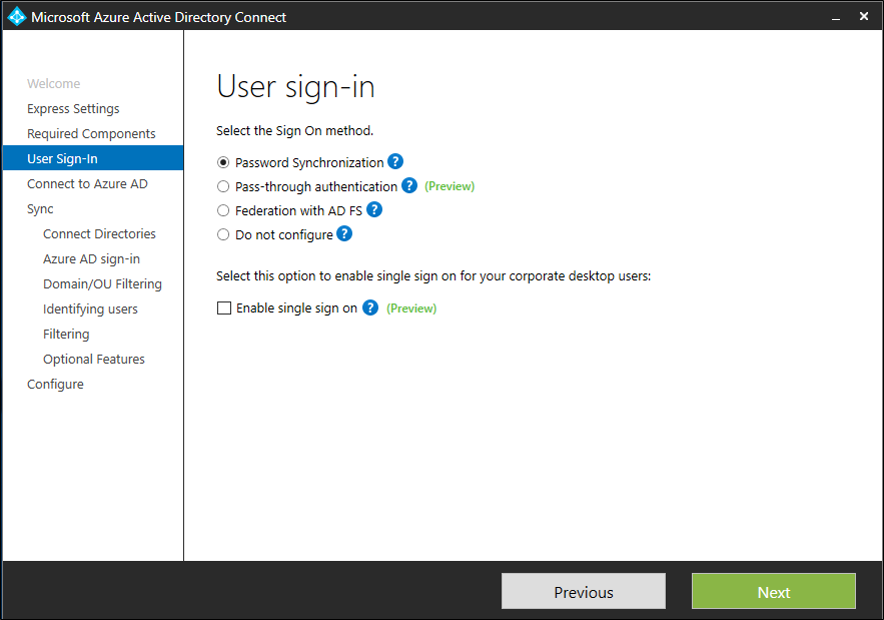

# Azure Active Directory Pass-through Authentication: Quick start

Azure Active Directory (Azure AD) Pass-through Authentication allows your users to sign in to both on-premises and cloud-based applications using the same passwords. It signs users in by validating their passwords directly against your on-premises Active Directory.

## How to deploy Azure AD Pass-through Authentication

To deploy Pass-through Authentication, you need to follow these steps:
1. *Check prerequisites*: Set up your tenant and on-premises environment correctly before you enable the feature.
2. *Enable the feature*: Turn on Pass-through Authentication on your tenant and install a lightweight on-premises agent to handle password validation requests.
3. *Test the feature*: Test user sign-in using Pass-through Authentication.
4. *Ensure high availability*: Install a second standalone agent to provide high availability for sign-in requests.

## Step 1: Check prerequisites

Ensure that the following prerequisites are in place:

### On the Azure portal

1. Create a cloud-only Global Administrator account on your Azure AD tenant. This way, you can manage the configuration of your tenant should your on-premises services fail or become unavailable. Learn about [adding a cloud-only Global Administrator account](../active-directory-users-create-azure-portal.md). Doing this step is critical to ensure that you don't get locked out of your tenant.
2. Add one or more [custom domain name(s)](../active-directory-add-domain.md) to your Azure AD tenant. Your users sign in using one of these domain names.

### In your on-premises environment

1. Identify a server running Windows Server 2012 R2 or later on which to run Azure AD Connect. Add the server to the same AD forest as the users whose passwords need to be validated.
2. Install the [latest version of Azure AD Connect](https://www.microsoft.com/download/details.aspx?id=47594) on the server identified in Step 2. If you already have Azure AD Connect running, ensure that the version is 1.1.486.0 or later.
3. Identify an additional server running Windows Server 2012 R2 or later on which to run a standalone Authentication Agent. The Authentication Agent version needs to be 1.5.58.0 or later. This server is needed to ensure high availability of sign-in requests. Add the server to the same AD forest as the users whose passwords need to be validated.
4. If there is a firewall between your servers and Azure AD, you need to configure the following items:
   - Open up your ports: Ensure that the Authentication Agents on your servers can make outbound requests to Azure AD over ports 80 and 443. If your firewall enforces rules according to originating users, open these ports for traffic coming from Windows services running as a Network Service.
   - Allow Azure AD endpoints: If URL filtering is enabled, ensure that the Authentication Agents can communicate with **\*.msappproxy.net** and **\*.servicebus.windows.net**.
   - Verify direct IP connections: Ensure that the Authentication Agents on your servers can make direct IP connections to the [Azure data center IP ranges](https://www.microsoft.com/en-us/download/details.aspx?id=41653).

## Step 2: Enable the feature

Pass-through Authentication can be enabled using [Azure AD Connect](active-directory-aadconnect.md).

If you are installing Azure AD Connect for the first time, choose the [custom installation path](active-directory-aadconnect-get-started-custom.md). At the **User sign-in** page, choose **Pass-through Authentication** as the Sign on method. On successful completion, a Pass-through Authentication agent is installed on the same server as Azure AD Connect. In addition, the Pass-through Authentication feature is enabled on your tenant.

If you have already installed Azure AD Connect (using the [express installation](active-directory-aadconnect-get-started-express.md) or the [custom installation](active-directory-aadconnect-get-started-custom.md) path), select **Change user sign-in page** on Azure AD Connect, and click **Next**. Then select **Pass-through Authentication** as the Sign on method. On successful completion, a Pass-through Authentication agent is installed on the same server as Azure AD Connect and the feature is enabled on your tenant.

>[!IMPORTANT]
>Pass-through Authentication is a tenant-level feature. Turning it on impacts sign-in for users across _all_ the managed domains in your tenant.

## Step 3: Test the feature

After Step 2, users from all managed domains in your tenant will sign in using Pass-through Authentication. However, users from federated domains continue to sign in using Active Directory Federation Services (AD FS) or another federation provider that you have previously configured. If you convert a domain from federated to managed, all users from that domain automatically start signing in using Pass-through Authentication. Cloud-only users are not impacted by the Pass-through Authentication feature.

## Step 4: Ensure high availability

If you plan to deploy Pass-through Authentication in a production environment, you should install a standalone Authentication Agent. Install this second Authentication Agent on a server _other_ than the one running Azure AD Connect and the first Authentication Agent. This setup provides you high availability of sign-in requests. Follow these instructions to deploy a standalone Authentication Agent:

### Download and install the Authentication Agent software on your server

1.	[Download](https://go.microsoft.com/fwlink/?linkid=837580) the latest Authentication Agent software. Verify that the version is 1.5.58.0 or later.
2.	Open the command prompt as an Administrator.
3.	Run the following command (the **/q** option means "quiet installation" - the installation does not prompt you to accept the End-User License Agreement):
`
AADApplicationProxyConnectorInstaller.exe REGISTERCONNECTOR="false" /q
`

>[!NOTE]
>You can install only a single Authentication Agent per server.

### Register the Authentication Agent with Azure AD

1.	Open a PowerShell window as an Administrator.
2.	Navigate to **C:\Program Files\Microsoft AAD App Proxy agent** and run the script as follows:
`.\Registeragent.ps1 -modulePath "C:\Program Files\Microsoft AAD App Proxy agent\Modules\" -moduleName "AppProxyPSModule" -Feature PassthroughAuthentication`
3.	When prompted, enter the credentials of the Global Administrator account on your Azure AD tenant.

## Next steps
- [**Current limitations**](active-directory-aadconnect-pass-through-authentication-current-limitations.md) - This feature is currently in preview. Learn which scenarios are supported and which ones are not.
- [**Technical Deep Dive**](active-directory-aadconnect-pass-through-authentication-how-it-works.md) - Understand how this feature works.
- [**Frequently Asked Questions**](active-directory-aadconnect-pass-through-authentication-faq.md) - Answers to frequently asked questions.
- [**Troubleshoot**](active-directory-aadconnect-troubleshoot-pass-through-authentication.md) - Learn how to resolve common issues with the feature.
- [**Azure AD Seamless SSO**](active-directory-aadconnect-sso.md) - Learn more about this complementary feature.
- [**UserVoice**](https://feedback.azure.com/forums/169401-azure-active-directory/category/160611-directory-synchronization-aad-connect) - For filing new feature requests.
