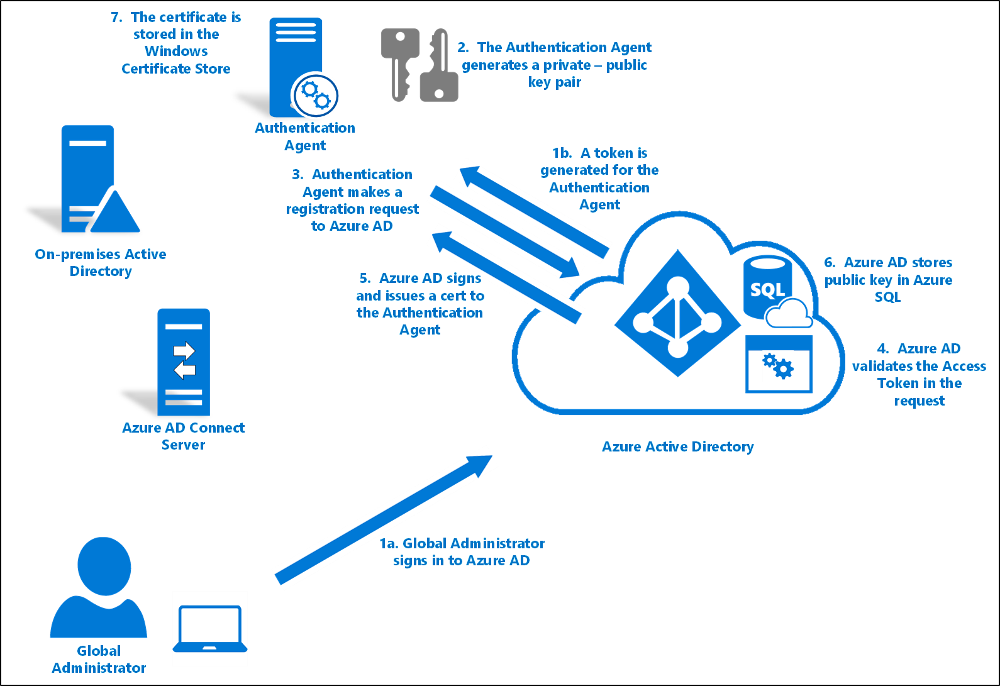
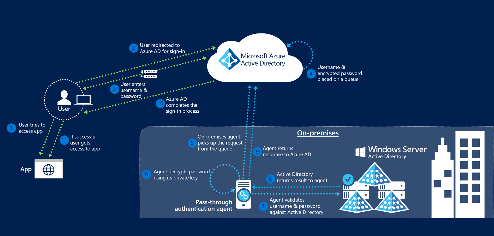

# Azure Active Directory Pass-through Authentication security deep-dive

This article provides a more detailed description on how Pass-through Authentication works. It focuses more on the security aspects of the feature. This topic will be of interest to security and IT administrators, Chief Compliance and Security officers, and other IT professionals responsible for IT security and compliance at small-to-medium organizations or large enterprises.

Topics addressed include:
- Detailed technical information about how Authentication Agents are installed and registered.
- Detailed technical information about encryption of passwords during user sign-in.
- Security of the channels between on-premises Authentication Agents and Azure Active Directory (Azure AD).
- Detailed technical information about how Authentication Agents are kept operationally secure.
- Other security-related topics.

## Key security capabilities

These are the key security aspects of this feature:
- It is built on a secure multi-tenanted architecture that provides isolation of sign-in requests between tenants.
- On-premises passwords are never stored in the cloud in any form.
- On-premises Authentication Agents, that listen for and respond to password validation requests, only make outbound connections from within your network. There is no requirement to install these Authentication Agents in a perimeter network (DMZ).
- Only standard ports (80 & 443) are used for outbound communication from the Authentication Agents to Azure AD. No inbound ports need to be opened on your firewall. 
  - Port 443 is used for all authenticated outbound communication
  - Port 80 is only used for downloading the Certificate Revocation Lists (CRLs) to ensure none of the certificates used by feature have been revoked.
  - See [here](active-directory-aadconnect-pass-through-authentication-quick-start.md#step-1-check-prerequisites) for the complete list of networking requirements.
- Passwords provided by the user during sign-in are encrypted in the cloud before being accepted by on-premises Authentication Agents for validation against your Active Directory.
- The HTTPS channel between Azure AD and an on-premises Authentication Agent is secured by mutual authentication.
- It seamlessly integrates with Azure AD’s cloud protection capabilities such as Conditional Access policies (including Multi-Factor Authentication), Identity Protection, and Smart Lockout.

## Components involved

For general details about Azure AD operational, service and data security, see the [Trust Center](https://azure.microsoft.com/support/trust-center/). The following components are involved when Pass-through Authentication is used for user sign-in:
- **Azure AD STS**: A stateless Security Token Service (STS) that processes sign-in requests and issues security tokens to users' browsers, clients, or services as required.
- **Azure Service Bus**: Provides cloud-enabled communication with enterprise messaging and relays communication that helps you connect on-premises solutions with the cloud.
- **Azure AD Connect Authentication Agent (Authentication Agent)**: An on-premises component that listens for and responds to password validation requests.
- **Azure SQL Database**: Holds information about your tenant's Authentication Agents, including its metadata and encryption keys.
- **Active Directory (AD)**: Your on-premises Active Directory, where your user accounts (and their passwords) are stored.

## Installation and registration of Authentication Agents

Authentication Agents are installed and registered with Azure AD when you [enable Pass-through Authentication using Azure AD Connect](https://docs.microsoft.com/azure/active-directory/connect/active-directory-aadconnect-pass-through-authentication-quick-start#step-2-enable-the-feature) or when you [add additional Authentication Agents to ensure high availability of sign-in requests](https://docs.microsoft.com/azure/active-directory/connect/active-directory-aadconnect-pass-through-authentication-quick-start#step-4-ensure-high-availability). Getting an Authentication Agent working involves three main phases:

- Authentication Agent installation
- Authentication Agent registration
- Authentication Agent initialization

Each of these will be discussed in detail in the following topics.

### Authentication Agent installation

Only Global Administrators can install an Authentication Agent (using Azure AD Connect or standalone) on an on-premises server. Installation adds these two new entries to the **Control Panel -> Programs -> Programs and Features** list:
- The Authentication Agent application itself. This runs with [Network Service](https://msdn.microsoft.com/library/windows/desktop/ms684272.aspx) privileges.
- The Updater application used for auto updating the Authentication Agent. This runs with [Local System](https://msdn.microsoft.com/library/windows/desktop/ms684190.aspx) privileges.

### Authentication Agent registration

After you install the Authentication Agent, it needs to register itself with Azure AD. Azure AD does this by assigning each Authentication Agent a unique digital identity certificate that it can use for secure communication with Azure AD.

The registration procedure also binds the Authentication Agent with your tenant so that Azure AD knows that this specific Authentication Agent is the only one authorized to handle password validation requests for your tenant. This procedure is repeated for each new Authentication Agent that you register.

Here is how Authentication Agents register themselves with Azure AD:

1. Azure AD first requests a Global Administrator to sign in to Azure AD with their credentials. During sign in, the Authentication Agent acquires an Access Token that it can use on behalf of the Global Administrator.
2. The Authentication Agent then generates a key pair – a public key and a private key.
    - This key pair is generated using standard **RSA 2048-bit** encryption.
    - The private key never leaves the on-premises server on which the Authentication Agent has been installed.
3.	The Authentication Agent makes a “registration” request to Azure AD over HTTPS, with the following components included in the request:
    - The Access Token acquired in Step 1.
    - The public key generated in Step 2.
    - A **Certificate Signing Request** (CSR or Certificate Request). This is to apply for a digital identity certificate, with Azure AD as its Certificate Authority.
4. Azure AD validates the Access Token in the registration request and verifies that the request came from a Global Administrator.
5. Azure AD then signs and issues a digital identity certificate back to the Authentication Agent.
    - The certificate is signed using **Azure AD’s Root Certificate Authority (CA)**. Note that this CA is _not_ in the Windows's **Trusted Root Certificate Authorities** store.
    - This CA is used only by the Pass-through Authentication feature. It is just used for signing CSRs during Authentication Agent registration.
    - This CA isn’t used by any other service in Azure AD.
    - The certificate’s subject (**Distinguished Name or DN**) is set to your **Tenant ID**. This is a GUID that uniquely identifies your tenant. This scopes the certificate for use with your tenant only.
6. Azure AD stores the public key of the Authentication Agent in an Azure SQL database, which only Azure AD has access to.
7. The certificate (issued in Step 5) is stored on the on-premises server in the **Windows Certificate Store** (specifically in the **[CERT_SYSTEM_STORE_LOCAL_MACHINE](https://msdn.microsoft.com/library/windows/desktop/aa388136.aspx#CERT_SYSTEM_STORE_LOCAL_MACHINE)** location), and is used by both the Authentication Agent and the Updater applications.

### Authentication Agent initialization

When the Authentication Agent starts, either for the first time after registration or after a server restart, it needs a way to securely communicate with Azure AD service and start accepting password validation requests.

Here is how Authentication Agents get initialized:

1. The Authentication Agent starts by making an outbound “bootstrap” request to Azure AD. 
    - This bootstrap request is made over port 443 and is over a mutually authenticated HTTPS channel (using the same certificate issued during Authentication Agent registration).
2. Azure AD responds to this bootstrap request by providing an **Access Key** to an Azure Service Bus queue that is unique to your tenant (identified by your Tenant ID).
3. The Authentication Agent makes a persistent outbound HTTPS connection (over port 443) to the queue. 
    - It is now ready to retrieve and handle password validation requests.

If you have multiple Authentication Agents registered on your tenant, then the initialization procedure ensures that each one connects to the same Azure Service Bus queue. 

## Processing sign-in requests 

The diagram below shows how Pass-through Authentication processes user sign-in requests.

Pass-through Authentication handles a user sign-in request as follows: 

1. A user tries to access an application (for example, the Outlook Web App - [https://outlook.office365.com/owa](https://outlook.office365.com/owa).)
2. If the user is not already signed in, the application redirects the browser to the Azure AD sign-in page.
3. The Azure AD STS service responds back with the user sign-in page.
4. The user enters their username and password into the Azure AD sign-in page and clicks the "Sign in" button.
5. The username and password are submitted to Azure AD STS in a HTTPS POST request.
6. Azure AD STS retrieves public keys for all Authentication Agents registered on your tenant from the Azure SQL database and encrypts the password using them. 
    - It produces ‘N’ encrypted password values for ‘N’ Authentication Agents registered on your tenant.
7. Azure AD STS places the password validation request (the username and the encrypted password values) onto the Azure Service Bus queue specific to your tenant.
8. Since the initialized Authentication Agents are persistently connected to the Azure Service Bus queue, one of the available Authentication Agents retrieves the password validation request.
9. The Authentication Agent locates the encrypted password value that is specific to its public key (using an identifier) and decrypts it using its private key.
10. The Authentication Agent attempts to validate the username and the password against your on-premises Active Directory using the **[Win32 LogonUser API](https://msdn.microsoft.com/library/windows/desktop/aa378184.aspx)** (with the **dwLogonType** parameter set to **LOGON32_LOGON_NETWORK**). 
    - This is the same API used by Active Directory Federation Services (AD FS) to sign in users in a Federated sign-in scenario.
    - This relies on the standard resolution process in Windows Server to locate the Domain Contoller.
11. The Authentication Agent receives the result from Active Directory (success, username or password incorrect, password expired, user is locked out, and so on).
12. The Authentication Agent forwards the result back to Azure AD STS over an outbound mutually authenticated HTTPS channel over port 443. Mutual authentication uses the same certificate previously issued to the Authentication Agent during registration.
13. Azure AD STS verifies that this result correlates with the specific sign-in request on your tenant.
14. Azure AD STS continues with the sign-in procedure as configured. For example, if the password validation was successful, the user could be challenged for Multi-Factor Authentication or redirected back to the application.

## Operational security of Authentication Agents

To ensure that Pass-through Authentication remains operationally secure, Azure AD periodically renews their certificates. These renewals are triggered from Azure AD, and are not governed by the Authentication Agents themselves.

Here is how an Authentication Agent renews its trust with Azure AD:

1. The Authentication Agent periodically pings Azure AD (every few hours) to check if it is time to renew its certificate. 
    - This check is done over a mutually authenticated HTTPS channel (using the same certificate issued during registration).
2. If the service indicates that it is time to renew, the Authentication Agent generates a new key pair: a public key and a private key.
    - These keys are generated using the standard **RSA 2048-bit** encryption.
    - The private key never leaves the on-premises server.
3. The Authentication Agent then makes a “certificate renewal” request to Azure AD over HTTPS, with the following components included in the request:
    - The existing certificate (retrieved from **CERT_SYSTEM_STORE_LOCAL_MACHINE** location on the Windows Certificate Store). There is no Global Administrator involved in this procedure, so there is no Access Token needed on behalf of the Global Administrator.
    - The public key generated in Step 2.
    - A **Certificate Signing Request** (CSR or Certificate Request). This is to apply for a new digital identity certificate, with Azure AD as its Certificate Authority.
4. Azure AD validates the existing certificate in the certificate renewal request. Then it verifies that the request came from an Authentication Agent registered on your tenant.
5. If the existing certificate is still valid, Azure AD then signs a new digital identity certificate, and issues the new certificate back to the Authentication Agent. 
6. If the existing certificate has expired, Azure AD deletes the Authentication Agent from your tenant’s list of registered Authentication Agents. Then a Global Administrator needs to manually install and register a new Authentication Agent.
    - The certificate is signed using **Azure AD’s Root Certificate Authority (CA)**.
    - The certificate’s subject (**Distinguished Name or DN**) is set to your **Tenant ID** a GUID that uniquely identifies your tenant. That is, the certificate is scoped to your tenant only.
6. Azure AD stores the “new” public key of the Authentication Agent in an Azure SQL database that only it has access to. And invalidates the “old” public key associated with the Authentication Agent.
7. The new certificate (that was issued in Step 5) is then stored on the server in the **Windows Certificate Store** (specifically in the **[CERT_SYSTEM_STORE_CURRENT_USER](https://msdn.microsoft.com/library/windows/desktop/aa388136.aspx#CERT_SYSTEM_STORE_CURRENT_USER)** location).
    - Since the trust renewal procedure happens non-interactively (without the presence of the Global Administrator), the Authentication Agent no longer has access to update the existing certificate in the **CERT_SYSTEM_STORE_LOCAL_MACHINE** location. Note that the certificate itself in the **CERT_SYSTEM_STORE_LOCAL_MACHINE** location is not removed during this procedure.
8. The new certificate is used for authentication from this point on. Every subsequent renewal of the certificate replaces the certificate in the **CERT_SYSTEM_STORE_LOCAL_MACHINE** location.

## Auto-update of Authentication Agents

The Updater application automatically updates the Authentication Agent when a new version is released. It does not handle any password validation requests for your tenant. 

Azure AD hosts the new version of the software as a signed **Windows Installer Package (MSI)**. The MSI is signed using [Microsoft Authenticode](https://msdn.microsoft.com/library/ms537359.aspx) with **SHA256** as the digest algorithm. 

Here is how an Authentication Agent gets auto-updated:

1. The Updater periodically pings Azure AD (every hour) to check if there is a new version of the Authentication Agent available. 
    - This check is done over a mutually authenticated HTTPS channel (using the same certificate issued during registration). The Authentication Agent and the Updater share the certificate stored on the server.
2. If a new version is available, Azure AD returns the signed MSI back to the Updater.
3. The Updater verifies that the MSI is signed by Microsoft.
4. The Updater runs the MSI. This action does the following steps (note that the Updater runs with [Local System](https://msdn.microsoft.com/library/windows/desktop/ms684190.aspx) privileges):
    - Stops the Authentication Agent service.
    - Installs the new version of the Authentication Agent on the server.
    - Restarts the Authentication Agent service.

>[!NOTE]
>If you have multiple Authentication Agents registered on your tenant, Azure AD does not renew their certificates or update them at the same time. Instead Azure AD does so gradually to ensure high availability of the sign-in requests.

## Next steps
- [**Current limitations**](active-directory-aadconnect-pass-through-authentication-current-limitations.md) - Learn which scenarios are supported and which ones are not.
- [**Quick Start**](active-directory-aadconnect-pass-through-authentication-quick-start.md) - Get up and running Azure AD Pass-through Authentication.
- [**Smart Lockout**](active-directory-aadconnect-pass-through-authentication-smart-lockout.md) - Configure Smart Lockout capability on your tenant to protect user accounts.
- [**How it works**](active-directory-aadconnect-pass-through-authentication-how-it-works.md) - Learn the basics of how Azure AD Pass-through Authentication works.
- [**Frequently Asked Questions**](active-directory-aadconnect-pass-through-authentication-faq.md) - Answers to frequently asked questions.
- [**Troubleshoot**](active-directory-aadconnect-troubleshoot-pass-through-authentication.md) - Learn how to resolve common issues with the feature.
- [**Azure AD Seamless SSO**](active-directory-aadconnect-sso.md) - Learn more about this complementary feature.

