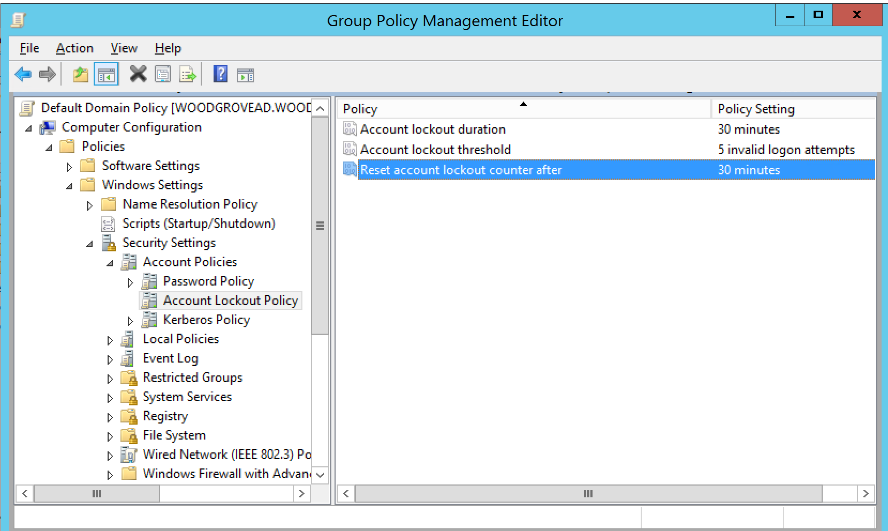

# Azure Active Directory Pass-through Authentication: Smart Lockout

## Overview

Azure AD protects against brute force password attacks and prevents genuine users from being locked out of their Office 365 and SaaS applications. This capability, called **Smart Lockout**, is supported when you use Pass-through Authentication as your sign-in method. Smart Lockout is enabled by default for all tenants and are protecting your user accounts all the time; there is no need to turn it on.

Smart Lockout works by keeping track of failed sign-in attempts, and after a certain **Lockout Threshold**, starting a **Lockout Duration**. Any sign-in attempts from the attacker during the Lockout Duration are rejected. If the attack continues, the subsequent failed sign-in attempts after the Lockout Duration ends result in longer Lockout Durations.

>[!NOTE]
>The default Lockout Threshold is 10 failed attempts, and the default Lockout Duration is 60 seconds.

Smart Lockout also distinguishes between sign-ins from genuine users and from attackers and only locks out the attackers in most cases. This functionality prevents attackers from maliciously locking out genuine users. We use past sign-in behavior, users’ devices & browsers and other signals to distinguish between genuine users and attackers. We are constantly improving our algorithms.

Because Pass-through Authentication forwards password validation requests onto your on-premises Active Directory (AD), you need to prevent attackers from locking out your users’ AD accounts. Since you have your own AD Account Lockout policies (specifically, [**Account Lockout Threshold**](https://technet.microsoft.com/library/hh994574(v=ws.11).aspx) and [**Reset Account Lockout Counter After policies**](https://technet.microsoft.com/library/hh994568(v=ws.11).aspx)), you need to configure Azure AD’s Lockout Threshold and Lockout Duration values appropriately to filter out attacks in the cloud before they reach your on-premises AD.

>[!NOTE]
>The Smart Lockout feature is free and is _on_ by default for all customers. However, modifying Azure AD’s Lockout Threshold and Lockout Duration values using Graph API needs your tenant to have at least one Azure AD Premium P2 license. You don't need an Azure AD Premium P2 license _per user_ to get the Smart Lockout feature with Pass-through Authentication.

To ensure that your users’ on-premises AD accounts are well protected, you need to ensure that:

1.	Azure AD’s Lockout Threshold is _less_ than AD’s Account Lockout Threshold. We recommend that you set the values such that AD’s Account Lockout Threshold is at least two or three times Azure AD’s Lockout Threshold.
2.	Azure AD’s Lockout Duration (represented in seconds) is _longer_ than AD’s Reset Account Lockout Counter After (represented in minutes).

## Verify your AD Account Lockout policies

Use the following instructions to verify your AD Account Lockout policies:

1.	Open the Group Policy Management tool.
2.	Edit the group policy that is applied to all users, for example, the Default Domain Policy.
3.	Navigate to Computer Configuration\Policies\Windows Settings\Security Settings\Account Policies\Account Lockout Policy.
4.	Verify your Account Lockout Threshold and Reset Account Lockout Counter After values.



## Use the Graph API to manage your tenant’s Smart Lockout values

>[!IMPORTANT]
>Modifying Azure AD’s Lockout Threshold and Lockout Duration values using Graph API is an Azure AD Premium P2 feature. It also needs you to be a Global Administrator on your tenant.

You can use [Graph Explorer](https://developer.microsoft.com/graph/graph-explorer) to read, set, and update Azure AD’s Smart Lockout values. But you can also do these operations programmatically.

### Read Smart Lockout values

Follow these steps to read your tenant’s Smart Lockout values:

1. Sign into Graph Explorer as a Global Administrator of your tenant. If prompted, grant access for the requested permissions.
2. Click “Modify permissions” and select the “Directory.ReadWrite.All” permission.
3. Configure the Graph API request as follows: Set version to “BETA”, request type to “GET” and URL to `https://graph.microsoft.com/beta/<your-tenant-domain>/settings`.
4. Click "Run Query" to see your tenant's Smart Lockout values. If you haven't set your tenant's values before, you see an empty set.

### Set Smart Lockout values

Follow these steps to set your tenant’s Smart Lockout values (for the first time only):

1. Sign into Graph Explorer as a Global Administrator of your tenant. If prompted, grant access for the requested permissions.
2. Click “Modify permissions” and select the “Directory.ReadWrite.All” permission.
3. Configure the Graph API request as follows: Set version to “BETA”, request type to “POST” and URL to `https://graph.microsoft.com/beta/<your-tenant-domain>/settings`.
4. Copy and paste the following JSON request into the "Request Body" field. Change the Smart Lockout values as appropriate and use a random GUID for `templateId`.
5. Click "Run Query" to set your tenant's Smart Lockout values.

```
{
  "templateId": "5cf42378-d67d-4f36-ba46-e8b86229381d",
  "values": [
    {
      "name": "LockoutDurationInSeconds",
      "value": "300"
    },
    {
      "name": "LockoutThreshold",
      "value": "5"
    },
    {
      "name" : "BannedPasswordList",
      "value": ""
    },
    {
      "name" : "EnableBannedPasswordCheck",
      "value": "false"
    }
  ]
}
```

>[!NOTE]
>If you are not using them, you can leave the **BannedPasswordList** and **EnableBannedPasswordCheck** values as empty ("") and "false" respectively.

Verify that you have set your tenant's Smart Lockout values correctly using [these steps](#read-smart-lockout-values).

### Update Smart Lockout values

Follow these steps to update your tenant’s Smart Lockout values (if you have already set them before):

1. Sign into Graph Explorer as a Global Administrator of your tenant. If prompted, grant access for the requested permissions.
2. Click “Modify permissions” and select the “Directory.ReadWrite.All” permission.
3. [Follow these steps to read your tenant's Smart Lockout values](#read-smart-lockout-values). Copy the `id` value (a GUID) of the item with "displayName" as "PasswordRuleSettings".
4. Configure the Graph API request as follows: Set version to “BETA”, request type to “PATCH” and URL to `https://graph.microsoft.com/beta/<your-tenant-domain>/settings/<id>` - use the GUID from Step 3 for `<id>`.
5. Copy and paste the following JSON request into the "Request Body" field. Change the Smart Lockout values as appropriate.
6. Click "Run Query" to update your tenant's Smart Lockout values.

```
{
  "values": [
    {
      "name": "LockoutDurationInSeconds",
      "value": "30"
    },
    {
      "name": "LockoutThreshold",
      "value": "4"
    },
    {
      "name" : "BannedPasswordList",
      "value": ""
    },
    {
      "name" : "EnableBannedPasswordCheck",
      "value": "false"
    }
  ]
}
```

Verify that you have updated your tenant's Smart Lockout values correctly using [these steps](#read-smart-lockout-values).

## Next steps
- [**UserVoice**](https://feedback.azure.com/forums/169401-azure-active-directory/category/160611-directory-synchronization-aad-connect) - For filing new feature requests.
