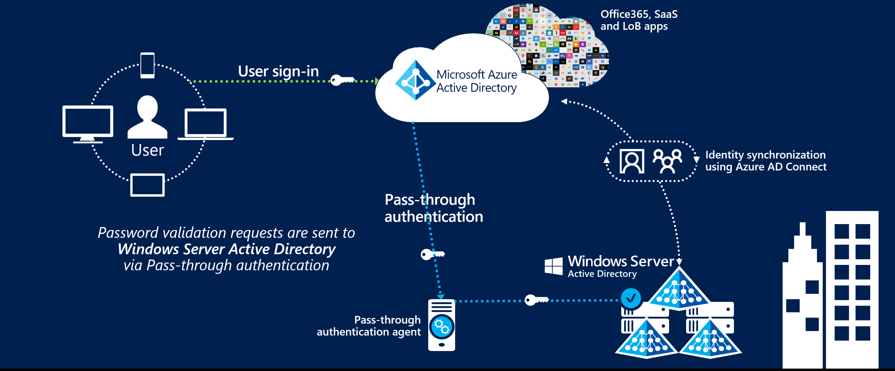

# User sign-in with Azure Active Directory Pass-through Authentication

## What is Azure Active Directory Pass-through Authentication?

Azure Active Directory (Azure AD) Pass-through Authentication allows your users to sign in to both on-premises and cloud-based applications using the same passwords. This feature provides your users a better experience - one less password to remember, and reduces IT helpdesk costs because your users are less likely to forget how to sign in. When users sign in using Azure AD, this feature validates users' passwords directly against your on-premises Active Directory.

This feature is an alternative to [Azure AD Password Hash Synchronization](active-directory-aadconnectsync-implement-password-synchronization.md), which provides the same benefit of cloud authentication to organizations. However, security and compliance policies in certain organizations don't permit these organizations to send users' passwords, even in a hashed form, outside their internal boundaries. Pass-through Authentication is the right solution for such organizations.

You can combine Pass-through Authentication with the [Seamless Single Sign-On](active-directory-aadconnect-sso.md) feature. This way, when your users are accessing applications on their corporate machines inside your corporate network, they don't need to type in their passwords to sign in.

## Key benefits of using Azure AD Pass-through Authentication

- *Great user experience*
  - Users use the same passwords to sign into both on-premises and cloud-based applications.
  - Users spend less time talking to the IT helpdesk resolving password-related issues.
  - Users can complete [self-service password management](../active-directory-passwords-overview.md) tasks in the cloud.
- *Easy to deploy & administer*
  - No need for complex on-premises deployments or network configuration.
  - Needs just a lightweight agent to be installed on-premises.
  - No management overhead. The agent automatically receives improvements and bug fixes.
- *Secure*
  - On-premises passwords are never stored in the cloud in any form.
  - The agent only makes outbound connections from within your network. Therefore, there is no requirement to install the agent in a perimeter network, also known as a DMZ.
  - Protects your user accounts by working seamlessly with [Azure AD Conditional Access policies](../active-directory-conditional-access-azure-portal.md), including Multi-Factor Authentication (MFA).
- *Highly available*
  - Additional agents can be installed on multiple on-premises servers to provide high availability of sign-in requests.

## Feature highlights

- Supports user sign-in into all web browser-based applications and into Microsoft Office client applications that use [modern authentication](https://aka.ms/modernauthga).
- Sign-in usernames can be either the on-premises default username (`userPrincipalName`) or another attribute configured in Azure AD Connect (known as `Alternate ID`).
- The feature works seamlessly with [conditional access](../active-directory-conditional-access.md) features such as Multi-Factor Authentication (MFA) to help secure your users.
- Multi-forest environments are supported if there are forest trusts between your AD forests and if name suffix routing is correctly configured.
- It is a free feature, and you don't need any paid editions of Azure AD to use it.
- It can be enabled via [Azure AD Connect](active-directory-aadconnect.md).
- It uses a lightweight on-premises agent that listens for and responds to password validation requests.
- Installing multiple agents provides high availability of sign-in requests.

## Next steps

- [**Quick Start**](active-directory-aadconnect-pass-through-authentication-quick-start.md) - Get up and running Azure AD Pass-through Authentication.
- [**Current limitations**](active-directory-aadconnect-pass-through-authentication-current-limitations.md) - This feature is currently in preview. Learn which scenarios are supported and which ones are not.
- [**Technical Deep Dive**](active-directory-aadconnect-pass-through-authentication-how-it-works.md) - Understand how this feature works.
- [**Frequently Asked Questions**](active-directory-aadconnect-pass-through-authentication-faq.md) - Answers to frequently asked questions.
- [**Troubleshoot**](active-directory-aadconnect-troubleshoot-pass-through-authentication.md) - Learn how to resolve common issues with the feature.
- [**Azure AD Seamless SSO**](active-directory-aadconnect-sso.md) - Learn more about this complementary feature.
- [**UserVoice**](https://feedback.azure.com/forums/169401-azure-active-directory/category/160611-directory-synchronization-aad-connect) - For filing new feature requests.
