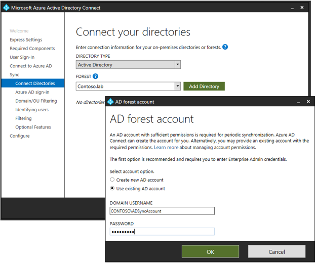
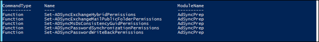

# Azure AD Connect PowerShell tools

A new PowerShell Module named **ADSyncConfig.psm1** was introduced with build 1.1.nnn.0 (released May 2018) that include a set of functions to help configure the correct Active Directory (AD) permissions for your Azure AD Connect deployment.

## Prepare Active Directory Permissions
The following PowerShell functions can be used to setup the correct Active Directory permissions of the AD Connector Account, for each feature that you pretend to enable in Azure AD Connect. You need to prepare AD permissions in advance whenever you want to install Azure AD Connect using a custom domain account for the AD Connector. 



For Azure AD Connect Express installation, an automatically generated account (MSOL_nnnnnnnnnn) is created in AD with all the necessary permissions, so there’s no need to run these scripts unless you have blocked permissions inheritance in some OUs or specific objects that you want to Synchronize to Azure AD.

For more information on specific permissions required on Azure AD Connect accounts, see [Azure AD Connect: Accounts and permissions](active-directory-aadconnect-accounts-permissions.md)

## Using the ADSyncConfig PowerShell Module
In order to use the ADSyncConfig.psm1 module you need to install [Remote Server Administration Tools (RSAT) for AD DS](https://www.microsoft.com/en-us/download/details.aspx?id=45520) which provides the required AD PowerShell functions and tools. To install RSAT for AD DS, open a Windows PowerShell window with ‘Run As Administrator’ and execute:

``` powershell
Install-WindowsFeature RSAT-AD-Tools
```


In order to use the ADSyncConfig.psm1 module, the Azure AD PowerShell (MSOnline) module is also required and you can also install it from a Windows PowerShell window:

``` powershell
Install-Module MSOnline
```

>[!NOTE]
>Install-Module cmdlet requires updating to [PowerShell 5.0 / WMF 5.0 (or later)](https://www.microsoft.com/en-us/download/details.aspx?id=50395), or install [PackageManagement PowerShell Modules Preview - March 2016 for PowerShell 3.0/4.0](https://www.microsoft.com/en-us/download/details.aspx?id=51451)

To start using the ADSyncConfig functions to prepare your AD, load the ADSyncConfig PowerShell module by executing:

``` powershell
Import-Module "C:\Program Files\Microsoft Azure Active Directory Connect\AdSyncConfig\AdSyncConfig.psm1"
```
To check all the AD permissions functions included in this module you can type the following command:

``` powershell
Get-Command *Permissions* -Module AdSyncConfig
```


In case you already have Azure AD Connect installed and you want to confirm the AD Connector Account in use, execute the expression below which will show you what is the domain (Forest-login-domain) and username (Forest-login-user) for each AD Connector:

``` powershell
(Get-ADSyncConnector | Where-Object {$_.ConnectorTypeName -eq "AD"}).ConnectivityParameters | select Name,Value | Where-Object {$_.Name -like "forest-login*" -or $_.Name -eq "forest-name"}
```


### Permissions for Read only
To set read-only permissions for the AD Connector account, when you are not using any AAD Connect feature, run:

``` powershell
Set-ADSyncBasicReadPermissions -AdConnectorAccount ADSyncAccount 
```

### Permissions for ms-Ds-ConsistencyGuid
To set the correct permissions for ms-Ds-ConsistencyGuid feature, run:

``` powershell
Set-ADSyncMsDsConsistencyGuidPermissions -AdConnectorAccount ADSyncAccount 
```

### Permissions for Password Hash Synchronization
To set the correct permissions for Password Hash Synchronization feature, run:

``` powershell
Set-ADSyncPasswordSynchronizationPermissions -AdConnectorAccount ADSyncAccount 
```

### Permissions for Password Writeback
To set the correct permissions for Password Writeback feature, run:

``` powershell
Set-ADSyncPasswordWriteBackPermissions -AdConnectorAccount ADSyncAccount
```

### Permissions for Exchange Hybrid Deployment
To set the correct permissions for Exchange Hybrid feature, run:

``` powershell
Set-ADSyncExchangeHybridPermissions -AdConnectorAccount ADSyncAccount 
```

### Permissions for Exchange Mail Public Folders (Preview)
To set the correct permissions for Exchange Mail Public Folders feature, run:

``` powershell
Set-ADSyncExchangeMailPublicFolderPermissions -AdConnectorAccount ADSyncAccount
```

### Restrict Permissions on the AD Connector Account
This PowerShell script will tighten permissions for the AD Connector Account provided as a parameter. Tightening permissions involves the following steps:
- Disable inheritance on the specified object
- Remove all ACEs on the specific object, except ACEs specific to SELF as we want to keep the default permissions intact when it comes to SELF.
- Assign the following specific permissions:

|Type|Name|Access|Applies To|
|-----|-----|-----|-----|
|Allow|SYSTEM|Full Control|This object|
|Allow|Enterprise Admins|Full Control|This object|
|Allow|Domain Admins|Full Control|This object|
|Allow|Administrators|Full Control|This object|
|Allow|Enterprise Domain Controllers|List Contents|This object|
|Allow|Enterprise Domain Controllers|Read All Properties|This object|
|Allow|Enterprise Domain Controllers|Read Permissions|This object|
|Allow|Authenticated Users|List Contents|This object|
|Allow|Authenticated Users|Read All Properties|This object|
|Allow|Authenticated Users|Read Permissions|This object|

The -ObjectDN parameter is the AD account whose permissions need to be tightened. This is typically the MSOL_nnnnnnnnnnnn domain account that is configured in the AD DS Connector. The -Credential parameter is necessary to specify the Administrator account that has the necessary privileges to restrict Active Directory permissions on the target AD object. This is typically the Enterprise or Domain Administrator. 

``` powershell
Set-ADSyncRestrictedPermissions [-ObjectDN] <String> [-Credential] <PSCredential> [-DisableCredentialValidation] [-WhatIf] [-Confirm] [<CommonParameters>]
```


For Example:

``` powershell
$credential = Get-Credential
Set-ADSyncRestrictedPermissions -ObjectDN 'CN=ADConnectorAccount,CN=Users,DC=Contoso,DC=com' -Credential $credential 
```

## Managing ImmutableID / ms-Ds-ConsistencyGuid

### Reading and writing mS-Ds-ConsistencyGuid and ObjectGuid attributes.


#### Get-ADSyncToolsConsistencyGuid
Returns the mS-Ds-ConsistencyGuid value for the target AD user [-User] in a GUID format. The user can be provided in a UPN on DistinguishedName format.

``` powershell
Get-ADSyncToolsConsistencyGuid [-User] <Object> [<CommonParameters>]
```

#### Set-ADSyncToolsConsistencyGuid
Puts a value [-Value] in mS-Ds-ConsistencyGuid attribute for the target AD user [-User]. The User parameter can be provided in a UPN or DistinguishedName format and the Value parameter in a 16-element byte array GUID, GUID string or Base64 string.

``` powershell
Set-ADSyncToolsConsistencyGuid [-User] <Object> [-Value] <Object> [<CommonParameters>]
```


#### Clear-ADSyncToolsConsistencyGuid
Removes the value in mS-Ds-ConsistencyGuid attribute for the target AD user [-User]

``` powershell
Clear-ADSyncToolsConsistencyGuid [-User] <Object> [<CommonParameters>]
```
#### Get-ADSyncToolsObjectGuid
Returns the ObjectGUID value in GUID format for the target AD user [-User].

``` powershell
Get-ADSyncToolsObjectGuid [-User] <Object> [<CommonParameters>]
```

### Re-matching Azure AD users with new AD users in migration or disaster recovery scenarios

#### Import-ADSyncToolsImmutableIdMigration
Generates a file [-Output] with all Azure AD Synchronized users containing the ImmutableID value in GUID format. Use [-IncludeSyncUsersFromRecycleBin] in case you want to retrieve users that are in a soft-deleted state. This is a read-only operation to list all synchronized users from Azure AD.
>[!NOTE]
> Also Requires MSOnline PowerShell Module

``` powershell
Import-ADSyncToolsImmutableIdMigration [-Output] <String> [-IncludeSyncUsersFromRecycleBin] [<CommonParameters>]
```
Pipelining Example:

``` powershell
Import-ADSyncToolsImmutableIdMigration -Output ImmutableIdList
```

#### Export-ADSyncToolsConsistencyGuidMigration
Generates a mS-Ds-ConsistencyGuid report [-Output] based on the CSV file from Import-ADSyncToolsImmutableIdMigration cmdlet. This report contains all the mS-Ds-ConsistencyGuid updates required in order to match Azure AD users with local AD users based on the same UPN on Username prefix. This is a read-only operation to correlate all the synchronized objects from Azure AD with your local AD users and create a CSV file with required changes for reviewing. Use [-AlternativeLoginId] in case you are using Mail as the sign-in attribute.

``` powershell
Export-ADSyncToolsConsistencyGuidMigration [-AlternativeLoginId] [-UserPrincipalName] <String> [-ImmutableIdGUID] <String> [-Output] <String> [<CommonParameters>]
```

Pipelining Example:
``` powershell
Import-Csv .\ImmutableIdList.csv | Export-ADSyncToolsConsistencyGuidMigration -Output msdsConsistencyGuidUpdates
```


#### Update-ADSyncToolsConsistencyGuidMigration
Updates users with the new mS-Ds-ConsistencyGuid value in AD taken from the mS-Ds-ConsistencyGuid report generated from Export-ADSyncToolsConsistencyGuidMigration cmdlet.

``` powershell
Update-ADSyncToolsConsistencyGuidMigration [[-DistinguishedName] <String>] [-ImmutableIdGUID] <String> [-Action] <String> [-Output] <String> [-WhatIf] [-Confirm] [<CommonParameters>]
```

>[!NOTE]
> ConsistencyGuid Report must be imported with Tab Delimiter

Pipelining Example:

``` powershell
Import-Csv .\msdsConsistencyGuidUpdates.csv -Delimiter "`t"| Update-ADSyncToolsConsistencyGuidMigration -Output .\ msdsConsistencyGuidResults
```

## Troubleshooting with PowerShell tools

### Resolving Large Object synchronization errors due to many Certificates stored in AD.

#### Remove-ADSyncToolsExpiredCertificates
This script takes all the objects from a target Organizational Unit in your Active Directory domain, filtered by Object Class (User/Computer), and deletes all expired certificates present in the UserCertificate attribute.

By default – in BackupOnly mode - it will only backup expired certificates to a file and not do any changes in AD. If you use -BackupOnly $false then any Expired Certificate present in UserCertificate attribute for these objects will be removed from AD after being copied to file.

Each certificate will be backed up to a separated filename in a format ObjectClass_ObjectGUID_CertThumprint.cer
The script will also create a log file in CSV format showing all the users with certificates that are either valid or expired, including the actual action taken (Skipped/Exported/Deleted).

``` powershell
Remove-ADSyncToolsExpiredCertificates [-TargetOU] <String> [[-BackupOnly] <Boolean>] [-ObjectClass] <String> [<CommonParameters>]
```

For example:
Check all users in a target OU - Expired Certificates will be copied to separated files and no certificates will be removed

``` powershell
Remove-ADSyncToolsExpiredCertificates -TargetOU "OU=Users,OU=Corp,DC=Contoso,DC=com" -ObjectClass user 
```

Delete Expired Certs from all Computer objects in target OU - Expired Certificates will be copied to files and removed from AD

``` powershell
Remove-ADSyncToolsExpiredCertificates -TargetOU "OU=Computers,OU=Corp,DC=Contoso,DC=com" -ObjectClass computer -BackupOnly $false
```
### Tracing tools

#### Trace-ADSyncToolsADImport
This tool simulates AAD Connect AD Import step using PowerShell for troubleshooting purposes. It creates a text file of the AD Import step by providing the XML file of AD Connector export or by directly providing the synchronization cookie data as the ADwatermark.

``` powershell
Trace-ADSyncToolsADImport [[-dc] <String>] [[-rootDN] <String>] [[-filter] <String>] [-SkipCredentials] [[-ADConnectorXML] <String>] [[-ADwatermark] <String>] [<CommonParameters>]
```

For Example:
``` powershell
Trace-ADSyncToolsADImport -dc 'DC1.contoso.com' -rootDN 'DC=Contoso,DC=com' -filter '(&(objectClass=*))' -ADConnectorXML .\ADConnector.xml
```


#### Trace-ADSyncToolsLdapQuery
Function to troubleshoot LDAP queries using PowerShell to reproduce the issue.

``` powershell
Trace-ADSyncToolsLdapQuery [-DistinguishedName] <String> [-Server] <String> [-Port] <Int32> [-Filter] <String> [<CommonParameters>]
```

For Example:
``` powershell
Trace-ADSyncToolsLdapQuery -Server "DC1.Contoso.com" -Filter "(&(objectCategory=group)(name=*))"
```

### Manual Fixes for Known Issues

#### Repair-ADSyncToolsAutoUpgradeState
A bug was introduced in AAD Connect 1.1.524.0 (May 2017) in how the AutoUpgrade state is set with regards to a registry key that controls the AutoUpgrade Agent. Due to this bug, the UpdateCheckEnabled key is set to False (0) whenever the AutoUpgrade state was set to Suspended which effectively disables the AutoUpgrade feature. This issue has been fixed in Abril 2018 release 1.1.750.0, so a manual upgrade to the latest build will correct the AutoUpgrade Suspended status.
For any AAD Connect version, you can fix the AutoUpgrade Suspended status with this script which checks if the server is affected by this issue and fixes it automatically. 

``` powershell
Repair-ADSyncToolsAutoUpgradeState [<CommonParameters>]
```

## Next Steps
- [Integrating your on-premises identities with Azure Active Directory](active-directory-aadconnect.md).
- [Azure AD Connect: Accounts and permissions](active-directory-aadconnect-accounts-permissions.md)
- [Azure AD Connect: Troubleshoot object synchronization](active-directory-aadconnect-troubleshoot-objectsync.md)
- [Azure AD Connect: Troubleshoot connectivity issues](active-directory-aadconnect-troubleshoot-connectivity.md)


