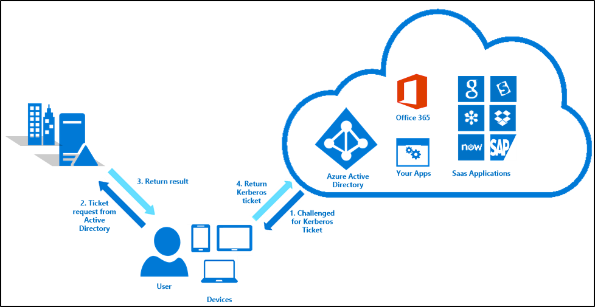

# Azure Active Directory Seamless Single Sign-On: Technical deep dive

This article gives you technical details into how the Azure Active Directory Seamless Single Sign-On (Azure AD Seamless SSO) feature works.

## How does Azure AD Seamless SSO work?

This section has two parts to it:
1. The setup of the Seamless SSO feature.
2. How a single user sign-in transaction works with Seamless SSO.

### How does set up work?

Seamless SSO is enabled using Azure AD Connect as shown [here](active-directory-aadconnect-sso-quick-start.md). While enabling the feature, the following steps occur:
- A computer account named `AZUREADSSOACCT` (which represents Azure AD) is created in your on-premises Active Directory (AD).
- The computer account's Kerberos decryption key is shared securely with Azure AD.
- In addition, two Kerberos service principal names (SPNs) are created to represent two URLs that are used during Azure AD sign-in.

>[!NOTE]
> The computer account and the Kerberos SPNs are created in each AD forest you synchronize to Azure AD (using Azure AD Connect) and for whose users you want Seamless SSO. Move the `AZUREADSSOACCT` computer account to an Organization Unit (OU) where other computer accounts are stored to ensure that it is managed in the same way and is not deleted.

### How does sign-in with Seamless SSO work?

Once the set-up is complete, Seamless SSO works the same way as any other sign-in that uses Integrated Windows Authentication (IWA). The flow is as follows:

1. The user tries to access an application (for example, the Outlook Web App - https://outlook.office365.com/owa/) from a domain-joined corporate device inside your corporate network.
2. If the user is not already signed in, the user is redirected to the Azure AD sign-in page.

  >[!NOTE]
  >If the Azure AD sign-in request includes a `domain_hint` (identifying your tenant- for example, contoso.onmicrosoft.com) or `login_hint` (identifying the user - for example, user@contoso.onmicrosoft.com or user@contoso.com) parameter, then step 2 is skipped.

3. The user types in their user name into the Azure AD sign-in page.
4. Using JavaScript in the background, Azure AD challenges the browser, via a 401 Unauthorized response, to provide a Kerberos ticket.
5. The browser, in turn, requests a ticket from Active Directory for the `AZUREADSSOACCT` computer account (which represents Azure AD).
6. Active Directory locates the computer account and returns a Kerberos ticket to the browser encrypted with the computer account's secret.
7. The browser forwards the Kerberos ticket it acquired from Active Directory to Azure AD (on one of the [Azure AD URLs previously added to the browser's Intranet zone settings](active-directory-aadconnect-sso-quick-start.md#step-3-roll-out-the-feature)).
8. Azure AD decrypts the Kerberos ticket, which includes the identity of the user signed into the corporate device, using the previously shared key.
9. After evaluation, Azure AD either returns a token back to the application or asks the user to perform additional proofs, such as Multi-Factor Authentication.
10. If the user sign-in is successful, the user is able to access the application.

The following diagram illustrates all the components and the steps involved.

Seamless SSO is opportunistic, which means if it fails, the sign-in experience falls back to its regular behavior - i.e, the user needs to enter their password to sign in.

## Next steps

- [**Quick Start**](active-directory-aadconnect-sso-quick-start.md) - Get up and running Azure AD Seamless SSO.
- [**Frequently Asked Questions**](active-directory-aadconnect-sso-faq.md) - Answers to frequently asked questions.
- [**Troubleshoot**](active-directory-aadconnect-troubleshoot-sso.md) - Learn how to resolve common issues with the feature.
- [**UserVoice**](https://feedback.azure.com/forums/169401-azure-active-directory/category/160611-directory-synchronization-aad-connect) - For filing new feature requests.
