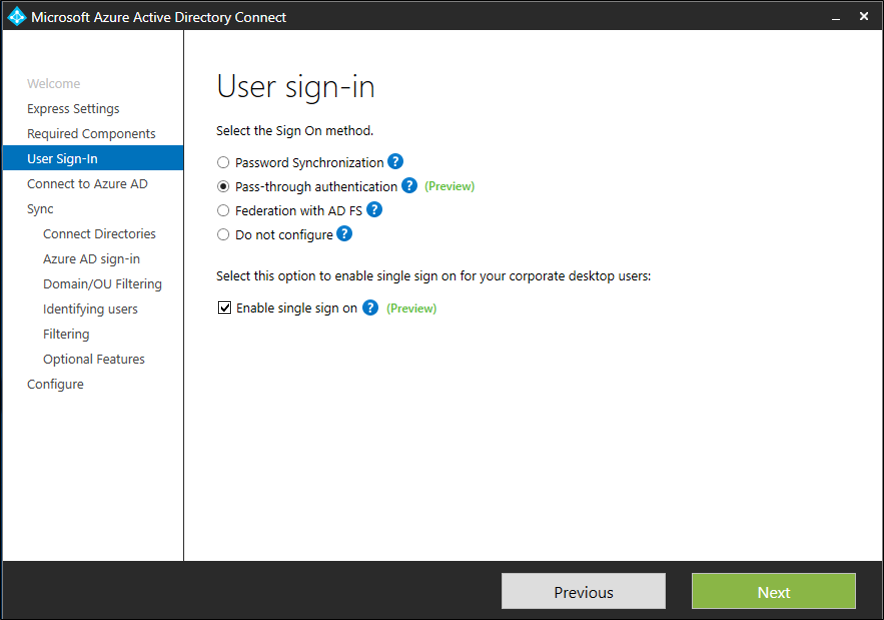
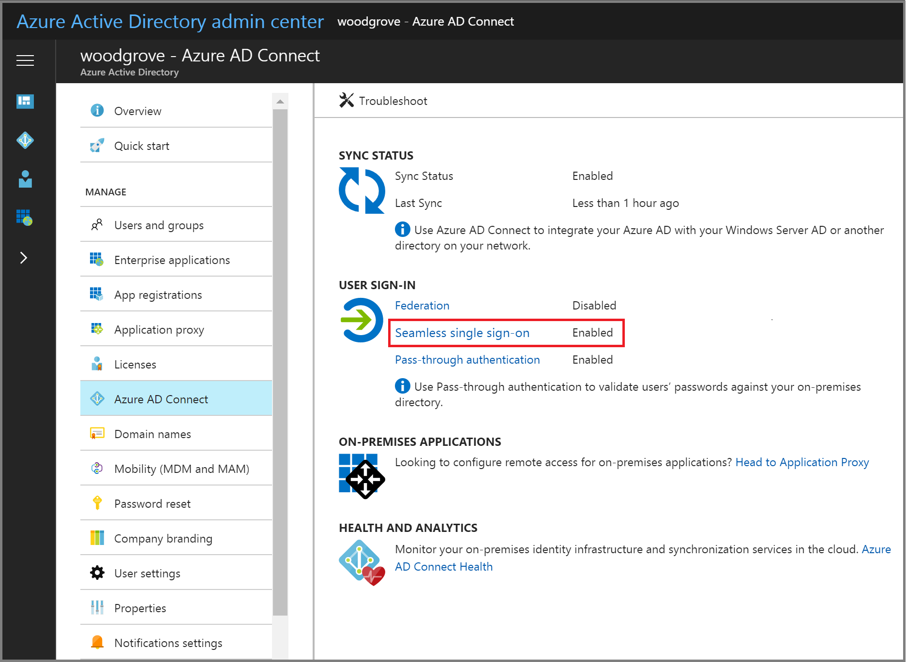
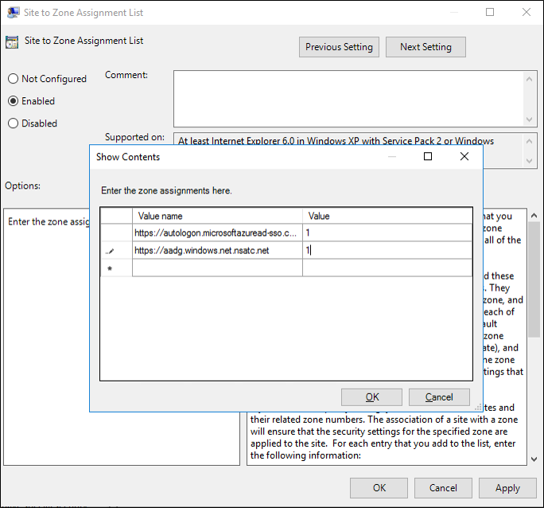

# Azure Active Directory Seamless Single Sign-On: Quick start

## How to deploy Seamless SSO

Azure Active Directory Seamless Single Sign-On (Azure AD Seamless SSO) automatically signs users in when they are on their corporate desktops connected to your corporate network. It provides your users easy access to your cloud-based applications without needing any additional on-premises components.

>[!IMPORTANT]
>The Seamless SSO feature is currently in preview.

To deploy Seamless SSO, you need to follow these steps:

## Step 1: Check prerequisites

Ensure that the following prerequisites are in place:

1. Set up your Azure AD Connect server: If you use [Pass-through Authentication](active-directory-aadconnect-pass-through-authentication.md) as your sign-in method, no further action is required. If you use [Password Hash Synchronization](active-directory-aadconnectsync-implement-password-synchronization.md) as your sign-in method, and if there is a firewall between Azure AD Connect and Azure AD, ensure that:
- You are using versions 1.1.484.0 or later of Azure AD Connect.
- Azure AD Connect can communicate with `*.msappproxy.net` URLs and over port 443. This prerequisite is applicable only when you enable the feature, not for actual user sign-ins.
- Azure AD Connect can make direct IP connections to the [Azure data center IP ranges](https://www.microsoft.com/download/details.aspx?id=41653). Again, this prerequisite is applicable only when you enable the feature.
2. You need Domain Administrator credentials for each AD forest that you synchronize to Azure AD (using Azure AD Connect) and for whose users you want to enable Seamless SSO.

## Step 2: Enable the feature

Seamless SSO can be enabled using [Azure AD Connect](active-directory-aadconnect.md).

If you are doing a fresh installation of Azure AD Connect, choose the [custom installation path](active-directory-aadconnect-get-started-custom.md). At the "User sign-in" page, check the "Enable single sign on" option.

If you already have an installation of Azure AD Connect, choose "Change user sign-in page" on Azure AD Connect and click "Next". Then check the "Enable single sign on" option.

Continue through the wizard until you get to the "Enable single sign on" page. Provide Domain Administrator credentials for each AD forest that you synchronize to Azure AD (using Azure AD Connect) and for whose users you want to enable Seamless SSO. 

After completion of the wizard, Seamless SSO is enabled on your tenant.

>[!NOTE]
> The Domain Administrator credentials are not stored in Azure AD Connect or in Azure AD, but are only used to enable the feature.

Follow these instructions to verify that you have enabled Seamless SSO correctly:

1. Sign in to the [Azure Active Directory admin center](https://aad.portal.azure.com) with the Global Administrator credentials for your tenant.
2. Select **Azure Active Directory** on the left-hand navigation.
3. Select **Azure AD Connect**.
4. Verify that the **Seamless Single Sign-On** feature shows as **Enabled**.

## Step 3: Roll out the feature

To roll out the feature to your users, you need to add two Azure AD URLs (https://autologon.microsoftazuread-sso.com and https://aadg.windows.net.nsatc.net) to users' Intranet zone settings via Group Policy in Active Directory.

>[!NOTE]
> The following instructions only work for Internet Explorer and Google Chrome on Windows  (if it shares set of trusted site URLs with Internet Explorer). Read the next section for instructions to set up Mozilla Firefox and Google Chrome on Mac.

### Why do you need to modify users' Intranet zone settings?

By default, the browser automatically calculates the right zone (Internet or Intranet) from a URL. For example, http://contoso/ is mapped to the Intranet zone, whereas http://intranet.contoso.com/ is mapped to the Internet zone (because the URL contains a period). Browsers don't send Kerberos tickets to a cloud endpoint - like the two Azure AD URLs - unless its URL is explicitly added to the browser's Intranet zone.

### Detailed steps

1. Open the Group Policy Management tool.
2. Edit the Group Policy that is applied to some or all your users. In this example, we use the **Default Domain Policy**.
3. Navigate to **User Configuration\Administrative Templates\Windows Components\Internet Explorer\Internet Control Panel\Security Page** and select **Site to Zone Assignment List**.
  
4. Enable the policy, and enter the following values (Azure AD URLs where Kerberos tickets are forwarded) and data (*1* indicates Intranet zone) in the dialog box.

		Value: https://autologon.microsoftazuread-sso.com
		Data: 1
		Value: https://aadg.windows.net.nsatc.net
		Data: 1
>[!NOTE]
> If you want to disallow some users from using Seamless SSO - for instance, if these users are signing in on shared kiosks - set the preceding values to *4*. This action adds the Azure AD URLs to the Restricted Zone, and fails Seamless SSO all the time.

5. Click **OK** and **OK** again.

### Browser considerations

#### Mozilla Firefox

Mozilla Firefox doesn't automatically do Kerberos Authentication. Each user has to manually add the Azure AD URLs to their Firefox settings using the following steps:
1. Run Firefox and enter `about:config` in the address bar. Dismiss any notifications that you see.
2. Search for the **network.negotiate-auth.trusted-uris** preference. This preference lists Firefox's trusted sites for Kerberos authentication.
3. Right-click and select "Modify".
4. Enter "https://autologon.microsoftazuread-sso.com, https://aadg.windows.net.nsatc.net" in the field.
5. Click "OK" and reopen the browser.

#### Safari on Mac OS

Ensure that the machine running Mac OS is joined to AD. See instructions on how to do that [here](http://training.apple.com/pdf/Best_Practices_for_Integrating_OS_X_with_Active_Directory.pdf).

#### Google Chrome on Mac OS

For Google Chrome on Mac OS and other non-Windows platforms, refer to [this article](https://dev.chromium.org/administrators/policy-list-3#AuthServerWhitelist) for information on how to whitelist the Azure AD URLs for integrated authentication.

Using third-party Active Directory Group Policy extensions to roll out the Azure AD URLs to Firefox and Google Chrome on Mac users is outside of this article's scope.

#### Known limitations

Seamless SSO doesn't work in private browsing mode on Firefox and Edge browsers. It also doesn't work on Internet Explorer if the browser is running in Enhanced Protection mode.

>[!IMPORTANT]
>We recently rolled back support for Edge to investigate customer-reported issues.

## Step 4: Test the feature

To test the feature for a specific user, ensure that _all_ the following conditions are in place:
  - The user is signing in on a corporate device.
  - The device has been previously joined to your Active Directory (AD) domain.
  - The device has a direct connection to your Domain Controller (DC), either on the corporate wired or wireless network or via a remote access connection, such as a VPN connection.
  - You have [rolled out the feature](##step-3-roll-out-the-feature) to this user using Group Policy.

To test the scenario where the user enters only the username, but not the password:
- Sign into *https://myapps.microsoft.com/* in a new private browser session.

To test the scenario where the user doesn't have to enter the username or the password: 
- Sign into *https://myapps.microsoft.com/contoso.onmicrosoft.com* in a new private browser session. Replace "*contoso*" with your tenant's name.
- Or sign into *https://myapps.microsoft.com/contoso.com* in a new private browser session. Replace "*contoso.com*" with a verified domain (not a federated domain) in your tenant.

## Step 5: Roll over keys

In Step 2, Azure AD Connect creates computer accounts (representing Azure AD) in all the AD forests on which you have enabled Seamless SSO. Learn more in detail [here](active-directory-aadconnect-sso-how-it-works.md). For improved security, it is recommended that  you frequently roll over the Kerberos decryption keys of these computer accounts.

>[!IMPORTANT]
>You don't need to do this step _immediately_ after you have enabled the feature. Roll over the Kerberos decryption keys at least every 30 days.

## Next steps

- [**Technical Deep Dive**](active-directory-aadconnect-sso-how-it-works.md) - Understand how this feature works.
- [**Frequently Asked Questions**](active-directory-aadconnect-sso-faq.md) - Answers to frequently asked questions.
- [**Troubleshoot**](active-directory-aadconnect-troubleshoot-sso.md) - Learn how to resolve common issues with the feature.
- [**UserVoice**](https://feedback.azure.com/forums/169401-azure-active-directory/category/160611-directory-synchronization-aad-connect) - For filing new feature requests.
