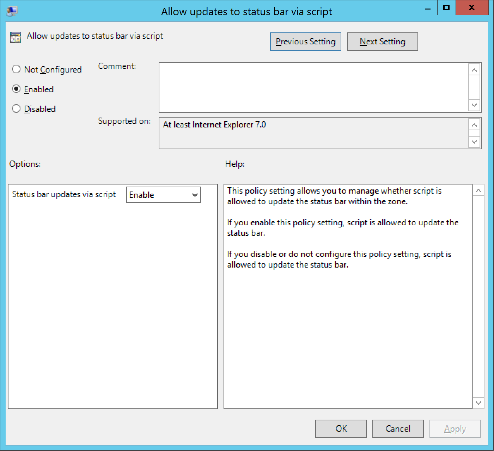

# Azure Active Directory Seamless Single Sign-On: Quick start

## Deploy Seamless Single Sign-On

Azure Active Directory Seamless Single Sign-On (Azure AD Seamless SSO) automatically signs users in when they are on their corporate desktops that are connected to your corporate network. It provides your users with easy access to your cloud-based applications without needing any additional on-premises components.

To deploy Seamless SSO, follow these steps:

## Step 1: Check the prerequisites

Ensure that the following prerequisites are in place:

* **Set up your Azure AD Connect server**: If you use [Pass-through Authentication](active-directory-aadconnect-pass-through-authentication.md) as your sign-in method, no additional prerequisite check is required. If you use [password hash synchronization](active-directory-aadconnectsync-implement-password-synchronization.md) as your sign-in method, and if there is a firewall between Azure AD Connect and Azure AD, ensure that:
   - You use version 1.1.644.0 or later of Azure AD Connect. 
   - If your firewall or proxy allows DNS whitelisting, whitelist the connections to the **\*.msappproxy.net** URLs over port 443. If not, allow access to the [Azure datacenter IP ranges](https://www.microsoft.com/download/details.aspx?id=41653), which are updated weekly. This prerequisite is applicable only when you enable the feature, it is not required for actual user sign ins.

    >[!NOTE]
    >Azure AD Connect versions 1.1.557.0, 1.1.558.0, 1.1.561.0, and 1.1.614.0 have a problem related to password hash synchronization. If you _don't_ intend to use password hash synchronization in conjunction with Pass-through Authentication, read the [Azure AD Connect release notes](https://docs.microsoft.com/azure/active-directory/connect/active-directory-aadconnect-version-history#116470) to learn more.

* **Set up Domain Administrator credentials**: You need to have Domain Administrator credentials for each Active Directory forest that:
    * You synchronize to Azure AD through Azure AD Connect.
    * You have users you want to enable the use of Seamless SSO.

## Step 2: Enable the feature

Enable Seamless SSO through [Azure AD Connect](active-directory-aadconnect.md).

If you're doing a fresh installation of Azure AD Connect, choose the [custom installation path](active-directory-aadconnect-get-started-custom.md). At the **User sign-in** page, select the **Enable single sign on** option.

If you already have an installation of Azure AD Connect, select the **Change user sign-in** page in Azure AD Connect, and then select **Next**.

Continue through the wizard until you get to the **Enable single sign on** page. Provide Domain Administrator credentials for each Active Directory forest that:
    * You synchronize to Azure AD through Azure AD Connect.
    * You have users you want to enable the use of Seamless SSO.

After completion of the wizard, Seamless SSO is enabled on your tenant.

>[!NOTE]
> The Domain Administrator credentials are not stored in Azure AD Connect or in Azure AD, but are only used to enable the feature.

Follow these instructions to verify that you have enabled Seamless SSO correctly:

1. Sign in to the [Azure Active Directory Administrative Center](https://aad.portal.azure.com) with the Global Administrator credentials for your tenant.
2. Select **Azure Active Directory** on the left-hand pane.
3. Select **Azure AD Connect**.
4. Verify that the **Seamless single sign-on** feature shows as **Enabled**.

## Step 3: Roll out the feature

To roll out the feature to your users, you need to add the following Azure AD URLs to the users' Intranet zone settings by using Group Policy in Active Directory:

- https://autologon.microsoftazuread-sso.com
- https://aadg.windows.net.nsatc.net

In addition, you need to enable an Intranet Zone policy setting called "Allow updates to status bar via script" through Group Policy. 

>[!NOTE]
> The following instructions only work for Internet Explorer and Google Chrome on Windows (if it shares a set of trusted site URLs with Internet Explorer). Read the next section for instructions on how to set up Mozilla Firefox and Google Chrome on Mac.

### Why do you need to modify users' Intranet zone settings?

By default, the browser automatically calculates the correct zone, either Internet or Intranet, from a specific URL. For example, "http://contoso/" maps to the Intranet zone, whereas "http://intranet.contoso.com/" maps to the Internet zone (because the URL contains a period). Browsers don't send Kerberos tickets to a cloud endpoint, like the two Azure AD URLs, unless you explicitly add the URL the browser's Intranet zone.

### Detailed steps

1. Open the Group Policy Management Editor tool.
2. Edit the Group Policy that's applied to some or all your users. This example uses the **Default Domain Policy**.
3. Browse to **User Configuration** > **Administrative Templates** > **Windows Components** > **Internet Explorer** > **Internet Control Panel** > **Security Page**, and then select **Site to Zone Assignment List**.

4. Enable the policy, and then enter the following values in the dialog box:
   - **Value name**: The Azure AD URLs where the Kerberos tickets are forwarded.
   - **Value** (Data): **1** indicates the Intranet zone.

   The result looks like this:

	Value: https://autologon.microsoftazuread-sso.com
  
	Data: 1
		
   Value: https://aadg.windows.net.nsatc.net

	Data: 1

>[!NOTE]
> If you want to disallow some users from using Seamless SSO, for instance, if these users sign in on shared kiosks, set the preceding values to **4**. This action adds the Azure AD URLs to the Restricted zone, and fails Seamless SSO all the time.

5. Select **OK**, and then select **OK** again.

6. Browse to **User Configuration** > **Administrative Templates** > **Windows Components** > **Internet Explorer** > **Internet Control Panel** > **Security Page** > **Intranet Zone**, and then select **Allow updates to status bar via script**.

7. Enable the policy setting, and then select **OK**.

### Browser considerations

#### Mozilla Firefox

Mozilla Firefox doesn't automatically use Kerberos authentication. Each user must manually add the Azure AD URLs to their Firefox settings by using the following steps:
1. Run Firefox and enter `about:config` in the address bar. Dismiss any notifications that you see.
2. Search for the **network.negotiate-auth.trusted-uris** preference. This preference lists Firefox's trusted sites for Kerberos authentication.
3. Right-click and select **Modify**.
4. Enter https://autologon.microsoftazuread-sso.com, https://aadg.windows.net.nsatc.net in the field.
5. Select **OK** and then reopen the browser.

#### Safari on Mac OS

Ensure that the machine running the Mac OS is joined to Azure AD. For instructions on joining Azure AD, see [Best Practices for Integrating OS X with Active Directory] (http://training.apple.com/pdf/Best_Practices_for_Integrating_OS_X_with_Active_Directory.pdf).

#### Google Chrome on Mac OS

For Google Chrome on Mac OS and other non-Windows platforms, refer to [The Chromium Project Policy List](https://dev.chromium.org/administrators/policy-list-3#AuthServerWhitelist) for information on how to whitelist the Azure AD URLs for integrated authentication.

The use if third-party Active Directory Group Policy extensions to roll out the Azure AD URLs to Firefox and Google Chrome on Mac users is outside of this article's scope.

#### Known browser limitations

Seamless SSO doesn't work in Private Browsing mode on Firefox and Edge browsers. It also doesn't work on Internet Explorer if the browser is running in Enhanced Protection mode.

>[!IMPORTANT]
>We recently rolled back support for Edge to investigate customer-reported problems.

## Step 4: Test the feature

To test the feature for a specific user, ensure that all the following conditions are in place:
  - The user signs in on a corporate device.
  - The device is joined to your Active Directory domain.
  - The device has a direct connection to your domain controller (DC), either on the corporate wired or wireless network or via a remote access connection, such as a VPN connection.
  - You have [rolled out the feature](##step-3-roll-out-the-feature) to this user through Group Policy.

To test the scenario where the user enters only the username, but not the password:
   - Sign in to https://myapps.microsoft.com/ in a new private browser session.

To test the scenario where the user doesn't have to enter the username or the password: 
   - Sign in to https://myapps.microsoft.com/contoso.onmicrosoft.com in a new private browser session. Replace "*contoso*" with your tenant's name.
   - Or sign in to https://myapps.microsoft.com/contoso.com in a new private browser session. Replace "*contoso.com*" with a verified domain (not a federated domain) on your tenant.

## Step 5: Key rollover

In Step 2, Azure AD Connect creates computer accounts (representing Azure AD) in all the Active Directory forests on which you have enabled Seamless SSO. To learn more, see [Azure Active Directory Seamless Single Sign-On: Technical deep dive](active-directory-aadconnect-sso-how-it-works.md). For improved security, it's recommended that you periodically roll over the Kerberos decryption keys of these computer accounts. For instructions on how to roll over keys, see [Azure Active Directory Seamless Single Sign-On: Frequently asked questions](active-directory-aadconnect-sso-faq.md#how-can-i-roll-over-the-kerberos-decryption-key-of-the-azureadssoacc-computer-account).

>[!IMPORTANT]
>You don't need to do this step _immediately_ after you have enabled the feature. Rollover the Kerberos decryption keys at least once every 30 days.

## Next steps

- [Technical deep dive](active-directory-aadconnect-sso-how-it-works.md): Understand how the Seamless Single Sign-On feature works.
- [Frequently asked questions](active-directory-aadconnect-sso-faq.md): Answers to frequently asked questions about Seamless Single Sign-On.
- [Troubleshoot](active-directory-aadconnect-troubleshoot-sso.md): Learn how to resolve common problems with the Seamless Single Sign-On feature.
- [UserVoice](https://feedback.azure.com/forums/169401-azure-active-directory/category/160611-directory-synchronization-aad-connect): Use the Azure Active Directory Forum to file new feature requests.
