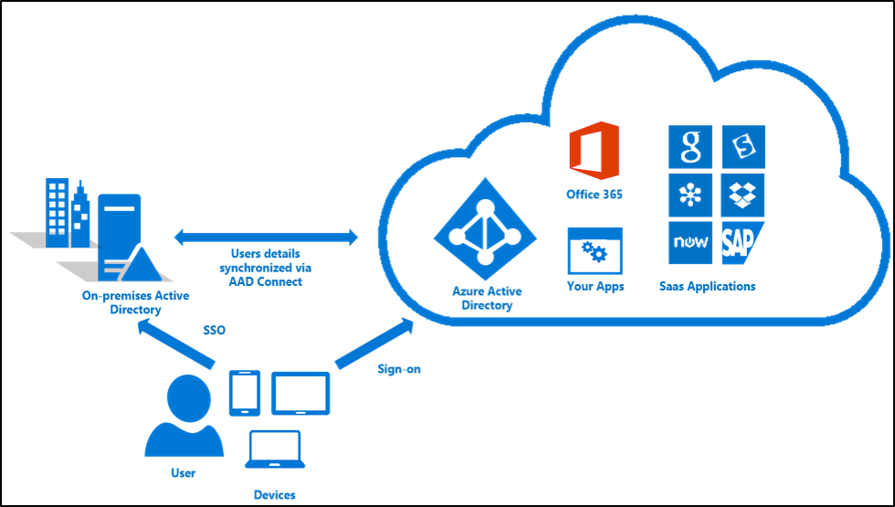

# Azure Active Directory Seamless Single Sign-On

## What is Azure Active Directory Seamless Single Sign-On?

Azure Active Directory Seamless Single Sign-On (Azure AD Seamless SSO) automatically signs users in when they are on their corporate devices connected to your corporate network. When enabled, users don't need to type in their passwords to sign in to Azure AD, and usually, even type in their usernames. This feature provides your users easy access to your cloud-based applications without needing any additional on-premises components.

Seamless SSO can be combined with either the [Password Hash Synchronization](active-directory-aadconnectsync-implement-password-synchronization.md) or [Pass-through Authentication](active-directory-aadconnect-pass-through-authentication.md) sign-in methods.

>[!NOTE]
>This feature is _not_ applicable to Active Directory Federation Services (ADFS), which already includes this capability.

## Key benefits of using Azure AD Seamless SSO

- *Great user experience*
  - Users are automatically signed into both on-premises and cloud-based applications.
  - Users don't have to enter their passwords repeatedly.
- *Easy to deploy & administer*
  - No additional components needed on-premises to make this work.
  - Works with any method of managed authentication - [Password Hash Synchronization](active-directory-aadconnectsync-implement-password-synchronization.md) or [Pass-through Authentication](active-directory-aadconnect-pass-through-authentication.md).
  - Can be rolled out to some or all your users using Group Policy.
  - Register non-Windows 10 devices with Azure AD. This needs version 2.1 or later of the [workplace-join client](https://www.microsoft.com/download/details.aspx?id=53554).

## Feature highlights

- Sign-in username can be either the on-premises default username (`userPrincipalName`) or another attribute configured in Azure AD Connect (`Alternate ID`).
- Seamless SSO is an opportunistic feature. If it fails for any reason, the user sign-in experience goes back to its regular behavior - i.e, the user needs to enter their password on the sign-in page.
- If an application forwards a `domain_hint` (identifying your tenant) or `login_hint` (identifying the user) parameter in its Azure AD sign-in request, users are automatically signed in without them entering usernames or passwords.
- It can be enabled via Azure AD Connect.
- It is a free feature, and you don't need any paid editions of Azure AD to use it.
- It is supported on web browser-based clients and Office clients that support [modern authentication](https://aka.ms/modernauthga) on platforms and browsers capable of Kerberos authentication:

| OS\Browser |Internet Explorer|Edge|Google Chrome|Mozilla Firefox|Safari|
| --- | --- |--- | --- | --- | -- 
|Windows 10|Yes|Not supported|Yes|Yes\*|N/A
|Windows 8.1|Yes|Not supported|Yes|Yes\*|N/A
|Windows 8|Yes|Not supported|Yes|Yes\*|N/A
|Windows 7|Yes|Not supported|Yes|Yes\*|N/A
|Mac OS X|N/A|N/A|Yes\*|Yes\*|Not supported

\*Requires [additional configuration](active-directory-aadconnect-sso-quick-start.md#browser-considerations)

>[!NOTE]
>For Windows 10, the recommendation is to use [Azure AD Join](../active-directory-azureadjoin-overview.md) for the optimal single sign-on experience with Azure AD.

## Next steps

- [**Quick Start**](active-directory-aadconnect-sso-quick-start.md) - Get up and running Azure AD Seamless SSO.
- [**Technical Deep Dive**](active-directory-aadconnect-sso-how-it-works.md) - Understand how this feature works.
- [**Frequently Asked Questions**](active-directory-aadconnect-sso-faq.md) - Answers to frequently asked questions.
- [**Troubleshoot**](active-directory-aadconnect-troubleshoot-sso.md) - Learn how to resolve common issues with the feature.
- [**UserVoice**](https://feedback.azure.com/forums/169401-azure-active-directory/category/160611-directory-synchronization-aad-connect) - For filing new feature requests.
