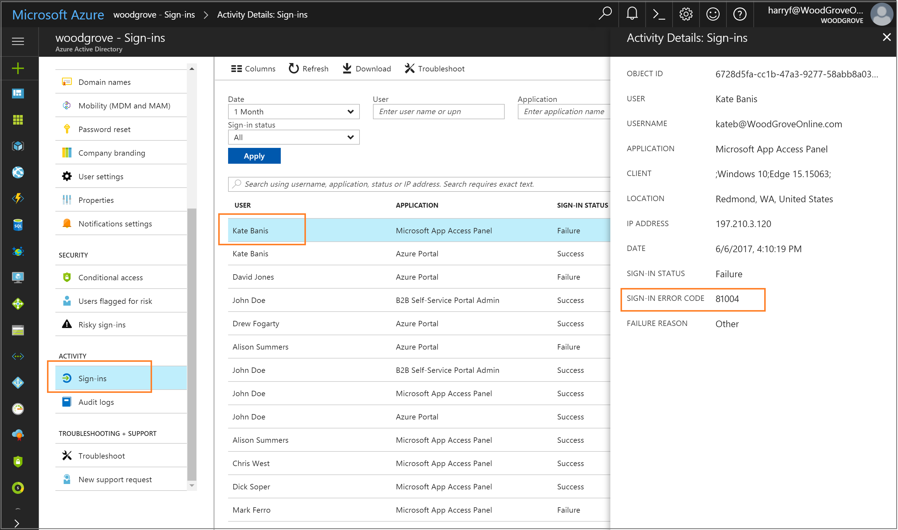

# Troubleshoot Azure Active Directory Seamless Single Sign-On

This article helps you find troubleshooting information about common issues regarding Azure AD Seamless Single Sign-On.

## Known issues

- If you are synchronizing 30 or more AD forests, you can't enable Seamless SSO using Azure AD Connect. As a workaround, you can [manually enable](#manual-reset-of-azure-ad-seamless-sso) the feature on your tenant.
- Adding Azure AD service URLs (https://autologon.microsoftazuread-sso.com, https://aadg.windows.net.nsatc.net) to the "Trusted sites" zone instead of the "Local intranet" zone blocks users from signing in.
- Seamless SSO doesn't work in private browsing mode on Firefox.

## Sign-in failure reasons on the Azure Active Directory admin center

A good place to start troubleshooting user sign-in issues with Seamless SSO is to look at the [sign-in activity report](../active-directory-reporting-activity-sign-ins.md) on the [Azure Active Directory admin center](https://aad.portal.azure.com/).



Navigate to **Azure Active Directory** -> **Sign-ins** on the [Azure Active Directory admin center](https://aad.portal.azure.com/) and click a specific user's sign-in activity. Look for the **SIGN-IN ERROR CODE** field. Map the value of that field to a failure reason and resolution using the following table:

|Sign-in error code|Sign-in failure reason|Resolution
| --- | --- | ---
| 81001 | User's Kerberos ticket is too large. | Reduce user's group memberships and try again.
| 81002 | Unable to validate user's Kerberos ticket. | See [troubleshooting checklist](#troubleshooting-checklist).
| 81003 | Unable to validate user's Kerberos ticket. | See [troubleshooting checklist](#troubleshooting-checklist).
| 81004 | Kerberos authentication attempt failed. | See [troubleshooting checklist](#troubleshooting-checklist).
| 81008 | Unable to validate user's Kerberos ticket. | See [troubleshooting checklist](#troubleshooting-checklist).
| 81009 | "Unable to validate user's Kerberos ticket. | See [troubleshooting checklist](#troubleshooting-checklist).
| 81010 | Seamless SSO failed because the user's Kerberos ticket has expired or is invalid. | User needs to sign in from a domain-joined device inside your corporate network.
| 81011 | Unable to find user object based on information in the user's Kerberos ticket. | Use Azure AD Connect to synchronize user information into Azure AD.
| 81012 | The user trying to sign in to Azure AD is different from the user signed into the device. | Sign in from a different device.
| 81013 | Unable to find user object based on information in the user's Kerberos ticket. |Use Azure AD Connect to synchronize user information into Azure AD. 

## Troubleshooting checklist

Use the following checklist to troubleshoot Seamless SSO issues:

- Check if the Seamless SSO feature is enabled in Azure AD Connect. If you can't enable the feature (for example, due to a blocked port), ensure that you have all the [pre-requisites](active-directory-aadconnect-sso-quick-start.md#step-1-check-prerequisites) in place.
- Check if both these Azure AD URLs (https://autologon.microsoftazuread-sso.com and https://aadg.windows.net.nsatc.net) are part of the user's Intranet zone settings.
- Ensure the corporate device is joined to the AD domain.
- Ensure the user is logged on to the device using an AD domain account.
- Ensure that the user's account is from an AD forest where Seamless SSO has been set up.
- Ensure the device is connected on the corporate network.
- Ensure that the device's time is synchronized with the Active Directory's and the Domain Controllers' time and is within five minutes of each other.
- List existing Kerberos tickets on the device using the **klist** command from a command prompt. Check if tickets issued for the `AZUREADSSOACCT` computer account are present. Users' Kerberos tickets are typically valid for 12 hours. You may have  different settings in your Active Directory.
- Purge existing Kerberos tickets from the device using the **klist purge** command, and try again.
- Review the console logs of the browser (under "Developer Tools") to help determine JavaScript-related or other potential issues.
- Review the [Domain Controller logs](#domain-controller-logs) as well.

### Domain Controller logs

If success auditing is enabled on your Domain Controller, then every time a user signs in using Seamless SSO a security entry is recorded in the Event log. You can find these security events using the following query (look for event **4769** associated with the computer account **AzureADSSOAcc$**):

```
	<QueryList>
	  <Query Id="0" Path="Security">
	<Select Path="Security">*[EventData[Data[@Name='ServiceName'] and (Data='AZUREADSSOACC$')]]</Select>
	  </Query>
	</QueryList>
```

## Manual reset of Azure AD Seamless SSO

If troubleshooting didn't help, use the following steps to manually reset the feature on your tenant:

### Step 1: Import the Seamless SSO PowerShell module

1. First, download, and install the [Microsoft Online Services Sign-In Assistant](http://go.microsoft.com/fwlink/?LinkID=286152).
2. Then download and install the [64-bit Azure Active Directory module for Windows PowerShell](http://go.microsoft.com/fwlink/p/?linkid=236297).
3. Navigate to the `%programfiles%\Microsoft Azure Active Directory Connect` folder.
4. Import the Seamless SSO PowerShell module using this command: `Import-Module .\AzureADSSO.psd1`.

### Step 2: Get the list of AD forests on which Seamless SSO has been enabled

1. In PowerShell, call `New-AzureADSSOAuthenticationContext`. When prompted, enter your Azure AD tenant administrator credentials.
2. Call `Get-AzureADSSOStatus`. This command provides you the list of AD forests (look at the "Domains" list) on which this feature has been enabled.

### Step 3: Disable Seamless SSO for each AD forest that it was set it up on

1. Call `$creds = Get-Credential`. When prompted, enter the Domain Administrator credentials for the intended AD forest.
2. Call `Disable-AzureADSSOForest -OnPremCredentials $creds`. This command removes the `AZUREADSSOACCT` computer account from the on-premises Domain Controller for this specific AD forest.
3. Repeat the preceding steps for each AD forest that you’ve set up the feature on.

### Step 4: Enable Seamless SSO for each AD forest

1. Call `Enable-AzureADSSOForest`. When prompted, enter the Domain Administrator credentials for the intended AD forest.
2. Repeat the preceding steps for each AD forest that you want to set up the feature on.

### Step 5. Enable the feature on your tenant

1. Call `Enable-AzureADSSO` and type in "true" at the `Enable: ` prompt to turn on the feature in your tenant.
