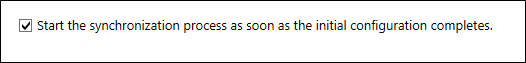

# Next steps and how to manage Azure AD Connect
Use the operational procedures in this article to customize Azure AD Connect to meet your organization's needs and requirements.  

## Add additional sync administrators
By default only the user who did the installation and local administrators will be able to manage the installed sync engine. For additional people to be able to access and manage the sync engine, locate the group named ADSyncAdmins on the local server and add them to this group.

## Assign licenses to Azure AD Premium and Enterprise Mobility users
Now that your users have been synchronized to the cloud, you will need to assign them a license so they can get going with cloud apps such as Office 365.

### To assign an Azure AD Premium or Enterprise Mobility Suite License

1. Sign-in to the Azure Portal as an Administrator.
2. On the left, select **Active Directory**.
3. On the Active Directory page, double-click on the directory that has the users you wish to enable.
4. At the top of the directory page, select **Licenses**.
5. On the Licenses page, select Active Directory Premium or Enterprise Mobility Suite, and then click **Assign**.
6. In the dialog box, select the users you want to assign licenses to, and then click the check mark icon to save the changes.

## Verify the scheduled synchronization task
If you want to check on the status of a synchronization you can do this by checking in the Azure portal.

### To verify the scheduled synchronization task
1. Sign-in to the Azure Portal as an Administrator.
2. On the left, select **Active Directory**.
3. On the Active Directory page, double-click on the directory that has the users you wish to enable.
4. At the top of the directory page, select **Directory Integration**.
5. Under integration with local active directory note the last sync time.

## Start a scheduled synchronization task
If you need to run a synchronization task you can do this by running through the Azure AD Connect wizard again.  You will need to provide your Azure AD credentials.  In the wizard, select the **Customize synchronization options** task and click next through the wizard. At the end, ensure that the **Start the synchronization process as soon as the initial configuration completes** box is checked.

For more information on the Azure AD Connect sync: Scheduler, see [Azure AD Connect Scheduler](active-directory-aadconnectsync-feature-scheduler.md)

## Additional tasks available in Azure AD Connect
After your initial installation of Azure AD Connect, you can always start the wizard again from the Azure AD Connect start page or desktop shortcut.  You will notice that going through the wizard again provides some new options in the form of Additional tasks.  

The following table provides a summary of these tasks and a brief description on each of them.

| Additional task | Description |
| --- | --- |
| View the selected scenario |View your current Azure AD Connect solution.  This includes general settings, synchronized directories, and synch settings. |
| Customize Synchronization options |Change the current configuration like adding additional Active Directory forests to the configuration, or enabling sync options such as user, group, device, or password write back. |
| Enable Staging Mode |Stage information that is not immediately synchronized, and is not exported to Azure AD or Active Directory.  With this feature, you can preview the synchronizations before they occur. |

## Next steps
Learn more about [Integrating your on-premises identities with Azure Active Directory](active-directory-aadconnect.md).
