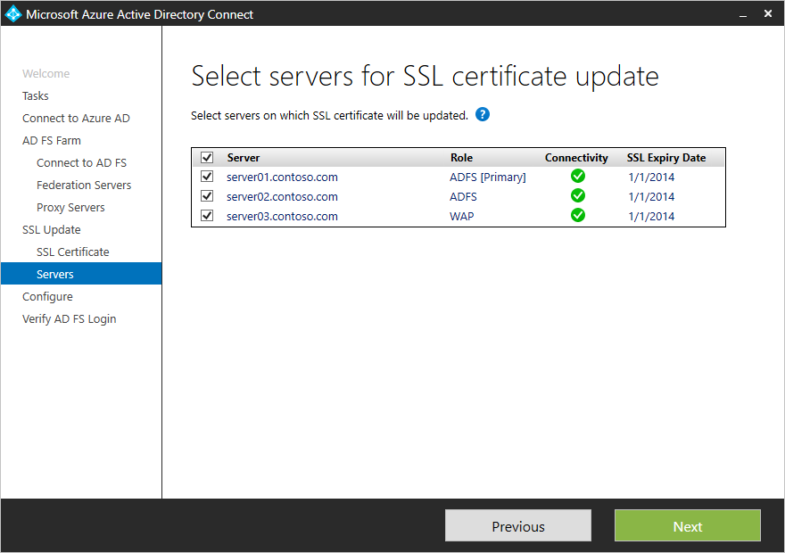

---
title: Update the SSL certificate for an Active Directory Federation Services (AD FS) farm | Microsoft Azure
description:This document details the steps to update SSL certificate of an AD FS farm using Azure AD Connect.
services: active-directory
keywords: azure ad connect, adfs ssl update, adfs certificate update, change adfs certificate, new adfs certificate, adfs certificate, update adfs ssl certificate, update ssl certificate adfs, configure adfs ssl certificate, adfs, ssl, certificate, adfs service communication certificate, update federation, configure federation, aad connect
authors: anandyadavmsft
manager: femila
editor: billmath

ms.assetid: 7c781f61-848a-48ad-9863-eb29da78f53c
ms.service: active-directory  
ms.workload: identity
ms.tgt_pltfrm: na
ms.devlang: na
ms.topic: article
ms.date: 02/07/2016
ms.author: anandy

---    

# Update the SSL certificate for an Active Directory Federation Services (AD FS) farm

## Overview
This article describes how Azure AD Connect can be used to update SSL certificate for Active Directory Federation Services (AD FS) farm.  If the sign-on method in Azure AD Connect  is set as AD FS, the Azure AD Connect  tool can be used to easily update the SSL Certificate for the AD FS farm – across all federation and WAP servers in 3 simple steps:

>[!NOTE] To learn more about certificates used by AD FS, refer to the article [Understanding Certificates Used by AD FS](https://technet.microsoft.com/library/cc730660.aspx)

##Pre-requisites

* **AD FS Farm**: AD FS farm should be 2012R2 or  higher
* **Azure AD Connect**: Ensure that Azure AD Connect version is 1.1.443.0 or newer. You will find the task “Update AD FS SSL certificate”

##Step 1: Provide AD FS farm information

AAD Connect will try to obtain the information about the AD FS farm automatically by:
1. Querying the farm information from AD FS (2016 or higher)
2. Referencing the information from previous runs (stored locally with Azure AD Connect). 

The list of servers displayed can be modified by adding or removing the servers to reflect the current configuration of the AD FS farm. As soon as the server information is provided, Azure AD Connect displays the connectivity and current SSL certificate status.

If the list contains a server that is no longer part of the AD FS farm, then click on remove to delete the server from the list of servers in your AD FS farm. 

 
>[!NOTE] Removing from the list of servers for AD FS farm in Azure AD Connect is a local operation and updates the information for the AD FS farm that Azure AD Connect maintains locally. Azure AD Connect will not do any modification of configuration on AD FS to reflect the change.    

##Step 2: Provide new SSL certificate

Once the information about AD FS farm servers has been confirmed, Azure AD Connect asks for the new SSL certificate. Provide a password protected PFX certificate to continue the installation. 

 
Once the certificate is provided, Azure AD Connect does a series of pre-requisites  check on the certificate to ensure that the certificate is correct for the AD FS farm:
1.	Subject name (SN) / Subject Alternate Name (SAN) for the certificate is either same as the federation service name or it is a wild card certificate.
2.	The certificate is valid for more than 30 days
3.	Certificate trust chain is valid 
4.	Certificate is password protected

##Step 3: Select servers for update

In the next step, select the servers on which the SSL certificate needs to be updated. Servers which are offline cannot be selected for the update. 

After configuration is complete, Azure AD Connect will display the message indicating the status of the update and will provide an option to verify the AD FS login.

   

##FAQs

* **What should be the subject name of the certificate for the new AD FS SSL certificate?**

    Azure AD Connect will check if the subject name of the certificate / alternate subject name contains the federation service name. For e.g. if your federation service name is fs.contoso.com, the subject name / alternate subject name must be fs.contoso.com.  Wild card certificates are also accepted. 

* **Why am I asked for credentials again on the WAP server page?**

    If the credentials provided for connecting to AD FS servers do not have the privilege to manage the WAP servers also, then Azure AD Connect will ask for credentials that have administrative privilege on the WAP servers.

* **Server is shown as offline, what should I do?**

    Azure AD Connect cannot perform any operation if the server is offline. If the server is part of the AD FS farm, then check the connectivity to the server and after you have resolved the issue hit refresh icon to update the status in the wizard. If the server was part of the farm earlier but now no longer exists, click on remove to delete it from the list of servers that Azure AD Connect maintains.  Removing the server from the list in Azure AD Connect does not alter the AD FS configuration itself and if you are using AD FS 2016 or higher the server will remain in the configuration settings and will be shown again on the next run of the task.

* **Can I update a subset of my farm servers with the new SSL certificate?**

    Yes. You can always run the task “Update SSL Certificate” again to update the remaining servers. On the “Select servers for SSL certificate update” page, you can sort the list of servers on “SSL Expiry date” to easily access the servers that are not yet updated. 

* **I removed the server in the previous run, but it is still being shown as offline and listed in the AD FS Servers page. Why is the offline server still there even after removal?**

    Removing the server from the list in Azure AD Connect does not remove it in the AD FS configuration. Azure AD Connect references AD FS (2016 or higher) also for any information about the farm and if the server is still present in the AD FS configuration, it will be listed back in the list.  

## Next steps

[Azure AD Connect and federation](active-directory-aadconnectfed-whatis.md)
[Active Directory Federation Services management and customization with Azure AD Connect](active-directory-aadconnect-federation-management.md)
